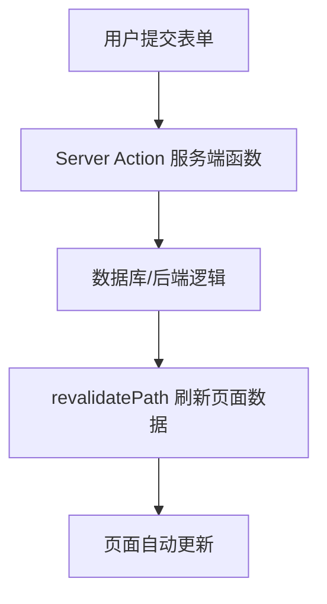
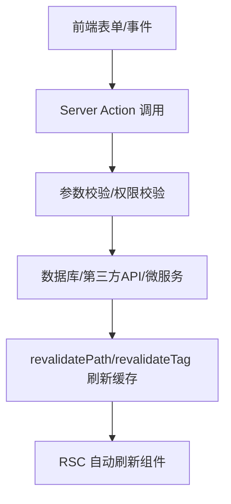

# 前言
大家好，我是鲫小鱼。是一名`不写前端代码`的前端工程师，热衷于分享非前端的知识，带领切图仔逃离切图圈子，欢迎关注我，微信公众号：`《鲫小鱼不正经》`。欢迎点赞、收藏、关注，一键三连！！

# 第十三章：Server Actions：新一代全栈能力

## 理论讲解

### 1. Server Actions 的诞生与定位

Server Actions 是 Next.js 13+ 在 App Router 体系下引入的一项革命性全栈能力。它允许开发者直接在 React 组件中声明服务端函数，并通过表单或事件驱动的方式无缝调用这些服务端逻辑，实现“前端即后端”的开发体验。

**核心优势：**
- 彻底消除传统 API Route 的冗余胶水代码，前后端逻辑合一。
- 支持表单无刷新提交，极致提升用户体验。
- 与 React Server Components (RSC) 深度集成，天然支持服务端数据变更与渲染。
- 自动处理请求体解析、CSRF 防护、Session 传递等安全细节。
- 适合表单、数据变更、权限校验等场景，极大简化全栈开发。

**与 API Routes 的对比：**
| 特性             | API Routes                | Server Actions                |
|------------------|---------------------------|-------------------------------|
| 代码分布         | 前后端分离                | 组件内声明服务端逻辑           |
| 调用方式         | fetch/AJAX                | 直接调用/表单 action           |
| 适用场景         | 复杂接口、第三方集成      | 表单、数据变更、轻量接口       |
| 错误处理         | 手动 try/catch            | 自动捕获并传递到组件           |
| Session/认证     | 需手动处理                | 自动透传                       |
| 性能优化         | 需手动缓存                | 支持 RSC 缓存、自动优化         |

### 2. Server Actions 的底层机制

- 仅在 App Router (`app/`) 下可用，需启用 React Server Components。
- 通过 `"use server"` 指令声明服务端函数，Next.js 自动将其编译为服务端可调用的 API。
- 支持表单 `<form action={serverAction}>` 直接提交，也可通过事件驱动（如按钮点击）调用。
- 支持异步、参数校验、错误处理、Session 访问等。
- 自动与 RSC 结合，数据变更后可自动刷新相关组件。

### 3. 适用场景与最佳实践

- 表单提交（如评论、反馈、注册、登录等）
- 数据变更（如增删改操作）
- 权限校验与安全操作
- 轻量级后端逻辑（如发送邮件、写日志等）
- 与 API Routes 协作：复杂接口仍建议用 API Routes，Server Actions 适合页面内轻量逻辑

## 详细代码示例

### 1. 基础用法：表单无刷新提交

```tsx
// app/todo/page.tsx
'use client';
import { useState } from 'react';
import { addTodo } from './actions';

export default function TodoPage() {
  const [input, setInput] = useState('');
  return (
    <form action={addTodo} className="flex gap-2 p-4">
      <input
        name="title"
        value={input}
        onChange={e => setInput(e.target.value)}
        placeholder="输入待办事项"
        className="border rounded px-2 py-1 flex-1"
        required
      />
      <button type="submit" className="bg-blue-500 text-white px-4 py-1 rounded">添加</button>
    </form>
  );
}
```

```ts
// app/todo/actions.ts
'use server';
import { revalidatePath } from 'next/cache';
import { z } from 'zod';

const TodoSchema = z.object({ title: z.string().min(1) });

export async function addTodo(formData: FormData) {
  const parsed = TodoSchema.safeParse({ title: formData.get('title') });
  if (!parsed.success) throw new Error('标题不能为空');
  // 假设写入数据库
  await db.todo.create({ data: { title: parsed.data.title } });
  revalidatePath('/todo'); // 自动刷新页面数据
}
```

### 2. 事件驱动调用 Server Action

```tsx
// app/todo/components/DeleteButton.tsx
'use client';
import { deleteTodo } from '../actions';

export function DeleteButton({ id }: { id: string }) {
  return (
    <form action={deleteTodo.bind(null, id)}>
      <button type="submit" className="text-red-500">删除</button>
    </form>
  );
}
```

```ts
// app/todo/actions.ts
'use server';
export async function deleteTodo(id: string) {
  await db.todo.delete({ where: { id } });
  revalidatePath('/todo');
}
```

### 3. 错误处理与权限校验

```ts
// app/todo/actions.ts
'use server';
import { getSession } from 'next-auth';

export async function addTodo(formData: FormData) {
  const session = await getSession();
  if (!session) throw new Error('请先登录');
  // ...其余逻辑
}
```

### 4. 移动端适配与性能优化

- 表单组件建议使用响应式布局（如 Tailwind CSS 的 flex、gap、w-full 等）
- Server Actions 自动优化网络请求，无需手动处理 loading 状态，但可结合 Suspense 优化体验

### 5. 国际化与 a11y

- 错误信息建议多语言处理，可结合 i18n 库
- 表单元素需加 aria-label，提升无障碍体验

## 实战项目：重构待办事项管理

### 1. 项目目标

- 用 Server Actions 重构待办事项管理功能，实现增删查改、权限校验、错误处理、移动端适配、国际化等。
- 体验 Server Actions 与 RSC 的协作，感受端到端全栈开发。

### 2. 目录结构

```
app/
  todo/
    page.tsx
    actions.ts
    components/
      TodoList.tsx
      DeleteButton.tsx
```

### 3. 关键代码

#### actions.ts
```ts
'use server';
import { revalidatePath } from 'next/cache';
import { z } from 'zod';
import { getSession } from 'next-auth';

const TodoSchema = z.object({ title: z.string().min(1) });

export async function addTodo(formData: FormData) {
  const session = await getSession();
  if (!session) throw new Error('未登录');
  const parsed = TodoSchema.safeParse({ title: formData.get('title') });
  if (!parsed.success) throw new Error('标题不能为空');
  await db.todo.create({ data: { title: parsed.data.title, userId: session.user.id } });
  revalidatePath('/todo');
}

export async function deleteTodo(id: string) {
  const session = await getSession();
  if (!session) throw new Error('未登录');
  await db.todo.delete({ where: { id, userId: session.user.id } });
  revalidatePath('/todo');
}
```

#### TodoList.tsx
```tsx
import { getTodos } from '../actions';
import { DeleteButton } from './DeleteButton';

export default async function TodoList() {
  const todos = await getTodos();
  return (
    <ul className="divide-y">
      {todos.map(todo => (
        <li key={todo.id} className="flex justify-between items-center py-2">
          <span>{todo.title}</span>
          <DeleteButton id={todo.id} />
        </li>
      ))}
    </ul>
  );
}
```

#### page.tsx
```tsx
import TodoList from './components/TodoList';
import AddForm from './components/AddForm';

export default function TodoPage() {
  return (
    <div className="max-w-md mx-auto p-4">
      <h1 className="text-2xl font-bold mb-4">待办事项</h1>
      <AddForm />
      <TodoList />
    </div>
  );
}
```

### 4. 项目亮点
- 全流程 Server Actions，无需传统 API Route
- 权限校验、错误处理、移动端适配、国际化
- 代码高度内聚，易于维护

## 最佳实践

1. **安全性**：所有数据变更操作都应做权限校验，防止未授权访问。
2. **性能优化**：利用 RSC 自动缓存，必要时手动调用 `revalidatePath` 或 `revalidateTag`。
3. **团队协作**：Server Actions 代码建议与组件同目录，便于协作和复用。
4. **a11y 与国际化**：表单、按钮等组件需加 aria 属性，错误信息多语言处理。
5. **错误处理**：利用 Error Boundary 捕获前端错误，Server Actions 内部抛出错误自动传递到组件。

## 常见问题与解决方案

### Q1: Server Actions 和 API Routes 如何协作？
A: 复杂接口、第三方集成建议用 API Routes，页面内表单、数据变更优先用 Server Actions。两者可互相调用。

### Q2: 如何调试 Server Actions？
A: 可在服务端函数内加日志，或用 try/catch 捕获错误并返回详细信息。开发环境下支持热重载。

### Q3: Server Actions 支持文件上传吗？
A: 支持，但需用 FormData 传递文件，服务端用 `formData.get('file')` 获取并处理。

### Q4: 为什么我的 Server Action 没有生效？
A: 检查是否在 `app/` 目录下，是否加了 `"use server"`，表单 action 是否正确绑定。

### Q5: 如何做移动端适配？
A: 表单、列表等组件建议用 Tailwind CSS 或 CSS Modules 实现响应式布局。

## 配图说明



> Server Actions 流程示意图：用户提交表单，服务端函数处理数据并刷新页面。

---

## 理论讲解（进阶扩展）

### 4. Server Actions 的生命周期与底层原理

Server Actions 的本质是“声明式服务端函数”，Next.js 在构建时会将带有 `"use server"` 的函数编译为服务端 API，并自动生成调用协议。其生命周期大致如下：

1. **声明**：开发者在组件外部声明带有 `"use server"` 的函数。
2. **调用**：前端通过表单 action、事件或直接调用触发。
3. **序列化**：Next.js 自动将参数序列化，通过 POST 请求发送到服务端。
4. **执行**：服务端接收到请求，执行对应的 Server Action。
5. **响应**：结果自动传递回前端，触发 RSC 重新渲染。
6. **缓存与失效**：可结合 `revalidatePath`、`revalidateTag` 控制缓存刷新。

**与 RSC 的协作机制**：Server Actions 与 React Server Components 紧密结合，数据变更后可自动刷新相关组件，极大提升开发效率和一致性。

### 5. 安全机制与企业级应用场景

- **CSRF 防护**：Server Actions 默认只接受 POST 请求，并自动校验来源，降低 CSRF 风险。
- **Session/认证透传**：可直接在 Server Action 内获取用户 Session，无需手动解析 Cookie。
- **数据校验**：建议配合 Zod、Yup 等库进行参数校验，防止恶意数据注入。
- **权限控制**：在 Server Action 内部做细粒度权限校验，防止越权操作。
- **企业级场景**：如审批流、评论系统、文件管理、权限系统、批量操作、事务处理等。

### 6. 性能优化与团队协作

- **缓存优化**：利用 RSC 的自动缓存，结合 `revalidatePath`、`revalidateTag` 精细控制失效。
- **并发与事务**：可在 Server Action 内部实现数据库事务、批量操作，保证数据一致性。
- **团队协作**：建议 Server Actions 与组件同目录，采用统一命名规范，便于多人协作和代码审查。
- **监控与日志**：可在 Server Action 内部集成日志采集、性能监控、异常上报等。

---

## 复杂代码示例与企业级场景

### 1. 复杂表单与嵌套数据处理

```tsx
// app/approval/page.tsx
'use client';
import { useState } from 'react';
import { submitApproval } from './actions';

export default function ApprovalForm() {
  const [fields, setFields] = useState([{ name: '', value: '' }]);
  return (
    <form action={submitApproval} className="space-y-4">
      {fields.map((f, i) => (
        <div key={i} className="flex gap-2">
          <input name={`fields[${i}][name]`} value={f.name} placeholder="字段名" required />
          <input name={`fields[${i}][value]`} value={f.value} placeholder="字段值" required />
        </div>
      ))}
      <button type="button" onClick={() => setFields([...fields, { name: '', value: '' }])}>添加字段</button>
      <button type="submit" className="bg-green-500 text-white px-4 py-1 rounded">提交审批</button>
    </form>
  );
}
```

```ts
// app/approval/actions.ts
'use server';
import { z } from 'zod';
import { revalidatePath } from 'next/cache';

const ApprovalSchema = z.object({
  fields: z.array(z.object({ name: z.string(), value: z.string() }))
});

export async function submitApproval(formData: FormData) {
  // 解析嵌套字段
  const fields = [];
  for (let [key, value] of formData.entries()) {
    if (key.startsWith('fields[')) {
      const match = key.match(/fields\[(\d+)\]\[(name|value)\]/);
      if (match) {
        const idx = Number(match[1]);
        const type = match[2];
        if (!fields[idx]) fields[idx] = { name: '', value: '' };
        fields[idx][type] = value as string;
      }
    }
  }
  const parsed = ApprovalSchema.safeParse({ fields });
  if (!parsed.success) throw new Error('表单校验失败');
  // 数据库写入审批流
  await db.approval.create({ data: { fields: parsed.data.fields } });
  revalidatePath('/approval');
}
```

### 2. 文件上传与进度反馈

```tsx
// app/upload/page.tsx
'use client';
import { uploadFile } from './actions';

export default function UploadForm() {
  return (
    <form action={uploadFile} encType="multipart/form-data" className="space-y-2">
      <input type="file" name="file" required aria-label="选择文件" />
      <button type="submit" className="bg-blue-600 text-white px-4 py-1 rounded">上传</button>
    </form>
  );
}
```

```ts
// app/upload/actions.ts
'use server';
import { revalidatePath } from 'next/cache';

export async function uploadFile(formData: FormData) {
  const file = formData.get('file') as File;
  if (!file) throw new Error('未选择文件');
  // 这里可集成云存储服务，如 S3、OSS
  await saveFileToStorage(file);
  revalidatePath('/upload');
}
```

### 3. 乐观 UI 与错误边界

```tsx
// app/comment/page.tsx
'use client';
import { useTransition, useState } from 'react';
import { addComment } from './actions';

export default function CommentForm() {
  const [pending, startTransition] = useTransition();
  const [error, setError] = useState('');
  return (
    <form action={async (fd) => {
      setError('');
      startTransition(async () => {
        try {
          await addComment(fd);
        } catch (e) {
          setError(e.message);
        }
      });
    }}>
      <textarea name="content" required aria-label="评论内容" />
      <button type="submit" disabled={pending}>提交</button>
      {error && <div className="text-red-500">{error}</div>}
    </form>
  );
}
```

### 4. 批量操作与事务处理

```ts
// app/batch/actions.ts
'use server';
import { db } from '@/lib/db';

export async function batchDelete(ids: string[]) {
  await db.$transaction(async (tx) => {
    for (const id of ids) {
      await tx.item.delete({ where: { id } });
    }
  });
  revalidatePath('/items');
}
```

### 5. 单元测试与端到端测试

- Server Actions 可用 Jest 进行单元测试，模拟 FormData、Session 等。
- 端到端测试可用 Playwright/Cypress，模拟表单提交、文件上传、权限校验等。

---

## 企业级实战案例

### 1. 审批流系统
- 多级审批、动态表单、权限校验、流程状态追踪。
- Server Actions 负责表单提交、审批流转、状态变更。
- 结合 RSC 实现审批进度实时刷新。

### 2. 评论与回复系统
- 支持嵌套评论、乐观 UI、敏感词过滤、权限校验。
- Server Actions 处理评论增删改查，结合缓存优化。

### 3. 文件管理与权限系统
- 支持多文件上传、分组管理、权限分级、日志审计。
- Server Actions 处理文件上传、下载、删除、权限校验。

---

## 最佳实践（扩展）

- **安全**：所有 Server Action 必须做参数校验和权限校验，防止注入和越权。
- **性能**：合理利用缓存，避免重复查询，批量操作用事务。
- **可维护性**：统一错误处理，日志采集，代码分层（actions、services、utils）。
- **团队协作**：约定目录结构、命名规范、代码审查流程。
- **测试**：为关键 Server Action 编写单元和端到端测试。
- **监控**：集成 Sentry、Datadog 等监控平台，追踪异常和性能瓶颈。
- **移动端适配**：表单、列表、弹窗等组件需响应式设计，兼容主流移动设备。
- **a11y**：所有表单、按钮、交互元素需加 aria 属性，确保无障碍。
- **国际化**：错误信息、提示文本多语言处理，支持 i18n。

---

## 常见问题与解决方案（扩展）

### Q6: Server Actions 如何与微服务/第三方 API 协作？
A: 可在 Server Action 内部调用微服务 API、GraphQL、RESTful 接口，处理后返回结果。

### Q7: 如何做灰度发布/AB 测试？
A: 可在 Server Action 内部根据用户特征、Session、Cookie 实现流量分流，支持灰度发布和 AB 测试。

### Q8: Server Actions 如何做日志采集和异常上报？
A: 可在 Server Action 内部集成 Sentry、Datadog 等日志平台，捕获异常并上报。

### Q9: 如何保证 Server Actions 的幂等性？
A: 对于支付、订单等敏感操作，建议引入幂等键（如唯一 token），服务端校验防止重复提交。

### Q10: Server Actions 支持流式响应吗？
A: 目前主要用于表单和数据变更，流式响应可结合 RSC 的 Suspense/Streaming 实现部分场景。

---

## 配图说明（扩展）



> Server Actions 全链路调用与缓存失效流程示意图。

> 最后感谢阅读！欢迎关注我，微信公众号：`《鲫小鱼不正经》`。欢迎点赞、收藏、关注，一键三连！！！