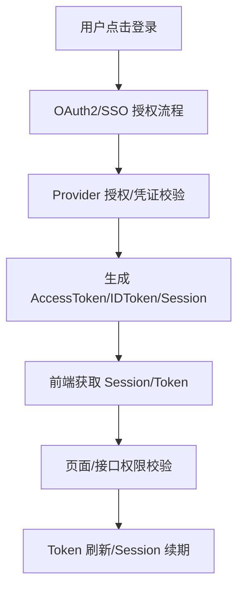

# 前言
大家好，我是鲫小鱼。是一名`不写前端代码`的前端工程师，热衷于分享非前端的知识，带领切图仔逃离切图圈子，欢迎关注我，微信公众号：`《鲫小鱼不正经》`。欢迎点赞、收藏、关注，一键三连！！

# 第十四章：NextAuth.js 身份认证与授权

## 理论讲解

### 1. 认证与授权的区别

- **认证（Authentication）**：确认用户身份，常见方式有账号密码、OAuth、短信验证码等。
- **授权（Authorization）**：确认用户是否有权限访问某资源或操作某功能，如管理员权限、资源所有权等。
- 在企业级应用中，认证和授权往往结合使用，确保系统安全。

### 2. NextAuth.js 简介与核心原理

NextAuth.js 是 Next.js 生态中最流行的认证解决方案，支持多种认证方式（OAuth、Credentials、Email 等），可无缝集成到 API Routes 和 App Router，支持服务端渲染、静态生成、API 保护等多种场景。

**核心特性：**
- 支持多 Provider（GitHub、Google、微信、企业微信等）
- 支持基于凭证的自定义登录
- Session 管理灵活，支持 JWT 和数据库存储
- 可扩展的回调机制，便于权限控制、用户信息增强
- 与 Next.js SSR/ISR/Server Actions 深度集成
- 丰富的安全机制（CSRF、加密、Token 刷新等）

### 3. NextAuth.js 的工作流程

1. 用户在前端页面发起登录请求（如点击 GitHub 登录按钮）
2. 跳转到第三方 Provider 认证页面，用户授权后回调到 Next.js 应用
3. NextAuth.js 通过 API Route `/api/auth/*` 处理回调，生成 Session
4. Session 可通过前端 hook、服务端 API、Server Actions 获取
5. 退出登录时销毁 Session，前端自动跳转到登录页

### 4. Session 管理与安全机制

- 支持 JWT（无状态）和数据库（有状态）两种 Session 存储方式
- 内置 CSRF 防护、Session 加密、Token 过期与刷新机制
- 可自定义 Session 生命周期、加密算法、回调逻辑
- 支持多端同步登录状态，适配移动端、桌面端等多场景

### 5. 与 Next.js 各种渲染模式协作

- **SSR/SSG**：可在 `getServerSideProps`、`getStaticProps`、API Routes、Server Actions 中安全获取 Session
- **App Router**：可在 Server Component、Server Action、API Route 中获取 Session，实现页面和接口保护
- **API 保护**：可在 API Route、Server Action 内部校验 Session，实现接口级权限控制

---

## 详细代码示例

### 1. NextAuth.js 基础配置（支持 GitHub OAuth 和自定义凭证登录）

```ts
// pages/api/auth/[...nextauth].ts
import NextAuth from 'next-auth';
import GitHubProvider from 'next-auth/providers/github';
import CredentialsProvider from 'next-auth/providers/credentials';

export default NextAuth({
  providers: [
    GitHubProvider({
      clientId: process.env.GITHUB_CLIENT_ID!,
      clientSecret: process.env.GITHUB_CLIENT_SECRET!,
    }),
    CredentialsProvider({
      name: 'Credentials',
      credentials: {
        username: { label: '用户名', type: 'text' },
        password: { label: '密码', type: 'password' },
      },
      async authorize(credentials) {
        // 这里可接入数据库校验
        if (credentials?.username === 'admin' && credentials?.password === '123456') {
          return { id: 1, name: '管理员', email: 'admin@example.com' };
        }
        return null;
      },
    }),
  ],
  session: {
    strategy: 'jwt', // 也可用 'database'
    maxAge: 60 * 60 * 24, // 1天
  },
  callbacks: {
    async session({ session, token }) {
      // 可扩展 session 信息
      session.userId = token.sub;
      return session;
    },
    async jwt({ token, user }) {
      if (user) token.sub = user.id;
      return token;
    },
  },
  pages: {
    signIn: '/auth/signin',
    error: '/auth/error',
  },
  secret: process.env.NEXTAUTH_SECRET,
});
```

### 2. 登录页面与多 Provider 支持

```tsx
// pages/auth/signin.tsx
import { getProviders, signIn } from 'next-auth/react';
import { useEffect, useState } from 'react';

export default function SignIn() {
  const [providers, setProviders] = useState<any>({});
  useEffect(() => {
    getProviders().then(setProviders);
  }, []);
  return (
    <div className="max-w-sm mx-auto p-4">
      <h1 className="text-2xl font-bold mb-4">登录</h1>
      {Object.values(providers).map((provider: any) => (
        <div key={provider.name} className="mb-2">
          <button
            className="w-full bg-blue-600 text-white py-2 rounded"
            onClick={() => signIn(provider.id)}
          >
            使用 {provider.name} 登录
          </button>
        </div>
      ))}
    </div>
  );
}
```

### 3. 受保护页面与 Session 校验

```tsx
// pages/dashboard.tsx
import { getSession, signOut } from 'next-auth/react';
import { useEffect, useState } from 'react';

export default function Dashboard() {
  const [session, setSession] = useState<any>(null);
  useEffect(() => {
    getSession().then(setSession);
  }, []);
  if (!session) return <div>请先登录</div>;
  return (
    <div className="p-4">
      <h2>欢迎，{session.user?.name}</h2>
      <button onClick={() => signOut()} className="mt-4 bg-gray-200 px-4 py-2 rounded">退出登录</button>
    </div>
  );
}
```

### 4. API Route 保护与权限校验

```ts
// pages/api/protected.ts
import { getSession } from 'next-auth/react';

export default async function handler(req, res) {
  const session = await getSession({ req });
  if (!session) {
    return res.status(401).json({ error: '未认证' });
  }
  // 权限校验
  if (session.user.role !== 'admin') {
    return res.status(403).json({ error: '无权限' });
  }
  res.json({ data: '受保护数据' });
}
```

### 5. App Router 下的 Server Component/Action 认证

```ts
// app/dashboard/page.tsx
import { getServerSession } from 'next-auth';
import { authOptions } from '../api/auth/[...nextauth]/route';

export default async function DashboardPage() {
  const session = await getServerSession(authOptions);
  if (!session) return <div>请先登录</div>;
  return <div>欢迎，{session.user?.name}</div>;
}
```

---

## 理论讲解（进阶扩展）

### 6. OAuth2/OpenID Connect 流程与 Token 类型

- **OAuth2 授权码流程**：用户点击第三方登录，跳转到 Provider 授权页，授权后回调，后端用 code 换取 AccessToken/IDToken。
- **OpenID Connect**：OAuth2 的扩展，增加 IDToken（JWT 格式），用于身份认证。
- **Token 类型**：
  - AccessToken：访问资源 API 的令牌，短时有效。
  - RefreshToken：用于刷新 AccessToken，安全性要求高。
  - IDToken：OpenID Connect 用于身份认证的 JWT。
- **多端同步与 SSO**：可结合企业微信、Google、LDAP、AD 实现单点登录，支持多端同步 Session。
- **多因子认证（MFA）**：可集成短信、邮箱、TOTP 二次验证，提升安全性。

### 7. NextAuth.js 回调机制与权限模型

- **回调机制**：
  - signIn：登录前回调，可自定义登录逻辑、拒绝登录。
  - redirect：登录/登出后跳转。
  - session：扩展 session 字段，如 userId、role、权限等。
  - jwt：自定义 JWT 内容，如权限、过期时间。
  - authorize：自定义凭证登录逻辑。
  - events：登录、登出、错误等事件钩子，可做日志采集、审计。
- **权限模型**：
  - RBAC（基于角色的访问控制）：user.role 字段控制页面/接口权限。
  - ABAC（基于属性的访问控制）：结合用户属性、资源属性、环境属性做细粒度权限。

### 8. 安全威胁与防护

- **会话劫持**：Session 建议用 HttpOnly、Secure、SameSite Cookie，防止 XSS/CSRF。
- **CSRF 防护**：NextAuth.js 内置 CSRF Token 校验，表单/接口需带 Token。
- **XSS 防护**：所有用户输入需转义，前端渲染时注意危险 HTML。
- **Token 失效与刷新**：AccessToken 过期后用 RefreshToken 刷新，Session 失效自动登出。
- **异常监控**：集成 Sentry、Datadog 等平台，监控认证异常、登录失败、权限拒绝等。

---

## 复杂代码示例与企业级场景

### 1. 邮箱验证码登录与注册激活

```ts
// pages/api/auth/email-login.ts
import { sendEmailCode, verifyEmailCode } from '@/lib/email';

export default async function handler(req, res) {
  if (req.method === 'POST') {
    const { email, code } = req.body;
    if (!code) {
      // 发送验证码
      await sendEmailCode(email);
      return res.json({ ok: true });
    } else {
      // 校验验证码
      const valid = await verifyEmailCode(email, code);
      if (!valid) return res.status(400).json({ error: '验证码错误' });
      // 生成 Session 或返回 Token
      // ...
      return res.json({ ok: true });
    }
  }
  res.status(405).end();
}
```

### 2. 短信验证码与多因子认证（MFA）

```ts
// pages/api/auth/sms-login.ts
import { sendSmsCode, verifySmsCode } from '@/lib/sms';

export default async function handler(req, res) {
  // 类似邮箱验证码，略
}
```

### 3. 用户注册、激活与找回密码

```ts
// pages/api/auth/register.ts
export default async function handler(req, res) {
  if (req.method === 'POST') {
    const { email, password } = req.body;
    // 校验、写入数据库、发送激活邮件
    // ...
    res.json({ ok: true });
  }
  res.status(405).end();
}

// pages/api/auth/activate.ts
export default async function handler(req, res) {
  // 校验激活链接，激活用户
}

// pages/api/auth/forgot-password.ts
export default async function handler(req, res) {
  // 发送重置密码邮件，校验重置链接
}
```

### 4. Session 持久化与 Token 刷新

```ts
// next-auth 配置中
session: {
  strategy: 'jwt',
  maxAge: 60 * 60 * 24 * 7, // 7天
  updateAge: 60 * 60 * 2, // 2小时自动刷新
},
// ...
callbacks: {
  async jwt({ token, account }) {
    if (account && account.refresh_token) {
      token.refreshToken = account.refresh_token;
    }
    // 刷新逻辑略
    return token;
  },
}
```

### 5. 企业微信/Google 登录与多 Provider 配置

```ts
import WechatWorkProvider from 'next-auth/providers/wechat-work';
import GoogleProvider from 'next-auth/providers/google';

providers: [
  // ...
  WechatWorkProvider({
    clientId: process.env.WECHATWORK_CLIENT_ID!,
    clientSecret: process.env.WECHATWORK_CLIENT_SECRET!,
  }),
  GoogleProvider({
    clientId: process.env.GOOGLE_CLIENT_ID!,
    clientSecret: process.env.GOOGLE_CLIENT_SECRET!,
  }),
]
```

### 6. App Router 下 Server Actions 保护敏感操作

```ts
// app/api/protected/route.ts
import { getServerSession } from 'next-auth';
import { authOptions } from '../auth/[...nextauth]/route';

export async function POST(req) {
  const session = await getServerSession(authOptions);
  if (!session || session.user.role !== 'admin') {
    return new Response('无权限', { status: 403 });
  }
  // 业务逻辑
  return new Response('ok');
}
```

### 7. 日志采集与异常监控

```ts
import * as Sentry from '@sentry/nextjs';

callbacks: {
  async signIn({ user, account, profile }) {
    Sentry.captureMessage(`用户登录: ${user.email}`);
    return true;
  },
  async signOut({ token }) {
    Sentry.captureMessage(`用户登出: ${token.email}`);
    return true;
  },
  async error({ error }) {
    Sentry.captureException(error);
    return true;
  },
}
```

---

## 企业级实战案例（扩展）

### 1. 权限分级与用户管理
- 用户分为超级管理员、管理员、普通用户、访客等，权限字段写入 session/jwt。
- 用户管理后台可增删改查用户、分配角色、重置密码、禁用账号。
- 所有敏感操作需二次确认与日志审计。

### 2. 与企业认证系统集成
- 支持企业微信、钉钉、LDAP、AD 等企业 SSO。
- 可用 next-auth 的自定义 Provider 或 OAuth2/OpenID Connect 标准协议对接。
- 支持与微服务架构下的统一认证中心集成。

### 3. 操作日志与异常监控
- 所有登录、登出、权限变更、异常操作均写入日志，便于安全审计。
- 集成 Sentry、Datadog、ELK 等平台，实时监控认证与授权相关异常。

---

## 最佳实践（扩展）
- **安全**：所有接口、页面、Server Action 必须做 session/权限校验，防止越权。
- **性能**：Session 建议用 JWT，减少数据库压力，Token 过期及时刷新。
- **合规**：用户数据加密存储，敏感信息脱敏，符合 GDPR/等保等合规要求。
- **团队协作**：统一认证/授权中间件，约定接口/页面保护规范，便于多人协作。
- **测试**：为认证、授权、注册、找回密码等关键流程编写单元与端到端测试。
- **监控**：认证相关操作、异常、权限变更均需日志采集与监控。
- **移动端适配**：认证流程、验证码、MFA、扫码登录等需兼容移动端。
- **a11y/国际化**：所有表单、按钮、提示信息需支持无障碍和多语言。

---

## 常见问题与解决方案（扩展）

### Q7: 如何实现单点登录（SSO）？
A: 结合企业微信、Google、LDAP、AD 等 Provider，或用 OpenID Connect 协议对接统一认证中心。

### Q8: 如何做多因子认证（MFA）？
A: 登录后要求输入短信/邮箱验证码或 TOTP，后端校验通过后再生成 session。

### Q9: 如何防止 Token/Session 被劫持？
A: 设置 HttpOnly、Secure、SameSite Cookie，定期刷新 Token，异常登录自动失效。

### Q10: 如何做权限细粒度控制？
A: 在 session/jwt 中写入权限字段，前后端均做权限校验，结合 RBAC/ABAC。

### Q11: 如何与微服务架构协作？
A: 认证中心统一颁发 Token，各微服务校验 Token 并做权限控制。

### Q12: 如何处理 Provider 扩展与自定义？
A: 可用 next-auth 的自定义 Provider，或基于 OAuth2/OpenID Connect 标准协议扩展。

### Q13: 如何做异常处理与用户体验优化？
A: 登录失败、权限拒绝、Token 失效等需友好提示，后端记录异常日志，前端自动跳转。

---

## 配图说明（扩展）



> OAuth2/SSO 认证与授权全流程、Token 刷新与权限校验示意图。

> 最后感谢阅读！欢迎关注我，微信公众号：`《鲫小鱼不正经》`。欢迎点赞、收藏、关注，一键三连！！！