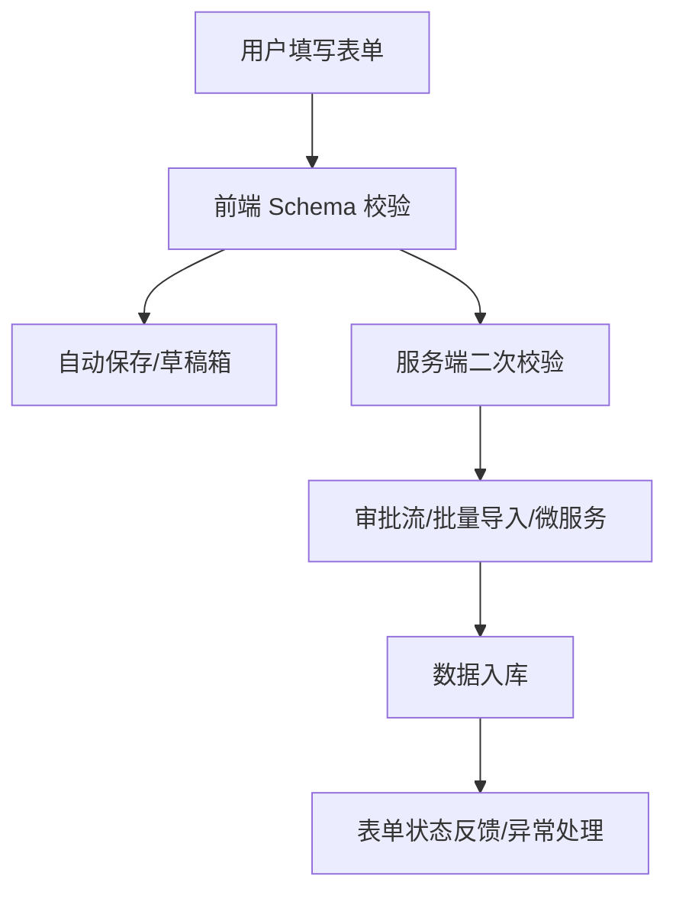

# 前言
大家好，我是鲫小鱼。是一名`不写前端代码`的前端工程师，热衷于分享非前端的知识，带领切图仔逃离切图圈子，欢迎关注我，微信公众号：`《鲫小鱼不正经》`。欢迎点赞、收藏、关注，一键三连！！

# 第十五章：复杂表单处理与数据校验

## 理论讲解

### 1. 表单设计原则与企业级场景
- 表单是企业级应用中最常见的交互方式，涉及注册、登录、下单、审批、数据录入等。
- 设计表单时需关注：用户体验、数据准确性、性能、移动端适配、a11y、国际化、可维护性。
- 企业级表单常见场景：多步骤表单、动态字段、嵌套表单、批量录入、文件上传、复杂校验、权限控制等。

### 2. React 表单管理主流方案
- **React Hook Form**：轻量、性能优、与 TypeScript 友好，支持 Schema 校验（如 Zod、Yup）。
- **Formik**：老牌方案，API 直观，适合中小型表单。
- **react-final-form**：适合高度定制场景。
- 推荐企业级项目优先选用 React Hook Form + Zod。

### 3. 表单状态管理与性能优化
- 表单状态包括：字段值、校验状态、错误信息、提交状态、脏/未脏、依赖字段等。
- React Hook Form 采用“非受控组件+Ref”方案，极大减少重渲染，适合大表单。
- 性能优化建议：分步渲染、虚拟滚动、延迟校验、字段懒加载。

### 4. 客户端与服务端数据校验
- 客户端校验提升用户体验，服务端校验保障数据安全。
- 推荐统一用 Zod/Yup 等 Schema，前后端复用校验规则。
- 常见校验类型：必填、格式、长度、范围、正则、自定义、异步（如用户名唯一性）。

### 5. 移动端适配、a11y 与国际化
- 表单布局需响应式，按钮/输入框适配触屏，支持键盘弹出、自动填充。
- a11y：label/aria-label、错误提示、Tab 顺序、语音阅读。
- 国际化：所有提示、错误信息多语言，支持 RTL 布局。

---

## 理论讲解（进阶扩展）

### 6. 表单可用性与易用性设计
- 支持输入法优化（如手机号自动格式化、银行卡分段、日期选择器等）。
- 自动保存与草稿恢复：用户填写中断后可恢复，减少数据丢失。
- 分步引导与表单分组：提升长表单体验，减少用户压力。
- 表单权限与审批流：不同角色可见/可编辑字段，支持多级审批。

### 7. 表单与后端接口协作
- 防抖/节流：防止频繁请求，提升性能。
- 幂等性与事务处理：防止重复提交，保证数据一致性。
- 批量提交与导入：支持Excel/CSV批量导入，后端批量校验与事务。
- 表单与微服务/Serverless协作：表单数据分发到不同后端服务。

### 8. 表单安全与合规
- 防XSS/CSRF：所有输入转义，接口加CSRF Token。
- 验证码/机器人防护：集成图形验证码、滑块、短信/邮箱验证码。
- 敏感信息加密与脱敏：如身份证、手机号、银行卡等。
- 合规：数据存储与传输加密，符合GDPR/等保等。

### 9. 团队协作与可维护性
- 表单组件化拆分，复用通用输入组件。
- Storybook/Playroom 进行表单UI与交互预览。
- 自动化测试（Jest/Testing Library/Cypress）保障表单质量。
- CI/CD集成，表单变更自动测试与部署。

---

## 详细代码示例

### 1. 多步骤表单（React Hook Form + Zod）

```tsx
// components/MultiStepForm.tsx
import { useForm, FormProvider } from 'react-hook-form';
import { zodResolver } from '@hookform/resolvers/zod';
import * as z from 'zod';
import Step1 from './Step1';
import Step2 from './Step2';
import Step3 from './Step3';

const schema = z.object({
  name: z.string().min(2, '姓名至少2个字'),
  email: z.string().email('邮箱格式错误'),
  address: z.string().min(5, '地址过短'),
  agree: z.boolean().refine(val => val, '请同意协议'),
});

export default function MultiStepForm() {
  const methods = useForm({ resolver: zodResolver(schema), mode: 'onBlur' });
  const [step, setStep] = useState(1);
  const onSubmit = data => {/* 提交到后端 */};
  return (
    <FormProvider {...methods}>
      <form onSubmit={methods.handleSubmit(onSubmit)}>
        {step === 1 && <Step1 onNext={() => setStep(2)} />}
        {step === 2 && <Step2 onNext={() => setStep(3)} onBack={() => setStep(1)} />}
        {step === 3 && <Step3 onBack={() => setStep(2)} />}
      </form>
    </FormProvider>
  );
}
```

### 2. 动态字段与嵌套表单

```tsx
// components/DynamicFields.tsx
import { useFieldArray, useFormContext } from 'react-hook-form';

export default function DynamicFields() {
  const { control, register } = useFormContext();
  const { fields, append, remove } = useFieldArray({ control, name: 'items' });
  return (
    <div>
      {fields.map((field, idx) => (
        <div key={field.id} className="flex gap-2">
          <input {...register(`items.${idx}.name`)} placeholder="商品名" />
          <input {...register(`items.${idx}.qty`)} type="number" placeholder="数量" />
          <button type="button" onClick={() => remove(idx)}>删除</button>
        </div>
      ))}
      <button type="button" onClick={() => append({ name: '', qty: 1 })}>添加商品</button>
    </div>
  );
}
```

### 3. 文件上传与异步校验

```tsx
// components/FileUpload.tsx
import { useFormContext } from 'react-hook-form';

export default function FileUpload() {
  const { register, setError, clearErrors } = useFormContext();
  const validateFile = async (file: File) => {
    if (file.size > 2 * 1024 * 1024) {
      setError('file', { message: '文件不能超过2MB' });
      return false;
    }
    clearErrors('file');
    return true;
  };
  return (
    <input type="file" {...register('file', { validate: validateFile })} />
  );
}
```

### 4. 服务端校验与 API 协作

```ts
// pages/api/validate-username.ts
import { NextApiRequest, NextApiResponse } from 'next';

export default async function handler(req: NextApiRequest, res: NextApiResponse) {
  const { username } = req.body;
  // 假设查数据库
  const exists = await db.user.findUnique({ where: { username } });
  if (exists) return res.status(400).json({ error: '用户名已存在' });
  res.json({ ok: true });
}
```

---

## 复杂代码示例与企业级场景

### 5. 分组表单与审批流

```tsx
// components/ApprovalForm.tsx
import { useForm, FormProvider } from 'react-hook-form';
import { zodResolver } from '@hookform/resolvers/zod';
import * as z from 'zod';

const schema = z.object({
  applicant: z.string().min(2),
  department: z.string(),
  amount: z.number().min(1),
  reason: z.string().min(5),
  approvers: z.array(z.string()).min(1),
});

export default function ApprovalForm() {
  const methods = useForm({ resolver: zodResolver(schema) });
  const onSubmit = data => {/* 提交到Server Actions或API */};
  return (
    <FormProvider {...methods}>
      <form onSubmit={methods.handleSubmit(onSubmit)}>
        <fieldset>
          <legend>申请信息</legend>
          <input {...methods.register('applicant')} placeholder="申请人" />
          <input {...methods.register('department')} placeholder="部门" />
        </fieldset>
        <fieldset>
          <legend>审批信息</legend>
          <input {...methods.register('amount')} type="number" placeholder="金额" />
          <textarea {...methods.register('reason')} placeholder="理由" />
          {/* 动态添加审批人 */}
        </fieldset>
        <button type="submit">提交审批</button>
      </form>
    </FormProvider>
  );
}
```

### 6. 批量导入与文件解析

```tsx
// components/BulkImport.tsx
import { useFormContext } from 'react-hook-form';

export default function BulkImport() {
  const { setValue } = useFormContext();
  const handleFile = async (e) => {
    const file = e.target.files[0];
    const text = await file.text();
    // 假设CSV解析
    const rows = text.split('\n').map(line => line.split(','));
    setValue('items', rows.map(([name, qty]) => ({ name, qty: Number(qty) })));
  };
  return <input type="file" accept=".csv" onChange={handleFile} />;
}
```

### 7. 表单自动保存与草稿恢复

```tsx
// hooks/useFormDraft.ts
import { useEffect } from 'react';
export function useFormDraft(form, key) {
  useEffect(() => {
    const saved = localStorage.getItem(key);
    if (saved) form.reset(JSON.parse(saved));
    const unsub = form.watch((data) => {
      localStorage.setItem(key, JSON.stringify(data));
    });
    return () => unsub.unsubscribe();
  }, [form, key]);
}
```

### 8. 表单与Server Actions/微服务协作

```tsx
// app/api/submit-form/route.ts
import { NextRequest } from 'next/server';
import { z } from 'zod';

const schema = z.object({ name: z.string(), email: z.string().email() });

export async function POST(req: NextRequest) {
  const data = await req.json();
  const parsed = schema.safeParse(data);
  if (!parsed.success) return new Response('参数错误', { status: 400 });
  // 分发到微服务
  await fetch('https://microservice/api', { method: 'POST', body: JSON.stringify(parsed.data) });
  return new Response('ok');
}
```

### 9. 表单安全：验证码与CSRF

```tsx
// components/Captcha.tsx
export default function Captcha({ onVerify }) {
  // 可集成第三方验证码服务
  return ;
}

// pages/api/captcha.ts
export default function handler(req, res) {
  // 生成验证码图片并返回
}
```

### 10. 表单自动化测试

```js
// __tests__/MultiStepForm.test.tsx
import { render, screen, fireEvent } from '@testing-library/react';
import MultiStepForm from '../components/MultiStepForm';

test('多步骤表单流程', () => {
  render(<MultiStepForm />);
  fireEvent.change(screen.getByPlaceholderText('姓名'), { target: { value: '张三' } });
  fireEvent.click(screen.getByText('下一步'));
  // ...后续步骤断言
});
```

---

## 企业级实战案例（扩展）

### 1. 审批流表单
- 多级审批、动态审批人、审批历史、权限分级。
- 支持审批人拒绝/转交/加签，流程可视化。

### 2. 批量导入与数据校验
- 支持Excel/CSV批量导入，前端解析预览，后端批量校验与事务。
- 导入失败可下载错误报告，支持断点续传。

### 3. 表单草稿箱与自动保存
- 用户填写中断后可恢复草稿，支持多端同步。
- 草稿定期自动保存，支持手动保存/恢复/删除。

### 4. 表单权限分级与审批流
- 不同角色可见/可编辑字段，审批流动态配置。
- 支持表单与Serverless/微服务架构集成。

---

## 最佳实践（扩展）
- **安全**：所有表单接口加CSRF Token，敏感信息加密，验证码防机器人。
- **性能**：大表单分步渲染、虚拟滚动、批量导入分片处理。
- **合规**：数据脱敏、加密存储，符合GDPR/等保。
- **协作**：表单组件化、Storybook预览、自动化测试、CI/CD集成。
- **测试**：关键表单流程单元+端到端测试，覆盖异常与边界场景。
- **监控**：表单异常、导入失败、审批流异常等日志采集与告警。

---

## 常见问题与解决方案（扩展）

### Q7: 表单草稿丢失如何恢复？
A: 用localStorage/IndexedDB自动保存，支持多端同步可用云存储。

### Q8: 批量导入失败如何定位问题？
A: 前端预览校验，后端返回详细错误报告，支持下载失败明细。

### Q9: 审批流异常如何处理？
A: 审批节点失败自动回滚，异常节点高亮，支持重试/转交。

### Q10: 表单与微服务/Serverless如何协作？
A: 表单数据分发到不同服务，接口幂等，失败自动补偿。

### Q11: 如何做表单自动化测试？
A: 用Jest/Testing Library/Cypress覆盖多步骤、动态、批量、异常等场景。

---

## 配图说明（扩展）



> 复杂表单分步、审批流、批量导入、自动保存与后端交互全流程示意图。

> 最后感谢阅读！欢迎关注我，微信公众号：`《鲫小鱼不正经》`。欢迎点赞、收藏、关注，一键三连！！！