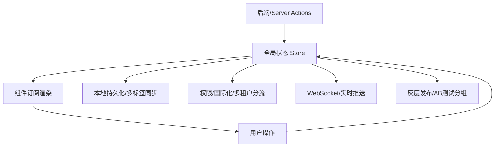

# 前言
大家好，我是鲫小鱼。是一名`不写前端代码`的前端工程师，热衷于分享非前端的知识，带领切图仔逃离切图圈子，欢迎关注我，微信公众号：`《鲫小鱼不正经》`。欢迎点赞、收藏、关注，一键三连！！

# 第十六章：Next.js 中的状态管理方案

## 理论讲解

### 1. Next.js 应用中的状态管理需求
- Next.js 支持 SSR、SSG、CSR、ISR 等多种渲染模式，状态管理需兼容服务端与客户端。
- 企业级项目常见状态类型：全局状态（如用户信息、主题、权限）、局部状态（如表单、弹窗）、异步数据（如接口数据、WebSocket 实时数据）、持久化状态（如本地存储、Cookie）。
- 状态管理的挑战：服务端与客户端同步、性能优化、可维护性、团队协作、类型安全、持久化、与后端协作。

### 2. 主流状态管理方案对比
- **Context API**：React 内置，适合简单全局状态，性能有限。
- **Redux Toolkit**：企业级标准，强大生态，支持中间件、持久化、DevTools，适合复杂业务。
- **Zustand**：轻量、极简、TypeScript 友好，天然支持 SSR/Next.js，适合中小型项目和局部全局状态。
- **Recoil**：原子化状态，适合复杂组件树，易于组合。
- **Jotai/MobX**：响应式、极简，适合特定场景。
- **SWR/React Query**：专注异步数据获取与缓存，适合接口数据管理。
- 推荐组合：Zustand/Redux 管理全局业务状态，SWR/React Query 管理异步数据。

### 3. 状态持久化与服务端协作
- 状态持久化：localStorage、sessionStorage、IndexedDB、Cookie，常用于主题、Token、草稿等。
- SSR/SSG/ISR 场景下，需注意服务端与客户端状态同步。
- 状态与 Server Actions、API Routes 协作：如全局状态变更后自动刷新页面、推送通知等。

### 4. 企业级状态管理最佳实践
- 状态拆分：全局/局部/异步/持久化分层管理，避免“大一统”Store。
- 类型安全：TypeScript 全面约束，减少运行时错误。
- 性能优化：避免不必要的重渲染，按需订阅、懒加载、分片更新。
- 团队协作：统一目录结构、命名规范、代码审查、自动化测试。
- 状态监控与调试：集成 Redux DevTools、LogRocket、Sentry 等。

---

## 详细代码示例

### 1. 使用 Zustand 管理全局主题模式

```ts
// stores/theme.ts
import create from 'zustand';

type ThemeState = {
  mode: 'light' | 'dark';
  toggle: () => void;
};

export const useThemeStore = create<ThemeState>((set) => ({
  mode: 'light',
  toggle: () => set((state) => ({ mode: state.mode === 'light' ? 'dark' : 'light' })),
}));
```

```tsx
// components/ThemeToggle.tsx
import { useThemeStore } from '../stores/theme';

export default function ThemeToggle() {
  const mode = useThemeStore((s) => s.mode);
  const toggle = useThemeStore((s) => s.toggle);
  return (
    <button onClick={toggle} aria-label="切换主题" className="p-2">
      当前模式：{mode === 'light' ? '亮色' : '暗色'}
    </button>
  );
}
```

### 2. Redux Toolkit 管理复杂业务状态

```ts
// stores/userSlice.ts
import { createSlice, PayloadAction } from '@reduxjs/toolkit';

interface UserState {
  name: string;
  role: string;
  token: string;
}

const initialState: UserState = { name: '', role: '', token: '' };

const userSlice = createSlice({
  name: 'user',
  initialState,
  reducers: {
    setUser(state, action: PayloadAction<UserState>) {
      return { ...state, ...action.payload };
    },
    clearUser() {
      return initialState;
    },
  },
});

export const { setUser, clearUser } = userSlice.actions;
export default userSlice.reducer;
```

```ts
// stores/index.ts
import { configureStore } from '@reduxjs/toolkit';
import userReducer from './userSlice';

export const store = configureStore({
  reducer: { user: userReducer },
});

export type RootState = ReturnType<typeof store.getState>;
export type AppDispatch = typeof store.dispatch;
```

```tsx
// pages/_app.tsx
import { Provider } from 'react-redux';
import { store } from '../stores';

export default function App({ Component, pageProps }) {
  return (
    <Provider store={store}>
      <Component {...pageProps} />
    </Provider>
  );
}
```

### 3. 状态持久化与 SSR 协作

```ts
// stores/theme.ts (持久化)
import create from 'zustand';
import { persist } from 'zustand/middleware';

export const useThemeStore = create(persist(
  (set) => ({
    mode: 'light',
    toggle: () => set((state) => ({ mode: state.mode === 'light' ? 'dark' : 'light' })),
  }),
  { name: 'theme-mode' }
));
```

```tsx
// pages/_document.tsx (SSR 同步主题)
import { Html, Head, Main, NextScript } from 'next/document';
export default function Document() {
  return (
    <Html>
      <Head />
      <body className="bg-white dark:bg-black">
        <Main />
        <NextScript />
      </body>
    </Html>
  );
}
```

### 4. Recoil 原子化状态管理

```ts
// stores/atoms.ts
import { atom } from 'recoil';

export const counterAtom = atom<number>({
  key: 'counter',
  default: 0,
});
```

```tsx
// components/Counter.tsx
import { useRecoilState } from 'recoil';
import { counterAtom } from '../stores/atoms';

export default function Counter() {
  const [count, setCount] = useRecoilState(counterAtom);
  return (
    <div>
      <button onClick={() => setCount(count - 1)}>-</button>
      <span>{count}</span>
      <button onClick={() => setCount(count + 1)}>+</button>
    </div>
  );
}
```

### 5. SWR/React Query 管理异步数据

```tsx
// components/UserProfile.tsx
import useSWR from 'swr';

const fetcher = (url) => fetch(url).then((res) => res.json());

export default function UserProfile() {
  const { data, error, isLoading } = useSWR('/api/user', fetcher);
  if (isLoading) return <div>加载中...</div>;
  if (error) return <div>加载失败</div>;
  return <div>用户名：{data.name}</div>;
}
```

---

## 实战项目：实时通知中心

### 1. 需求分析
- 全局管理消息数据，支持未读计数、消息标记为已读、WebSocket 实时推送。
- 支持移动端适配、a11y、国际化、性能优化、错误处理。
- 与后端/Server Actions 协作，消息状态持久化。

### 2. 目录结构
```
stores/
  notification.ts
components/
  NotificationList.tsx
  NotificationBell.tsx
pages/
  dashboard.tsx
api/
  notifications.ts
```

### 3. 关键代码片段
- 用 Zustand 管理全局消息状态，SWR 拉取历史消息，WebSocket 推送新消息。
- 消息已读状态同步到后端，未读计数全局展示。
- 组件响应式布局，支持移动端和无障碍。

```ts
// stores/notification.ts
import create from 'zustand';

type Notification = { id: string; content: string; read: boolean };
type NotificationState = {
  list: Notification[];
  unread: number;
  add: (n: Notification) => void;
  markRead: (id: string) => void;
  setList: (list: Notification[]) => void;
};

export const useNotificationStore = create<NotificationState>((set) => ({
  list: [],
  unread: 0,
  add: (n) => set((s) => ({ list: [n, ...s.list], unread: s.unread + 1 })),
  markRead: (id) => set((s) => {
    const list = s.list.map((n) => n.id === id ? { ...n, read: true } : n);
    return { list, unread: list.filter((n) => !n.read).length };
  }),
  setList: (list) => set({ list, unread: list.filter((n) => !n.read).length }),
}));
```

```tsx
// components/NotificationBell.tsx
import { useNotificationStore } from '../stores/notification';

export default function NotificationBell() {
  const unread = useNotificationStore((s) => s.unread);
  return (
    <button aria-label="通知" className="relative">
      <span>🔔</span>
      {unread > 0 && <span className="badge">{unread}</span>}
    </button>
  );
}
```

```tsx
// components/NotificationList.tsx
import { useNotificationStore } from '../stores/notification';

export default function NotificationList() {
  const list = useNotificationStore((s) => s.list);
  const markRead = useNotificationStore((s) => s.markRead);
  return (
    <ul>
      {list.map((n) => (
        <li key={n.id} className={n.read ? 'read' : 'unread'}>
          {n.content}
          {!n.read && <button onClick={() => markRead(n.id)}>标记为已读</button>}
        </li>
      ))}
    </ul>
  );
}
```

---

## 理论讲解（进阶扩展）

### 5. 状态提升与下沉、隔离与作用域
- 状态提升：将局部状态提升到最近的公共父组件，实现兄弟组件通信。
- 状态下沉：将全局状态拆分为局部状态，减少不必要的全局依赖。
- 状态隔离：通过 Context、Provider、作用域 Store 实现多实例隔离（如多弹窗、嵌套表单）。
- 作用域 Store：如 Recoil 的 Scope、Zustand 的 createStore，支持多租户/多实例。

### 6. 跨页面/多标签同步与一致性
- 多标签/多窗口同步：用 BroadcastChannel、localStorage 事件、Service Worker 实现。
- 状态一致性：如用户登出、Token 失效、全局通知等需多标签同步。
- 示例：用户在A标签页登出，B标签页自动同步登出。

### 7. 状态安全、权限与国际化
- 状态安全：Token/敏感信息仅存内存或 HttpOnly Cookie，防止XSS/CSRF。
- 权限控制：全局状态中存储用户角色/权限，组件/路由按权限渲染。
- 国际化/多租户：全局状态存储当前语言、租户ID，支持多语言/多租户切换。

### 8. 状态与异步流、缓存失效、灰度发布
- WebSocket/SSE/GraphQL订阅：全局状态与实时数据流协作，自动推送/刷新。
- 缓存失效/手动刷新：如 React Query/SWR 的 mutate、invalidateQueries。
- 灰度发布/AB测试：全局状态存储实验分组，按分组渲染不同UI/功能。

---

## 复杂代码示例与企业级场景

### 6. 多标签/多窗口状态同步

```ts
// hooks/useBroadcast.ts
import { useEffect } from 'react';
export function useBroadcast(key: string, onMessage: (data: any) => void) {
  useEffect(() => {
    const bc = new BroadcastChannel(key);
    bc.onmessage = (e) => onMessage(e.data);
    return () => bc.close();
  }, [key, onMessage]);
}

// 在全局状态变更时同步到其他标签页
useBroadcast('auth', (data) => {
  if (data.type === 'logout') {
    // 清理本地状态
  }
});
```

### 7. 状态与权限控制

```tsx
// components/ProtectedButton.tsx
import { useSelector } from 'react-redux';
export default function ProtectedButton({ role, ...props }) {
  const userRole = useSelector((s) => s.user.role);
  if (userRole !== role) return null;
  return <button {...props} />;
}
```

### 8. 状态与国际化/多租户

```ts
// stores/i18n.ts
import create from 'zustand';
export const useI18nStore = create((set) => ({
  lang: 'zh',
  setLang: (lang) => set({ lang }),
}));

// 切换语言
useI18nStore.getState().setLang('en');
```

### 9. 状态与WebSocket实时协作

```ts
// hooks/useWebSocket.ts
import { useEffect } from 'react';
export function useWebSocket(url, onMessage) {
  useEffect(() => {
    const ws = new WebSocket(url);
    ws.onmessage = (e) => onMessage(JSON.parse(e.data));
    return () => ws.close();
  }, [url, onMessage]);
}

// 在通知中心中实时推送新消息
useWebSocket('wss://api/ws', (msg) => useNotificationStore.getState().add(msg));
```

### 10. 状态与缓存失效/手动刷新

```tsx
// components/RefreshButton.tsx
import { mutate } from 'swr';
export default function RefreshButton() {
  return <button onClick={() => mutate('/api/user')}>手动刷新用户数据</button>;
}
```

### 11. 状态与灰度发布/AB测试

```ts
// stores/experiment.ts
import create from 'zustand';
export const useExperimentStore = create(() => ({
  group: Math.random() > 0.5 ? 'A' : 'B',
}));

// 组件内按分组渲染
const group = useExperimentStore((s) => s.group);
return group === 'A' ? <NewUI /> : <OldUI />;
```

### 12. 状态自动化测试

```js
// __tests__/themeStore.test.ts
import { act } from 'react-dom/test-utils';
import { useThemeStore } from '../stores/theme';

test('主题切换', () => {
  act(() => {
    useThemeStore.getState().toggle();
  });
  expect(useThemeStore.getState().mode).toBe('dark');
});
```

---

## 企业级实战案例（扩展）

### 1. 多标签同步通知中心
- 用户在任一标签页操作（如登出、消息已读），所有标签页自动同步。
- BroadcastChannel/Service Worker 实现全局状态同步。

### 2. 权限分级的全局状态管理
- 不同角色/租户拥有不同菜单、按钮、数据权限。
- 全局状态存储权限，组件/路由按权限渲染。

### 3. 国际化与多租户状态管理
- 全局状态存储当前语言、租户ID，支持多语言/多租户切换。
- 状态与后端协作，切换时自动刷新数据。

### 4. 状态与Serverless/微服务集成
- 状态变更后自动推送到微服务/Serverless，支持实时通知、全局刷新。

### 5. 状态与灰度发布/AB测试
- 全局状态存储实验分组，按分组渲染不同UI/功能，支持动态切换。

---

## 最佳实践（扩展）
- **安全**：Token/敏感信息仅存内存或 HttpOnly Cookie，状态变更需鉴权。
- **性能**：多标签同步用 BroadcastChannel，WebSocket/SSE 实时推送，缓存失效及时刷新。
- **协作**：统一状态管理方案、目录结构、命名规范，关键状态流程自动化测试。
- **监控**：状态异常、同步失败、权限越权等日志采集与告警。
- **合规**：多租户/国际化状态隔离，敏感信息加密，符合GDPR/等保。

---

## 常见问题与解决方案（扩展）

### Q6: 多标签/多窗口状态如何同步？
A: 用 BroadcastChannel、localStorage 事件、Service Worker 实现，关键状态变更时广播消息。

### Q7: 如何防止状态泄露与权限越权？
A: Token/敏感信息仅存内存/HttpOnly Cookie，组件/路由按权限渲染，后端二次校验。

### Q8: 状态与国际化/多租户如何协作？
A: 全局状态存储当前语言/租户ID，切换时自动刷新数据，后端接口支持多语言/多租户。

### Q9: 状态与WebSocket/实时推送如何集成？
A: 全局状态与 WebSocket/SSE/GraphQL 订阅协作，推送新数据自动更新 Store。

### Q10: 状态与灰度发布/AB测试如何落地？
A: 全局状态存储实验分组，按分组渲染不同UI/功能，支持动态切换与数据分析。

---

## 配图说明（扩展）



> Next.js 状态管理多标签同步、权限分级、国际化、灰度发布、实时推送等全流程示意图。

> 最后感谢阅读！欢迎关注我，微信公众号：`《鲫小鱼不正经》`。欢迎点赞、收藏、关注，一键三连！！！