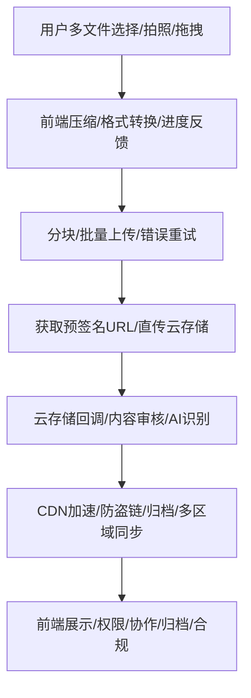

# 前言
大家好，我是鲫小鱼。是一名`不写前端代码`的前端工程师，热衷于分享非前端的知识，带领切图仔逃离切图圈子，欢迎关注我，微信公众号：`《鲫小鱼不正经》`。欢迎点赞、收藏、关注，一键三连！！

# 第十七章：文件上传与云存储服务集成

## 理论讲解

### 1. 文件上传的原理与挑战
- 文件上传是企业级应用中常见需求，涉及图片、视频、文档、音频等多种类型。
- 挑战：大文件/多文件上传、断点续传、分块上传、进度反馈、移动端兼容、权限控制、安全防护、性能优化、云存储集成。
- 前端需支持多种交互（选择、拖拽、拍照），后端需高效处理文件流、校验、存储、回调。

### 2. 前后端协作与分块上传
- 小文件可直接通过表单或 fetch/AJAX 上传。
- 大文件/不稳定网络建议分块上传（前端将文件切片，逐块上传，后端合并）。
- 断点续传：前端记录已上传分块，断线后可继续上传剩余部分。
- 进度反馈：前端监听上传进度，实时展示进度条。

### 3. 预签名 URL 与云存储直传
- 预签名 URL（Presigned URL）：后端生成带权限的临时上传链接，前端直传到云存储（如 S3、OSS、Cloudinary），减轻后端压力。
- 优势：安全、性能高、支持大文件、权限可控。
- 典型流程：前端请求后端获取预签名 URL，前端用该 URL 直接 PUT/POST 文件到云存储。

### 4. 云存储服务集成
- 主流云存储：AWS S3、阿里云 OSS、腾讯云 COS、Cloudinary、七牛云等。
- 集成方式：SDK/REST API/GraphQL，支持多种语言和平台。
- 权限控制：Bucket 策略、Token、预签名 URL、回调校验。
- 文件管理：上传、下载、删除、批量操作、生命周期管理、CDN 加速。

### 5. 移动端适配、安全与性能优化
- 移动端需支持拍照/选择、压缩、断点续传、弱网优化。
- 安全：校验文件类型/大小、鉴权、XSS/CSRF 防护、病毒扫描、敏感信息脱敏。
- 性能：分块/并发上传、CDN 加速、图片压缩、懒加载、缓存。
- a11y/国际化：上传按钮、进度条、错误提示需支持无障碍和多语言。

---

## 详细代码示例

### 1. 前端文件选择、拖拽、拍照与压缩

```tsx
// components/FileUploader.tsx
import { useRef, useState } from 'react';

export default function FileUploader({ onUpload }) {
  const inputRef = useRef();
  const [preview, setPreview] = useState(null);
  const handleFile = (e) => {
    const file = e.target.files[0];
    setPreview(URL.createObjectURL(file));
    onUpload(file);
  };
  return (
    <div>
      <input type="file" ref={inputRef} onChange={handleFile} accept="image/*" capture="environment" />
      {preview && }
      <button onClick={() => inputRef.current.click()}>选择/拍照上传</button>
    </div>
  );
}
```

### 2. 分块上传与断点续传

```ts
// utils/chunkUpload.ts
export async function chunkUpload(file, onProgress) {
  const chunkSize = 2 * 1024 * 1024; // 2MB
  const total = Math.ceil(file.size / chunkSize);
  let uploaded = 0;
  for (let i = 0; i < total; i++) {
    const chunk = file.slice(i * chunkSize, (i + 1) * chunkSize);
    // 假设后端 /api/upload-chunk 支持分块
    await fetch('/api/upload-chunk', {
      method: 'POST',
      body: chunk,
      headers: { 'X-Chunk-Index': i, 'X-Chunk-Total': total, 'X-File-Name': file.name },
    });
    uploaded++;
    onProgress(Math.round((uploaded / total) * 100));
  }
  // 上传完成后通知后端合并
  await fetch('/api/merge-chunks', { method: 'POST', body: JSON.stringify({ fileName: file.name }) });
}
```

### 3. 获取预签名 URL 并直传云存储

```ts
// pages/api/presign.ts
import { S3Client, PutObjectCommand } from '@aws-sdk/client-s3';
import { getSignedUrl } from '@aws-sdk/s3-request-presigner';

export default async function handler(req, res) {
  const { fileName, fileType } = req.body;
  const s3 = new S3Client({ region: 'ap-northeast-1', credentials: { accessKeyId: 'xxx', secretAccessKey: 'yyy' } });
  const command = new PutObjectCommand({ Bucket: 'your-bucket', Key: fileName, ContentType: fileType });
  const url = await getSignedUrl(s3, command, { expiresIn: 300 });
  res.json({ url });
}
```

```tsx
// utils/uploadToS3.ts
export async function uploadToS3(file) {
  const { url } = await fetch('/api/presign', {
    method: 'POST',
    body: JSON.stringify({ fileName: file.name, fileType: file.type }),
    headers: { 'Content-Type': 'application/json' },
  }).then(res => res.json());
  await fetch(url, { method: 'PUT', body: file, headers: { 'Content-Type': file.type } });
}
```

### 4. 后端 API Route 处理文件流

```ts
// pages/api/upload-chunk.ts
import formidable from 'formidable';
import fs from 'fs';

export const config = { api: { bodyParser: false } };
export default async function handler(req, res) {
  const form = new formidable.IncomingForm();
  form.parse(req, (err, fields, files) => {
    // 保存分块到临时目录
    // ...
    res.json({ ok: true });
  });
}
```

### 5. 云存储服务集成（以 S3/OSS/Cloudinary 为例）

```ts
// utils/s3.ts
import { S3Client, PutObjectCommand, DeleteObjectCommand } from '@aws-sdk/client-s3';
const s3 = new S3Client({ region: 'ap-northeast-1', credentials: { accessKeyId: 'xxx', secretAccessKey: 'yyy' } });
export async function uploadToS3Buffer(buffer, fileName, mime) {
  await s3.send(new PutObjectCommand({ Bucket: 'your-bucket', Key: fileName, Body: buffer, ContentType: mime }));
}
export async function deleteFromS3(fileName) {
  await s3.send(new DeleteObjectCommand({ Bucket: 'your-bucket', Key: fileName }));
}
```

---

## 实战项目：图片分享应用

### 1. 需求分析
- 用户可上传图片，支持拍照/选择、进度条、移动端适配。
- 图片存储于云服务（S3/OSS/Cloudinary），支持展示、删除、权限控制。
- 支持多语言、a11y、性能优化、错误处理。

### 2. 目录结构
```
components/
  FileUploader.tsx
  ImageGallery.tsx
utils/
  chunkUpload.ts
  uploadToS3.ts
  s3.ts
pages/
  api/
    presign.ts
    upload-chunk.ts
    merge-chunks.ts
  gallery.tsx
```

### 3. 关键代码片段
- 见上方详细代码示例
- 图片上传用预签名 URL 直传 S3，支持分块/断点续传
- 图片展示用 CDN 加速，支持懒加载、移动端适配
- 删除图片需鉴权，后端调用 S3/OSS/Cloudinary API
- 错误信息多语言，上传/删除按钮加 aria-label

### 4. 项目亮点
- 支持大文件/多文件上传、断点续传、进度反馈
- 云存储直传，减轻后端压力，提升性能
- 权限控制、安全校验、移动端适配、a11y、国际化
- 代码结构清晰，易于团队协作和维护

---

## 理论讲解（进阶扩展）

### 6. 多文件/批量上传与元数据管理
- 多文件上传：前端支持多选、拖拽、批量上传，后端批量处理、并发优化。
- 文件元数据：如文件名、类型、大小、上传人、标签、业务ID，便于后续管理与检索。
- 批量上传进度与错误重试：每个文件独立进度，失败可重试，整体进度聚合展示。

### 7. 图片/视频压缩、格式转换与内容审核
- 图片压缩：前端用 canvas/Compressor.js/WebAssembly，后端用 sharp/imagemagick，提升上传速度，节省存储。
- 视频转码：前端用 ffmpeg.wasm，后端用云转码服务，兼容多端播放。
- 内容审核/AI识别：集成云服务（如阿里云/腾讯云/百度云内容安全），自动识别违规/敏感内容。
- 文件标签/AI打标：上传后自动识别图片/视频内容，生成标签，便于检索。

### 8. 云存储回调、异步处理与生命周期
- 回调/事件通知：云存储上传/删除/转码完成后回调业务后端，支持异步处理、消息队列。
- 文件生命周期：自动归档、定期清理、冷存储、合规删除。
- CDN与防盗链：图片/视频用CDN加速，配置防盗链/Referer限制，防止盗链滥用。

### 9. 团队协作、CI/CD与合规
- 团队协作：多人协作上传/管理，权限分级、操作日志、审批流。
- CI/CD：上传/处理流程自动化测试、集成部署、异常告警。
- 合规：敏感信息脱敏、加密存储、合规删除、GDPR/等保等。

---

## 复杂代码示例与企业级场景

### 6. 多文件/批量上传与进度条

```tsx
// components/MultiFileUploader.tsx
import { useRef, useState } from 'react';
export default function MultiFileUploader({ onUpload }) {
  const inputRef = useRef();
  const [files, setFiles] = useState([]);
  const [progress, setProgress] = useState({});
  const handleFiles = (e) => {
    const fs = Array.from(e.target.files);
    setFiles(fs);
    fs.forEach((file) => {
      onUpload(file, (p) => setProgress((prev) => ({ ...prev, [file.name]: p })));
    });
  };
  return (
    <div>
      <input type="file" ref={inputRef} multiple onChange={handleFiles} />
      <button onClick={() => inputRef.current.click()}>批量上传</button>
      <ul>
        {files.map((file) => (
          <li key={file.name}>
            {file.name} - {progress[file.name] || 0}%
          </li>
        ))}
      </ul>
    </div>
  );
}
```

### 7. 图片压缩与格式转换

```ts
// utils/compressImage.ts
export async function compressImage(file, quality = 0.7) {
  return new Promise((resolve) => {
    const img = new window.Image();
    img.onload = () => {
      const canvas = document.createElement('canvas');
      canvas.width = img.width;
      canvas.height = img.height;
      canvas.getContext('2d').drawImage(img, 0, 0);
      canvas.toBlob((blob) => resolve(blob), 'image/jpeg', quality);
    };
    img.src = URL.createObjectURL(file);
  });
}
```

### 8. 云存储回调与内容审核

```ts
// pages/api/callback.ts
export default async function handler(req, res) {
  // 云存储回调，校验签名，处理业务逻辑
  // 如内容审核、AI识别、业务入库、异步通知
  res.json({ ok: true });
}
```

### 9. CDN加速与图片懒加载

```tsx
// components/LazyImage.tsx
import { useRef, useEffect, useState } from 'react';
export default function LazyImage({ src, alt }) {
  const ref = useRef();
  const [show, setShow] = useState(false);
  useEffect(() => {
    const io = new IntersectionObserver(([entry]) => {
      if (entry.isIntersecting) setShow(true);
    });
    io.observe(ref.current);
    return () => io.disconnect();
  }, []);
  return ;
}
```

### 10. 上传进度与错误重试

```ts
// utils/retryUpload.ts
export async function retryUpload(uploadFn, maxRetry = 3) {
  let attempt = 0;
  while (attempt < maxRetry) {
    try {
      return await uploadFn();
    } catch (e) {
      attempt++;
      if (attempt >= maxRetry) throw e;
    }
  }
}
```

---

## 企业级实战案例（扩展）

### 1. 批量上传与内容审核
- 支持多文件批量上传，前端压缩，后端并发处理。
- 上传后自动触发内容审核/AI识别，违规文件自动拦截。
- 支持批量删除、批量归档、批量标签。

### 2. 文件生命周期与归档
- 文件上传后自动归档、定期清理、冷存储、合规删除。
- 支持文件归档审批流、操作日志、异常告警。

### 3. 团队协作与CI/CD
- 多人协作上传/管理，权限分级、操作日志、审批流。
- 上传/处理流程自动化测试、集成部署、异常监控。

### 4. CDN加速与防盗链
- 图片/视频用CDN加速，配置防盗链/Referer限制，防止盗链滥用。
- CDN缓存失效自动刷新，支持多区域/多活部署。

---

## 最佳实践（扩展）
- **安全**：文件类型/大小/内容/病毒校验，预签名URL权限最小化，接口鉴权，内容审核。
- **性能**：前端压缩、分块/并发上传、CDN加速、懒加载、批量处理。
- **协作**：多人协作、权限分级、操作日志、审批流、CI/CD自动化。
- **监控**：上传/处理/审核/归档异常日志采集与告警。
- **合规**：敏感信息脱敏、加密存储、合规删除、GDPR/等保。

---

## 常见问题与解决方案（扩展）

### Q6: 批量上传失败如何定位和重试？
A: 每个文件独立进度与错误提示，失败可单独重试，整体进度聚合展示。

### Q7: 图片压缩失真如何优化？
A: 动态调整压缩质量，前后端协同压缩，支持WebP/AVIF等新格式。

### Q8: CDN缓存失效如何自动刷新？
A: 上传/删除后自动调用CDN刷新API，支持多区域同步。

### Q9: 云存储回调异常如何处理？
A: 回调需签名校验，失败自动重试/告警，支持异步补偿。

### Q10: 内容审核不通过如何处理？
A: 自动拦截违规文件，前端友好提示，支持人工复审与申诉。

### Q11: 团队协作冲突如何解决？
A: 操作日志、版本控制、审批流、冲突检测与合并。

---

## 配图说明（扩展）



> 批量上传、压缩、内容审核、CDN、回调、归档、协作等全流程企业级文件上传与云存储集成示意图。

> 最后感谢阅读！欢迎关注我，微信公众号：`《鲫小鱼不正经》`。欢迎点赞、收藏、关注，一键三连！！！