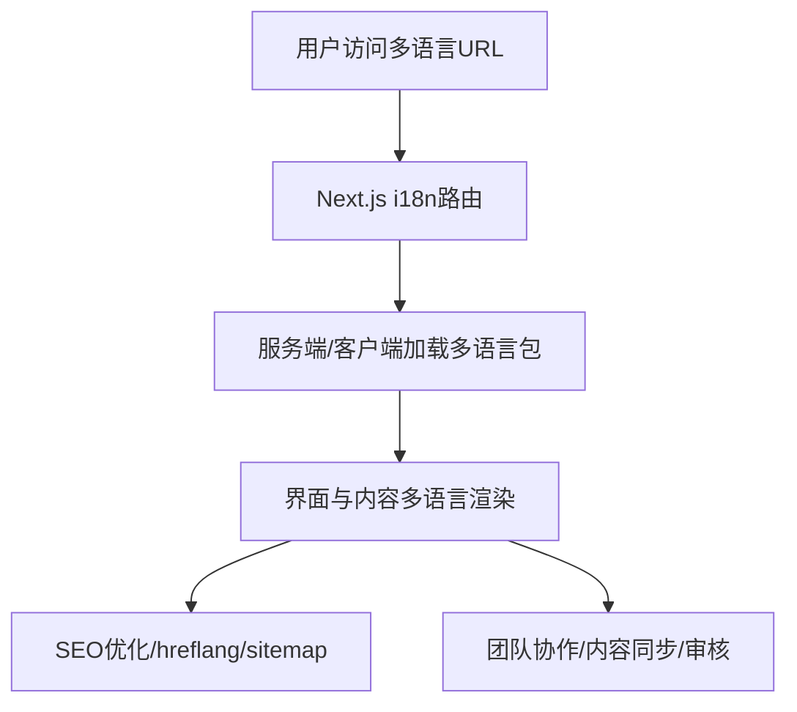
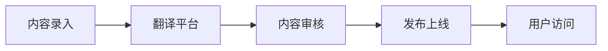

# 前言
大家好，我是鲫小鱼。是一名`不写前端代码`的前端工程师，热衷于分享非前端的知识，带领切图仔逃离切图圈子，欢迎关注我，微信公众号：`《鲫小鱼不正经》`。欢迎点赞、收藏、关注，一键三连！！

# 第十八章：国际化 (i18n) 与多语言支持

## 理论讲解

### 1. 国际化与本地化的区别
- **国际化（i18n）**：为应用支持多语言、多地区、多文化的能力，通常在开发阶段实现。它不仅仅是翻译文本，还包括日期、货币、数字、时区、图片、富文本等多方面的适配。
- **本地化（l10n）**：针对特定地区/语言进行内容、格式、UI、法律等适配，通常在运营阶段实现。比如中国区的法律声明、欧洲区的 GDPR 合规、阿拉伯区的 RTL 布局等。
- **企业级项目需关注**：多语言内容、界面、URL、SEO、时区、货币、合规、团队协作、内容同步、翻译审核、移动端适配、性能优化。

#### 实际挑战与解决方案
- **内容同步难题**：多语言内容如何保持同步？推荐使用带多语言字段的 CMS（如 Strapi、Sanity、Contentful）或自建多语言表结构。
- **法律合规**：不同地区的法律声明、隐私政策、合规内容需多语言覆盖，建议与法务团队协作，内容单独管理。
- **团队协作**：开发、翻译、运营分工明确，推荐使用在线翻译平台（如 Crowdin、Lokalise、Transifex）实现内容流转、审核、发布自动化。

### 2. Next.js 国际化能力与主流方案
- **Next.js 内置 i18n 路由与本地化 URL 支持**：通过 next.config.js 配置 locales、defaultLocale、domains，实现多语言路由、自动检测、回退机制。
- **主流国际化库对比**：
  - next-i18next（基于 i18next）：与 Next.js 深度集成，支持 SSR、SSG、API、App Router，适合团队协作。
  - react-intl/formatjs：灵活强大，适合需要复杂格式化（如复数、性别、日期、货币）的项目。
  - LinguiJS：代码分包、懒加载优秀，适合大型项目。
- **选择建议**：企业级推荐 next-i18next，兼容 SSR/SSG，易于团队协作。

#### 多语言切换与用户体验
- **自动检测**：可根据浏览器 Accept-Language 自动切换，提升用户体验。
- **回退机制**：未翻译内容自动回退到默认语言，避免内容缺失。
- **多语言切换按钮**：UI 需明显，支持移动端、键盘导航、a11y。

### 3. 国际化 URL 策略与 SEO
- **路径前缀**：/en、/zh、/fr 等，支持多语言切换，SEO 友好，推荐中小型项目。
- **域名/子域名**：en.example.com、fr.example.com，适合大型/多品牌项目，便于地区隔离、合规。
- **hreflang 标签**：告知搜索引擎页面语言与地区，提升多语言 SEO，避免重复内容。
- **动态内容国际化**：文章、产品、评论等内容多语言同步与管理，推荐 CMS/数据库多语言字段。

### 4. 多语言内容与界面管理
- **内容国际化**：CMS/数据库多语言字段，支持内容同步、翻译、审核、定时发布。
- **界面国际化**：JSON/PO 文件存储多语言文本，支持动态加载、分包、懒加载，推荐按页面/模块拆分。
- **变量与占位符**：如“欢迎，{name}”，支持多语言插值、复数、性别、日期、货币等格式化，推荐使用 i18next 的 formatters。
- **富文本、图片、视频国际化**：富文本推荐 HTML/Markdown 多语言字段，图片/视频可按地区/语言切换资源。
- **团队协作**：开发、翻译、运营分工，支持在线翻译平台，内容流转自动化。

### 5. 移动端适配、a11y、合规与性能
- **移动端**：多语言切换、RTL 布局、键盘/语音输入、日期/货币本地化，推荐响应式设计与断点测试。
- **a11y**：多语言 aria-label、无障碍提示、语音阅读，推荐使用 react-aria、axe-core 检查。
- **合规**：法律声明、隐私政策、合规内容多语言，推荐单独页面管理，支持地区自动跳转。
- **性能**：多语言包分包、懒加载、CDN 加速，推荐按需加载、gzip 压缩、缓存优化。

---

## 详细代码示例

### 1. next.config.js 国际化配置

```js
// next.config.js
module.exports = {
  i18n: {
    locales: ['zh', 'en', 'fr'],
    defaultLocale: 'zh',
    localeDetection: true,
    domains: [
      { domain: 'example.com', defaultLocale: 'zh' },
      { domain: 'en.example.com', defaultLocale: 'en' },
    ],
  },
};
```

### 2. next-i18next 集成与多语言 JSON

```js
// next-i18next.config.js
module.exports = {
  i18n: {
    defaultLocale: 'zh',
    locales: ['zh', 'en', 'fr'],
  },
  localePath: './public/locales',
};
```

```
// public/locales/zh/common.json
{
  "welcome": "欢迎，{{name}}！",
  "logout": "退出登录",
  "cart": "购物车({{count}})",
  "error_required": "请输入{{field}}",
  "date_format": "YYYY年MM月DD日"
}
// public/locales/en/common.json
{
  "welcome": "Welcome, {{name}}!",
  "logout": "Logout",
  "cart": "Cart ({{count}})",
  "error_required": "Please enter {{field}}",
  "date_format": "YYYY-MM-DD"
}
```

### 3. 页面与组件多语言切换

```tsx
// pages/_app.tsx
import { appWithTranslation } from 'next-i18next';
function MyApp({ Component, pageProps }) {
  return <Component {...pageProps} />;
}
export default appWithTranslation(MyApp);
```

```tsx
// components/LanguageSwitcher.tsx
import { useRouter } from 'next/router';
export default function LanguageSwitcher() {
  const router = useRouter();
  const { locales, locale, asPath } = router;
  return (
    <div>
      {locales.map((lng) => (
        <button
          key={lng}
          disabled={lng === locale}
          onClick={() => router.push(asPath, asPath, { locale: lng })}
        >
          {lng}
        </button>
      ))}
    </div>
  );
}
```

```tsx
// components/Header.tsx
import { useTranslation } from 'next-i18next';
export default function Header({ user }) {
  const { t } = useTranslation('common');
  return (
    <header>
      <span>{t('welcome', { name: user.name })}</span>
      <button>{t('logout')}</button>
    </header>
  );
}
```

#### 动态路由下的国际化

```tsx
// pages/[slug].tsx
import { serverSideTranslations } from 'next-i18next/serverSideTranslations';
import { useTranslation } from 'next-i18next';
export async function getServerSideProps({ locale, params }) {
  // 假设 fetchPost 返回多语言内容
  const post = await fetchPost(params.slug, locale);
  return {
    props: {
      ...(await serverSideTranslations(locale, ['common'])),
      post,
    },
  };
}
export default function PostPage({ post }) {
  const { t } = useTranslation('common');
  return <article><h1>{post.title}</h1><div>{post.content}</div></article>;
}
```

#### 多语言表单校验与错误提示

```tsx
// components/LoginForm.tsx
import { useTranslation } from 'next-i18next';
import { useState } from 'react';
export default function LoginForm() {
  const { t } = useTranslation('common');
  const [error, setError] = useState('');
  const [username, setUsername] = useState('');
  const handleSubmit = (e) => {
    e.preventDefault();
    if (!username) {
      setError(t('error_required', { field: t('username') }));
      return;
    }
    // ...登录逻辑
  };
  return (
    <form onSubmit={handleSubmit}>
      <input value={username} onChange={e => setUsername(e.target.value)} placeholder={t('username')} />
      {error && <div>{error}</div>}
      <button type="submit">{t('login')}</button>
    </form>
  );
}
```

#### 多语言图片、视频、富文本内容

```tsx
// components/LocalizedImage.tsx
import { useRouter } from 'next/router';
export default function LocalizedImage({ srcs }) {
  const { locale } = useRouter();
  return ;
}
// 用法：<LocalizedImage srcs={{ zh: '/banner.zh.png', en: '/banner.en.png' }} />
```

### 4. 服务端/客户端国际化与动态内容

```tsx
// pages/index.tsx
import { serverSideTranslations } from 'next-i18next/serverSideTranslations';
export async function getServerSideProps({ locale }) {
  return {
    props: {
      ...(await serverSideTranslations(locale, ['common'])),
    },
  };
}
```

```tsx
// components/Cart.tsx
import { useTranslation } from 'next-i18next';
export default function Cart({ count }) {
  const { t } = useTranslation('common');
  return <div>{t('cart', { count })}</div>;
}
```

### 5. 国际化 API 与内容管理

```ts
// pages/api/content.ts
export default function handler(req, res) {
  const { lang } = req.query;
  // 查询数据库/CMS 获取多语言内容
  res.json({ title: lang === 'en' ? 'Hello' : '你好' });
}
```

#### API 层多语言错误处理

```ts
// pages/api/login.ts
export default function handler(req, res) {
  const { lang } = req.query;
  if (!req.body.username) {
    return res.status(400).json({ error: lang === 'en' ? 'Username required' : '请输入用户名' });
  }
  // ...
}
```

---

## 实战项目：多语言博客系统

### 1. 需求分析
- 支持文章内容多语言、界面多语言、动态切换、SEO 优化。
- 支持移动端适配、a11y、国际化团队协作、内容同步与审核。
- 支持后台管理端多语言内容录入、审核、发布。
- 支持与第三方翻译平台集成，自动化内容流转。

### 2. 目录结构
```
public/locales/
  zh/common.json
  en/common.json
  fr/common.json
components/
  LanguageSwitcher.tsx
  Header.tsx
  Cart.tsx
  LocalizedImage.tsx
  LoginForm.tsx
pages/
  index.tsx
  [slug].tsx
  api/content.ts
  api/login.ts
next.config.js
next-i18next.config.js
```

### 3. 关键代码片段
- 见上方详细代码示例
- 文章内容多语言字段，CMS/数据库同步管理
- SEO 优化：hreflang、meta、sitemap 多语言支持
- 多语言切换、界面与内容同步、移动端适配、a11y
- 后台管理端多语言内容录入、审核、发布（可用开源 CMS 或自建）
- 与 Crowdin/Lokalise 等翻译平台集成（API/Webhook 自动同步）

### 4. 项目亮点
- 支持多语言内容、界面、URL、SEO、团队协作
- 动态切换、服务端/客户端国际化、内容同步与审核
- 移动端适配、a11y、合规、性能优化
- 代码结构清晰，易于团队协作和维护
- 支持自动化内容流转、翻译、审核、发布

---

## 最佳实践
- 内容与界面国际化分离，统一管理，推荐使用 CMS/数据库多语言字段。
- 多语言包分包、懒加载、CDN 加速，推荐按页面/模块分包，提升首屏性能。
- SEO 友好：hreflang、sitemap、meta、URL 规范，避免重复内容。
- 多语言内容同步、翻译、审核流程，推荐自动化工具和平台。
- 团队协作：开发、翻译、运营分工，支持在线翻译平台，内容流转自动化。
- 关键流程编写单元与端到端测试，保证多语言切换、内容同步、SEO 等功能稳定。
- 日志采集国际化异常，便于定位问题，推荐 Sentry、Datadog 等工具。
- 统一目录结构、命名规范，便于团队协作和维护。
- 多语言 A/B 测试与数据埋点，优化用户体验。
- 多语言包自动化构建与校验，防止遗漏和错误。

---

## 常见问题与解决方案

### Q1: 多语言 URL 如何设计？
A: 推荐路径前缀（/en、/zh），或子域名，结合 next.config.js i18n 配置。大型项目可用多域名，便于地区隔离和合规。

### Q2: 动态内容如何国际化？
A: CMS/数据库多语言字段，内容同步、翻译、审核，API 按 lang 查询。推荐内容与界面分离，便于管理。

### Q3: SEO 如何做好多语言？
A: 配置 hreflang、sitemap、meta，URL 规范，内容同步，避免重复内容。建议定期用 Google Search Console 检查。

### Q4: 团队如何协作多语言？
A: 分工明确，支持在线翻译平台，内容同步、审核、发布流程。推荐自动化 Webhook 通知。

### Q5: 如何做移动端适配和 a11y？
A: 多语言按钮、aria-label、RTL 布局、语音阅读、键盘导航。推荐响应式设计和无障碍测试。

### Q6: 多语言缓存、CDN、SSR/SSG 下的坑？
A: 多语言包需按 locale 分包，CDN 配置需支持多语言路径，SSR/SSG 需传递 locale，避免内容错乱。

### Q7: 多语言 SEO 的常见误区？
A: hreflang 配置错误、URL 不规范、内容未同步、重复内容未处理，建议定期用 SEO 工具检查。

### Q8: 性能优化与监控？
A: 多语言包懒加载、gzip 压缩、CDN 加速，推荐用 Lighthouse、WebPageTest、Sentry 监控。

---

## 配图说明



> Next.js 国际化路由、内容与界面多语言、SEO、团队协作全流程示意图。



> 多语言内容流转、团队协作、自动化流程示意图。

---

> 最后感谢阅读！欢迎关注我，微信公众号：`《鲫小鱼不正经》`。欢迎点赞、收藏、关注，一键三连！！！
