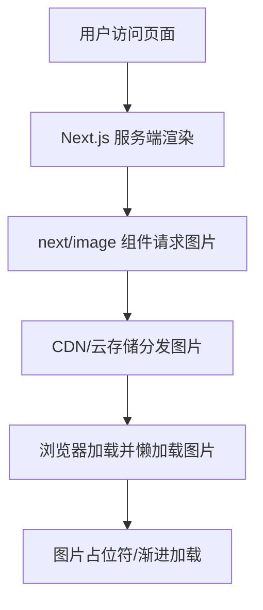

# 前言
大家好，我是鲫小鱼。是一名`不写前端代码`的前端工程师，热衷于分享非前端的知识，带领切图仔逃离切图圈子，欢迎关注我，微信公众号：`《鲫小鱼不正经》`。欢迎点赞、收藏、关注，一键三连！！

# 第十九章：图像优化：`next/image` 与高级技巧

## 理论讲解

### 1. 图像优化的重要性
- 图像资源通常占据网页加载体积的 60% 以上，是影响页面性能、SEO、用户体验的关键因素。
- 移动端网络环境复杂，图片优化直接影响首屏速度、流量消耗和转化率。
- 企业级项目需关注：多终端适配、CDN、WebP/AVIF 格式、懒加载、占位符、图片安全与合规、自动化处理。

### 2. Next.js `next/image` 组件核心特性
- **自动响应式**：根据设备分辨率和屏幕尺寸自动生成多种尺寸，适配移动端和高分屏。
- **懒加载**：默认开启图片懒加载，提升首屏速度。
- **格式优化**：自动优先使用 WebP/AVIF 等现代格式，兼容性好。
- **占位符**：支持模糊占位符（blur）、自定义占位符，提升加载体验。
- **CDN 集成**：可与 Vercel、阿里云、七牛云等主流 CDN 配合，自动分发和缓存图片。
- **图片安全**：支持域名白名单、图片尺寸限制，防止盗链和恶意攻击。
- **自定义 Loader**：支持自定义图片加载逻辑，适配企业自有图片服务。

### 3. 图像优化的企业级场景
- 电商、社交、内容平台等图片量大、更新频繁的场景，需自动化压缩、格式转换、内容审核、CDN 分发。
- 多端适配：PC、移动、平板、PWA、小程序等，需不同尺寸和格式的图片。
- 图片合规：水印、内容审核、版权保护。
- 图片安全：防盗链、鉴权、敏感信息遮挡。

---

## 详细代码示例

### 1. 基础用法与响应式图片

```tsx
import Image from 'next/image';

export default function ProductCard() {
  return (
    <div style={{ width: 300 }}>
      <Image
        src="/products/shoes.jpg"
        alt="运动鞋"
        width={300}
        height={200}
        layout="responsive"
        placeholder="blur"
        blurDataURL="/products/shoes-blur.jpg"
        priority
      />
      <h3>舒适运动鞋</h3>
    </div>
  );
}
```

- `layout="responsive"` 已在 Next.js 13+ 被 `fill`、`width`、`height` 替代，推荐直接指定宽高或使用 `fill`。
- `placeholder="blur"` 可用低分辨率图片或 SVG 作为占位符。
- `priority` 属性用于首屏图片，提升加载优先级。

### 2. 多终端适配与 `sizes` 属性

```tsx
<Image
  src="/banner.jpg"
  alt="首页横幅"
  width={1200}
  height={400}
  sizes="(max-width: 600px) 100vw, (max-width: 1200px) 50vw, 33vw"
/>
```
- `sizes` 属性告知浏览器在不同屏幕宽度下图片实际显示尺寸，配合响应式布局节省流量。

### 3. 使用外部图片与域名白名单

```js
// next.config.js
module.exports = {
  images: {
    domains: ['cdn.example.com', 'img.alicdn.com'],
    deviceSizes: [320, 640, 750, 828, 1080, 1200, 1920],
    formats: ['image/webp', 'image/avif'],
  },
};
```

```tsx
<Image
  src="https://cdn.example.com/banner.jpg"
  alt="CDN 图片"
  width={800}
  height={300}
  quality={80}
/>
```
- `quality` 属性控制图片压缩质量，建议 70-85 之间。

### 4. 自定义图片 Loader（适配企业图片服务）

```tsx
// utils/imageLoader.ts
export default function aliOssLoader({ src, width, quality }) {
  return `https://img.alicdn.com/${src}?x-oss-process=image/resize,w_${width}/quality,q_${quality || 80}`;
}
```

```tsx
<Image
  loader={aliOssLoader}
  src="shop/banner.jpg"
  alt="阿里云 OSS 图片"
  width={1200}
  height={400}
/>
```
- 可根据企业图片服务 API 定制 loader，实现自动压缩、格式转换、水印等。

### 5. 图片懒加载与占位符优化

```tsx
<Image
  src="/gallery/photo.jpg"
  alt="画廊照片"
  width={600}
  height={400}
  placeholder="blur"
  blurDataURL="/gallery/photo-blur.jpg"
/>
```
- `blurDataURL` 可用 base64 小图或 SVG 占位，提升加载体验。

### 6. 图片安全与合规

```js
// next.config.js
module.exports = {
  images: {
    domains: ['cdn.example.com'],
    minimumCacheTTL: 60,
    contentSecurityPolicy: "default-src 'self'; img-src 'self' cdn.example.com;",
  },
};
```
- 配置 CSP、防盗链、图片尺寸限制，防止恶意攻击。

---

## 实战项目：企业级电商图片优化方案

### 1. 需求分析
- 商品图片量大，需多终端适配、CDN 分发、自动压缩、格式转换。
- 首页、列表页、详情页图片需不同尺寸和优先级。
- 移动端需极致流量优化，支持 WebP/AVIF。
- 图片需支持水印、内容审核、版权保护。

### 2. 目录结构
```
components/
  ProductCard.tsx
  Banner.tsx
  Gallery.tsx
utils/
  imageLoader.ts
pages/
  index.tsx
  products/[id].tsx
next.config.js
public/
  products/
  gallery/
```

### 3. 关键代码片段
- 见上方详细代码示例。
- 首页 Banner 使用大图，优先加载，支持多终端适配。
- 商品卡片图片使用 `sizes` 和 `placeholder`，移动端优先加载小图。
- 详情页图片支持缩放、懒加载、格式切换。
- 图片上传接口自动压缩、内容审核（可用云服务 API）。

### 4. 项目亮点
- 全面适配 PC/移动端，自动选择最佳图片尺寸和格式。
- 支持企业级图片服务、CDN、内容安全。
- 代码结构清晰，易于团队协作和维护。
- 性能极致优化，提升转化率和 SEO。

---

## 最佳实践
- 所有图片均用 `next/image`，禁止直接用 ``，统一优化。
- 首屏大图用 `priority`，非首屏图片用懒加载。
- 合理配置 `sizes`，节省流量，提升移动端体验。
- 图片域名白名单、CSP、防盗链，保障安全。
- 图片上传自动压缩、格式转换、内容审核。
- CDN 分发，配置合理缓存策略。
- 定期用 Lighthouse、WebPageTest 检查图片性能。
- 团队协作：UI、前端、后端、运维协同，制定图片规范。

---

## 常见问题与解决方案

### Q1: 为什么图片加载慢？
A: 检查图片尺寸是否过大、未压缩、未用 WebP/AVIF、CDN 配置是否正确、是否开启懒加载。

### Q2: 移动端图片模糊或失真？
A: 合理配置 `sizes` 和 `deviceSizes`，确保不同分辨率下加载合适尺寸图片。

### Q3: 外部图片无法显示？
A: 检查 `next.config.js` 是否配置了正确的 `domains` 白名单。

### Q4: 如何防止图片盗链？
A: 配置图片服务 Referer 鉴权、CSP、图片尺寸限制。

### Q5: 如何批量压缩和格式转换历史图片？
A: 可用 Node.js 脚本结合 sharp、imagemin 等工具批量处理，或用云服务 API。

### Q6: 图片上传如何自动内容审核？
A: 集成阿里云、腾讯云、百度云等内容安全 API，上传后自动审核。

### Q7: 如何处理图片版权和水印？
A: 上传时自动加水印，或用云服务图片处理 API 动态加水印。

---

## 配图说明



> 企业级 Next.js 图片优化全流程示意图。

---

> 最后感谢阅读！欢迎关注我，微信公众号：`《鲫小鱼不正经》`。欢迎点赞、收藏、关注，一键三连！！