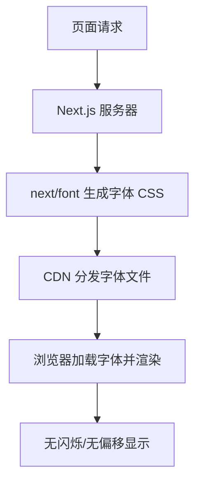

# 前言
大家好，我是鲫小鱼。是一名`不写前端代码`的前端工程师，热衷于分享非前端的知识，带领切图仔逃离切图圈子，欢迎关注我，微信公众号：`《鲫小鱼不正经》`。欢迎点赞、收藏、关注，一键三连！！

# 第二十章：字体优化：`next/font` 与自定义字体

## 理论讲解

### 1. 字体优化的重要性
- 字体文件体积大、加载慢，直接影响首屏渲染速度和用户体验。
- 字体加载不当会导致“闪烁无样式文本”（FOIT）或“闪烁不可见文本”（FOUT），影响品牌形象和可读性。
- 移动端和国际化场景下，字体兼容性、性能和可访问性（a11y）尤为关键。
- 企业级项目需关注：品牌字体统一、字体授权合规、性能优化、无障碍支持、CDN 分发、字体子集化、动态加载。

### 2. Next.js 字体优化方案演进
- 传统做法：通过 CSS @font-face 引入本地或第三方字体，手动控制字体加载和优化，易出错且难以自动优化。
- Next.js 13+ 引入 `next/font`，支持 Google Fonts 和本地自定义字体的自动优化：
  - 自动生成最优字体 CSS，避免 CLS（布局偏移）。
  - 支持字体子集化（只加载用到的字符），极大减小体积。
  - 支持懒加载、优先级控制、无闪烁体验。
  - 支持多字体、粗细、斜体、变量字体等高级特性。

### 3. 字体加载流程与性能优化原理
- **字体子集化**：只打包页面实际用到的字符，减少无用字形。
- **懒加载与优先级**：首屏字体优先加载，次要字体懒加载，提升首屏速度。
- **预加载与预连接**：合理使用 `<link rel="preload">` 和 `<link rel="preconnect">`，减少字体请求延迟。
- **CDN 分发**：字体文件通过 CDN 靠近用户，降低延迟。
- **无障碍与国际化**：为不同语言、地区、a11y 场景配置合适字体。

---

## 详细代码示例

### 1. 使用 `next/font/google` 加载 Google Fonts

```tsx
// app/layout.tsx (Next.js 13+ App Router)
import { Roboto, Noto_Sans_SC } from 'next/font/google';

const roboto = Roboto({
  subsets: ['latin'],
  weight: ['400', '700'],
  display: 'swap',
});
const notoSansSC = Noto_Sans_SC({
  subsets: ['chinese-simplified'],
  weight: ['400', '700'],
  display: 'swap',
});

export default function RootLayout({ children }) {
  return (
    <html lang="zh">
      <body className={`${roboto.className} ${notoSansSC.className}`}>{children}</body>
    </html>
  );
}
```
- `display: 'swap'` 避免 FOIT，提升可用性。
- 可按需加载多种字体，支持多语言和品牌需求。

### 2. 加载本地自定义字体

```tsx
// app/fonts.ts
import localFont from 'next/font/local';

export const myBrandFont = localFont({
  src: [
    {
      path: './fonts/Brand-Regular.woff2',
      weight: '400',
      style: 'normal',
    },
    {
      path: './fonts/Brand-Bold.woff2',
      weight: '700',
      style: 'bold',
    },
  ],
  display: 'swap',
  variable: '--font-brand',
});
```

```tsx
// app/layout.tsx
import { myBrandFont } from './fonts';

export default function RootLayout({ children }) {
  return (
    <html lang="zh">
      <body className={myBrandFont.className}>{children}</body>
    </html>
  );
}
```
- 支持多权重、斜体、变量字体，适合企业品牌定制。
- 可通过 CSS 变量灵活切换字体。

### 3. 字体子集化与多语言支持

```tsx
const notoSansJP = Noto_Sans_JP({
  subsets: ['japanese'],
  weight: ['400', '700'],
  display: 'swap',
});
```
- 只加载实际用到的字符集，极大减小字体体积，适合国际化项目。

### 4. 字体预加载与性能优化

```tsx
// pages/_document.tsx (Next.js 12/13 Pages Router)
import Document, { Html, Head, Main, NextScript } from 'next/document';

export default class MyDocument extends Document {
  render() {
    return (
      <Html lang="zh">
        <Head>
          <link rel="preconnect" href="https://fonts.googleapis.com" />
          <link rel="preconnect" href="https://fonts.gstatic.com" crossOrigin="anonymous" />
        </Head>
        <body>
          <Main />
          <NextScript />
        </body>
      </Html>
    );
  }
}
```
- 预连接字体 CDN，减少首包延迟。

### 5. 字体 Fallback 与无障碍支持

```css
body {
  font-family: var(--font-brand), 'Noto Sans SC', 'PingFang SC', 'Microsoft YaHei', Arial, sans-serif;
}
```
- 配置多级字体回退，保证不同终端、不同语言下都能正常显示。
- 推荐为 a11y 场景配置高对比度、易读字体。

### 6. 字体动态切换与主题适配

```tsx
// 通过 CSS 变量和 className 动态切换字体
function ThemeSwitcher() {
  const [theme, setTheme] = useState('default');
  return (
    <div className={theme === 'brand' ? 'font-brand' : ''}>
      <button onClick={() => setTheme('brand')}>品牌字体</button>
      <button onClick={() => setTheme('default')}>系统字体</button>
    </div>
  );
}
```
- 支持暗黑模式、品牌主题等多场景字体切换。

---

## 实战项目：企业官网品牌字体优化

### 1. 需求分析
- 品牌字体需全站统一，兼容中英文、移动端、暗黑模式。
- 字体需授权合规，支持子集化、CDN 分发、性能优化。
- 首页、Banner、标题等需优先加载品牌字体，正文可用系统字体。
- 支持无障碍和国际化，保证所有用户体验一致。

### 2. 目录结构
```
app/
  layout.tsx
  fonts.ts
  page.tsx
public/
  fonts/
    Brand-Regular.woff2
    Brand-Bold.woff2
components/
  ThemeSwitcher.tsx
```

### 3. 关键代码片段
- 见上方详细代码示例。
- layout.tsx 全局引入品牌字体，支持多权重和变量。
- ThemeSwitcher 组件支持动态切换字体主题。
- _document.tsx 配置字体 CDN 预连接。
- CSS 变量和 fallback 保证兼容性和 a11y。

### 4. 项目亮点
- 字体极致优化，首屏无闪烁，品牌形象统一。
- 支持多语言、暗黑模式、a11y。
- 代码结构清晰，易于团队协作和维护。
- 字体授权合规，支持 CDN 分发和子集化。

---

## 最佳实践
- 优先使用 `next/font` 管理所有字体，禁止直接用 @font-face。
- 所有品牌字体需授权合规，避免侵权风险。
- 字体子集化，按需加载，减少体积。
- 首页、Banner 等首屏内容字体用 `priority` 或提前加载。
- 多级 fallback，保证不同终端和语言下体验一致。
- 字体文件用 CDN 分发，配置合理缓存策略。
- 定期用 Lighthouse、WebPageTest 检查字体性能。
- 团队协作：UI、前端、法务协同，制定字体规范和授权流程。

---

## 常见问题与解决方案

### Q1: 为什么字体加载慢？
A: 检查字体文件是否过大、未子集化、CDN 配置是否正确、是否预加载。

### Q2: 出现字体闪烁或布局偏移？
A: 使用 `next/font` 自动优化，设置 `display: 'swap'`，避免 FOIT/CLS。

### Q3: 字体授权和合规如何保障？
A: 采购正版字体，保留授权文件，避免用盗版字体。

### Q4: 国际化场景下字体不兼容？
A: 配置多语言字体和 fallback，保证所有字符都能正常显示。

### Q5: 如何支持暗黑模式和主题切换？
A: 用 CSS 变量和 className 动态切换字体。

### Q6: 字体文件体积大，如何优化？
A: 用 `next/font` 子集化功能，或用 fonttools、glyphhanger 等工具手动子集化。

### Q7: 如何保障 a11y？
A: 选用高对比度、易读字体，支持屏幕阅读器，保证无障碍体验。

---

## 配图说明



> Next.js 字体优化全流程示意图。

---

> 最后感谢阅读！欢迎关注我，微信公众号：`《鲫小鱼不正经》`。欢迎点赞、收藏、关注，一键三连！！