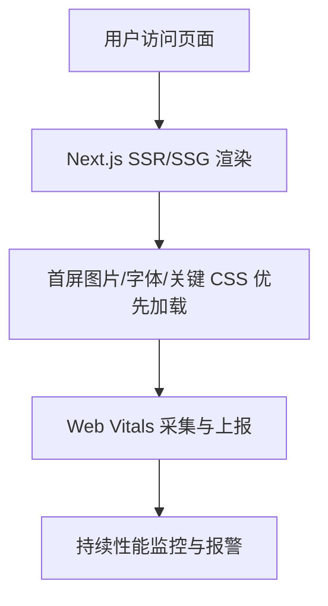

# 前言
大家好，我是鲫小鱼。是一名`不写前端代码`的前端工程师，热衷于分享非前端的知识，带领切图仔逃离切图圈子，欢迎关注我，微信公众号：`《鲫小鱼不正经》`。欢迎点赞、收藏、关注，一键三连！！

# 第二十一章：核心 Web Vitals 与性能调优

## 理论讲解

### 1. 什么是 Web Vitals？
- Web Vitals 是 Google 推出的衡量网页用户体验的核心指标体系，聚焦于真实用户的加载、交互和视觉稳定性。
- 核心指标包括：
  - **LCP（Largest Contentful Paint）**：最大内容绘制时间，衡量首屏主要内容加载速度。
  - **FID（First Input Delay）**：首次输入延迟，衡量页面首次可交互的响应速度。
  - **CLS（Cumulative Layout Shift）**：累计布局偏移，衡量页面视觉稳定性。
  - **INP（Interaction to Next Paint）**：交互到下次绘制，衡量整体交互流畅性（逐步取代 FID）。
- 企业级项目和 SEO 强依赖 Web Vitals，影响搜索排名、转化率和用户留存。

### 2. Web Vitals 的采集与分析
- **Lighthouse**：Google 官方性能分析工具，支持本地和 CI/CD 集成。
- **Web Vitals Chrome 扩展**：实时监控真实用户体验。
- **Next.js 内置报告**：通过 `next/script` 或自定义上报采集 Web Vitals。
- **企业级监控**：Sentry、Datadog、New Relic 等可采集并分析 Web Vitals。

### 3. Next.js 性能优化的核心策略
- **首屏渲染优化**：SSR/SSG、图片优化、字体优化、代码分割、懒加载。
- **交互性能优化**：减少 JS 体积、异步加载、事件节流/防抖、避免长任务。
- **视觉稳定性优化**：为图片/广告/iframe 预留尺寸，避免 CLS。
- **移动端适配**：响应式布局、资源按需加载、低端设备兼容。
- **缓存与 CDN**：合理配置 HTTP 缓存、CDN 分发、数据缓存。
- **监控与自动化**：持续集成性能检测，自动报警和回归分析。

---

## 详细代码示例

### 1. Next.js 集成 Web Vitals 采集与上报

```tsx
// pages/_app.tsx
import { reportWebVitals } from 'next/app';

export function reportWebVitals(metric) {
  if (metric.label === 'web-vital') {
    // 可上报到自有监控平台
    fetch('/api/report-web-vitals', {
      method: 'POST',
      body: JSON.stringify(metric),
      keepalive: true,
    });
  }
}
```

```ts
// pages/api/report-web-vitals.ts
export default function handler(req, res) {
  // 这里可将数据写入数据库、日志或转发到监控平台
  const metric = JSON.parse(req.body);
  console.log('Web Vitals:', metric);
  res.status(200).json({ ok: true });
}
```

### 2. 使用 Lighthouse 自动化性能分析

```json
// package.json
{
  "scripts": {
    "lighthouse": "lighthouse http://localhost:3000 --output html --output-path ./lighthouse-report.html --chrome-flags=\"--headless\""
  }
}
```
- 可在 CI/CD 流程中集成，自动生成性能报告。

### 3. 优化 LCP 的常用手段

- **图片优化**：首屏大图用 `next/image`，设置 `priority`，使用 WebP/AVIF 格式。
- **字体优化**：用 `next/font`，避免 FOIT/CLS。
- **SSR/SSG**：首屏内容服务端渲染，减少白屏时间。
- **预加载关键资源**：用 `<link rel="preload">` 提前加载首屏图片、字体、CSS。

```tsx
// app/layout.tsx
import Image from 'next/image';
export default function Layout() {
  return (
    <main>
      <Image src="/banner.jpg" alt="Banner" width={1200} height={400} priority />
      {/* 其他首屏内容 */}
    </main>
  );
}
```

### 4. 优化 FID/INP 的常用手段

- **减少 JS 体积**：代码分割、动态导入、移除无用依赖。
- **异步加载非关键 JS**：如第三方统计、客服等。
- **事件节流/防抖**：避免高频事件阻塞主线程。
- **避免长任务**：将大计算拆分为小任务，使用 `requestIdleCallback`。

```tsx
// 动态导入大组件
import dynamic from 'next/dynamic';
const HeavyComponent = dynamic(() => import('./HeavyComponent'), { ssr: false });
```

### 5. 优化 CLS 的常用手段

- **为图片/广告/iframe 预留尺寸**：避免加载后内容跳动。
- **避免动态插入内容到首屏上方**。
- **用 CSS min-height 预留空间**。

```tsx
// 预留图片尺寸
<Image src="/ad.jpg" alt="广告" width={300} height={100} />
```

### 6. 移动端性能优化

- **响应式图片与资源**：用 `sizes` 属性和 CDN。
- **按需加载**：用 Intersection Observer 懒加载图片和组件。
- **低端设备降级**：减少动画、特效，简化交互。

```tsx
// 懒加载组件
import { useEffect, useRef, useState } from 'react';
function LazySection() {
  const ref = useRef();
  const [visible, setVisible] = useState(false);
  useEffect(() => {
    const observer = new IntersectionObserver(([entry]) => {
      if (entry.isIntersecting) setVisible(true);
    });
    if (ref.current) observer.observe(ref.current);
    return () => observer.disconnect();
  }, []);
  return <section ref={ref}>{visible ? <HeavyComponent /> : <div>加载中...</div>}</section>;
}
```

### 7. 持续集成中的性能监控

- 在 GitHub Actions、Jenkins 等 CI 流程中集成 Lighthouse、WebPageTest，自动检测性能回归。
- 结合 Sentry、Datadog 实时采集线上 Web Vitals。

---

## 实战项目：电商网站性能全面优化

### 1. 需求分析
- 首页、商品列表、详情页需极致首屏速度和交互流畅性。
- 移动端用户占比高，需响应式和低端设备兼容。
- 需持续监控 Web Vitals，自动报警。

### 2. 目录结构
```
components/
  Banner.tsx
  ProductList.tsx
  ProductCard.tsx
  LazySection.tsx
pages/
  _app.tsx
  api/report-web-vitals.ts
  index.tsx
  products/[id].tsx
utils/
  performance.ts
lighthouse-report.html
```

### 3. 关键代码片段
- 见上方详细代码示例。
- Banner、ProductList 首屏图片用 `priority`，预留尺寸。
- ProductCard 动态导入，减少首屏 JS。
- LazySection 用 Intersection Observer 懒加载。
- _app.tsx 集成 Web Vitals 上报。
- CI 集成 Lighthouse，自动生成性能报告。

### 4. 项目亮点
- 首屏 LCP < 2.5s，CLS < 0.1，INP < 200ms。
- 移动端体验极致，低端设备兼容。
- 持续性能监控，自动报警和回归分析。
- 代码结构清晰，易于团队协作和维护。

---

## 最佳实践
- 首屏内容 SSR/SSG，图片/字体/关键 CSS 优先加载。
- 所有图片用 `next/image`，预留尺寸，避免 CLS。
- 代码分割、动态导入，减少 JS 体积。
- 懒加载非首屏组件和资源。
- 响应式布局和资源，移动端优先。
- 持续集成性能检测，自动报警。
- 团队协作：UI、前端、后端、运维协同，制定性能规范。

---

## 常见问题与解决方案

### Q1: LCP 超标怎么办？
A: 优化首屏图片、字体、SSR/SSG，减少 JS 体积，预加载关键资源。

### Q2: CLS 偏高如何排查？
A: 检查图片/广告/iframe 是否预留尺寸，避免动态插入内容。

### Q3: FID/INP 偏高如何优化？
A: 减少 JS 体积，异步加载非关键 JS，优化事件处理。

### Q4: 移动端性能差？
A: 响应式图片、按需加载、低端设备降级，减少动画和特效。

### Q5: 如何持续监控性能？
A: 集成 Web Vitals 上报、Lighthouse 自动化、Sentry/Datadog 实时监控。

### Q6: 性能优化和 SEO 有冲突吗？
A: 合理配置 SSR/SSG、懒加载、预加载，兼顾性能和 SEO。

---

## 配图说明



> Next.js 性能优化与 Web Vitals 监控全流程示意图。

---

> 最后感谢阅读！欢迎关注我，微信公众号：`《鲫小鱼不正经》`。欢迎点赞、收藏、关注，一键三连！！