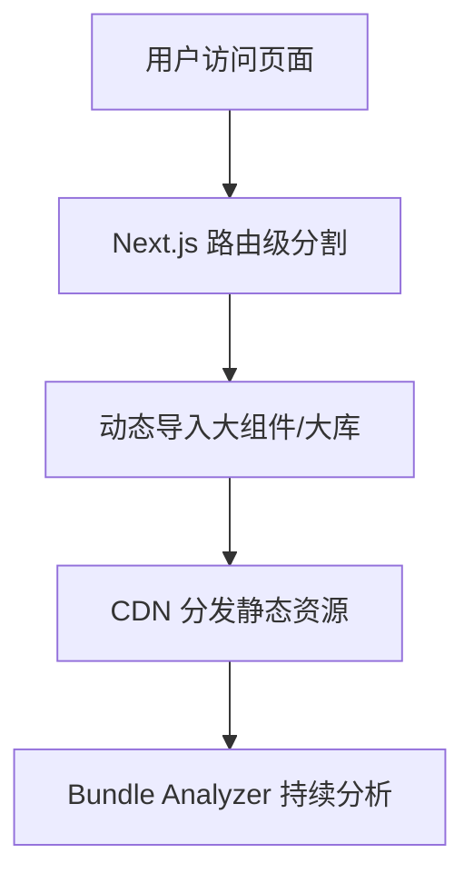

# 前言
大家好，我是鲫小鱼。是一名`不写前端代码`的前端工程师，热衷于分享非前端的知识，带领切图仔逃离切图圈子，欢迎关注我，微信公众号：`《鲫小鱼不正经》`。欢迎点赞、收藏、关注，一键三连！！

# 第二十二章：代码分割与打包优化

## 理论讲解

### 1. 为什么要做代码分割与打包优化？
- 随着前端项目体积增大，单包加载会导致首屏慢、交互卡顿、移动端流量浪费。
- 代码分割（Code Splitting）让用户只加载当前页面/功能所需的 JS、CSS，提升首屏速度和体验。
- 打包优化（Bundle Optimization）减少冗余、压缩体积、提升缓存命中，降低带宽和服务器压力。
- 企业级项目需关注：多页面/多端适配、第三方库优化、动态导入、CDN 缓存、团队协作、持续集成。

### 2. Next.js 代码分割机制
- **自动路由级分割**：每个页面自动生成独立 JS/CSS 包，访问哪个页面只加载哪个页面的资源。
- **动态导入（Dynamic Import）**：可将大组件、第三方库按需异步加载，减少主包体积。
- **共享依赖提取**：自动将多个页面/组件共用的依赖提取为公共包（如 `react`、`lodash`）。
- **CSS 分割**：每个页面只加载自身用到的 CSS，避免全局样式污染。
- **图片、字体等静态资源分割**：按需加载，支持 CDN。

### 3. 打包优化的核心策略
- **Tree Shaking**：移除未用代码，减少包体积。
- **Minification**：压缩 JS/CSS/HTML，减少传输体积。
- **Polyfill 按需加载**：只为低端浏览器加载必要 polyfill。
- **CDN 缓存与版本控制**：静态资源加 hash，提升缓存命中。
- **Bundle Analyzer**：可视化分析包体积，定位优化点。
- **第三方库优化**：只引入用到的模块，避免全量引入。

---

## 详细代码示例

### 1. 路由级代码分割（Next.js 默认支持）

```tsx
// pages/index.tsx
export default function Home() {
  return <div>首页内容</div>;
}

// pages/about.tsx
export default function About() {
  return <div>关于我们</div>;
}
```
- 访问 `/` 只加载 Home 页 JS，访问 `/about` 只加载 About 页 JS。

### 2. 动态导入大组件/第三方库

```tsx
import dynamic from 'next/dynamic';

const Chart = dynamic(() => import('../components/Chart'), {
  loading: () => <div>图表加载中...</div>,
  ssr: false, // 只在客户端加载
});

export default function Dashboard() {
  return (
    <div>
      <h2>数据仪表盘</h2>
      <Chart />
    </div>
  );
}
```
- `ssr: false` 可避免大组件影响 SSR 首屏。
- 适合大图表、富文本编辑器、地图等大体积组件。

### 3. 按需引入第三方库

```js
// 只引入 lodash 的 debounce
import debounce from 'lodash/debounce';

// 避免 import _ from 'lodash'，会引入整个库
```

### 4. 使用 Bundle Analyzer 分析包体积

```js
// next.config.js
const withBundleAnalyzer = require('@next/bundle-analyzer')({
  enabled: process.env.ANALYZE === 'true',
});
module.exports = withBundleAnalyzer({});
```

```json
// package.json
{
  "scripts": {
    "analyze": "ANALYZE=true next build"
  }
}
```
- 执行 `npm run analyze`，自动生成可视化包体积报告。

### 5. Tree Shaking 与 Minification
- Next.js 默认开启 Tree Shaking 和压缩，无需手动配置。
- 只需避免副作用代码和全量引入。

### 6. Polyfill 按需加载

```js
// next.config.js
module.exports = {
  polyfill: false, // 只为低端浏览器自动注入 polyfill
};
```
- Next.js 13+ 已自动优化 polyfill，无需手动引入 core-js。

### 7. 静态资源分割与 CDN 配置

```js
// next.config.js
module.exports = {
  assetPrefix: 'https://cdn.example.com',
};
```
- 静态资源自动加 hash，CDN 缓存友好。

---

## 实战项目：企业级仪表盘代码分割与打包优化

### 1. 需求分析
- 仪表盘包含多个大模块（图表、报表、地图、富文本），需按需加载，首屏极致优化。
- 移动端需只加载必要资源，节省流量。
- 需持续分析和优化包体积，自动报警。

### 2. 目录结构
```
components/
  Chart.tsx
  Map.tsx
  RichEditor.tsx
  DashboardHeader.tsx
pages/
  dashboard.tsx
  report.tsx
  index.tsx
next.config.js
utils/
  analyze.ts
```

### 3. 关键代码片段
- 见上方详细代码示例。
- Dashboard 页面动态导入 Chart、Map、RichEditor。
- DashboardHeader 常驻主包，提升导航体验。
- 按需引入 lodash、echarts 等第三方库。
- next.config.js 配置 Bundle Analyzer 和 CDN。

### 4. 项目亮点
- 首屏 JS < 100KB，移动端极致优化。
- 动态导入大组件，提升交互流畅性。
- 持续分析包体积，自动报警和优化建议。
- 代码结构清晰，易于团队协作和维护。

---

## 最佳实践
- 路由级分割 + 动态导入，所有大组件/大库都异步加载。
- 只引入用到的第三方模块，避免全量引入。
- 静态资源用 CDN，自动加 hash，提升缓存命中。
- 持续用 Bundle Analyzer 检查包体积。
- 避免副作用代码，保证 Tree Shaking 有效。
- 团队协作：UI、前端、后端协同，制定分包规范。

---

## 常见问题与解决方案

### Q1: 首屏 JS 体积大？
A: 检查是否有大组件/大库未动态导入，是否全量引入第三方库。

### Q2: 动态导入组件闪烁或加载慢？
A: 配置 loading 占位符，优化大组件首屏体验。

### Q3: Bundle Analyzer 报告怎么看？
A: 关注主包（main.js）、各页面包、公共包（commons.js），定位大文件和冗余依赖。

### Q4: Polyfill 体积大？
A: Next.js 13+ 已自动优化 polyfill，避免手动引入 core-js。

### Q5: 静态资源缓存不生效？
A: 检查 assetPrefix 和 CDN 配置，确保资源带 hash。

### Q6: Tree Shaking 无效？
A: 避免副作用代码，package.json 配置 sideEffects: false。

### Q7: 如何持续优化包体积？
A: 集成 Bundle Analyzer，CI 自动报警，定期 review 依赖和分包策略。

---

## 配图说明



> Next.js 代码分割与打包优化全流程示意图。

---

> 最后感谢阅读！欢迎关注我，微信公众号：`《鲫小鱼不正经》`。欢迎点赞、收藏、关注，一键三连！！

---

## 进阶实战与企业级细节补充

### 4.1 SSR/SSG/ISR 场景下的代码分割与打包优化

- **SSR 场景**：服务端渲染时，Next.js 会自动为每个页面生成独立的 JS/CSS 包，服务端只加载当前请求页面的 bundle，客户端 hydration 时按需加载剩余资源。对于大组件/大库，建议动态导入并 `ssr: false`，避免影响首屏 SSR 性能。
- **SSG/ISR 场景**：静态生成页面时，Next.js 也会自动分割每个页面的 bundle，结合 CDN 可实现极致的静态资源分发。ISR 支持页面增量再生，分割后的 bundle 也能自动缓存和更新。
- **微前端集成**：可结合 Module Federation 等方案，将 Next.js 子应用独立打包，主应用只加载需要的子包，提升团队协作和独立部署能力。

### 4.2 复杂依赖与第三方库优化

- **Echarts/AntV/Mapbox 等大库**：务必动态导入，避免主包膨胀。可用 `dynamic(() => import('echarts'), { ssr: false })`。
- **多语言/国际化包**：如 moment.js、date-fns，推荐只引入所需 locale，或用 dayjs 替代。
- **富文本/编辑器**：如 Quill、Monaco Editor，动态导入并按需加载插件/主题。

### 4.3 CSS/样式分割与优化

- **CSS-in-JS**：如 styled-components、emotion，Next.js 支持 SSR 样式提取，避免 FOUC。
- **Tailwind CSS**：结合 PurgeCSS 自动移除未用样式，极大减小最终 CSS 体积。
- **全局样式与模块样式**：推荐全局样式只做基础 reset，业务样式全部模块化，提升分割效果。

### 4.4 团队协作与分包规范

- **分层目录结构**：如 `pages/` 只做路由，`components/` 拆分通用与业务组件，`modules/` 按业务域分包，`services/` 统一管理 API。
- **分包规范**：约定大组件/大库必须动态导入，代码评审自动检查。
- **CI/CD 自动分析**：集成 Bundle Analyzer、Lighthouse，构建后自动生成报告并推送到团队群，超标自动报警。

### 4.5 CI/CD 自动化与性能回归

- **自动化分析**：在 GitHub Actions、Jenkins 等 CI 流程中，构建后自动运行 `npm run analyze`，将 bundle 体积报告上传到云端或推送到团队通知。
- **性能回归检测**：每次合并 PR 后自动对比主包体积，若增长超阈值则阻止合并。
- **分环境打包**：生产环境开启所有压缩和分割，开发环境保留 sourcemap 和未压缩，便于调试。

### 4.6 移动端与弱网优化

- **按需加载与骨架屏**：移动端大组件、图片、视频等全部懒加载，配合骨架屏提升体验。
- **低端设备降级**：通过 UA 检测或性能 API，弱机型只加载核心功能，动画/特效降级。
- **PWA 支持**：结合 next-pwa 插件，离线缓存静态资源，提升弱网体验。

### 4.7 常见陷阱与排查技巧

- **动态导入未分包**：检查 dynamic import 路径，确保未被 Webpack 静态分析为主包依赖。
- **副作用代码导致 Tree Shaking 失效**：package.json 配置 "sideEffects": false，并避免全局副作用。
- **第三方库全量引入**：如 `import _ from 'lodash'`，应改为 `import debounce from 'lodash/debounce'`。
- **CDN 缓存失效**：资源未加 hash 或 CDN 配置不当，需定期检查缓存命中率。

---

## 进阶代码示例

### 1. SSR/SSG/ISR 下动态导入大组件

```tsx
// pages/dashboard.tsx
import dynamic from 'next/dynamic';
const Map = dynamic(() => import('../components/Map'), { ssr: false, loading: () => <div>地图加载中...</div> });

export default function Dashboard() {
  return (
    <div>
      <h1>企业仪表盘</h1>
      <Map />
    </div>
  );
}
```

### 2. CI/CD 自动分析与报警

```yaml
# .github/workflows/bundle-analyze.yml
name: Analyze Bundle Size
on: [push]
jobs:
  analyze:
    runs-on: ubuntu-latest
    steps:
      - uses: actions/checkout@v2
      - run: npm ci
      - run: npm run build
      - run: npm run analyze
      - name: Upload report
        uses: actions/upload-artifact@v2
        with:
          name: bundle-report
          path: .next/analyze/
```

### 3. 多团队协作下的分包规范

```js
// scripts/check-dynamic-imports.js
// 检查大组件/大库是否动态导入，CI 阶段自动执行
```

---

## 进阶最佳实践补充

- SSR/SSG/ISR 场景下都要关注 bundle 分割与缓存，结合 CDN、Edge Functions 提升全球访问速度。
- 大型项目推荐每周定期 review bundle 体积，自动生成趋势图。
- 业务线独立分包，支持微前端架构，提升团队协作和独立部署能力。
- 结合 PWA、Service Worker，提升弱网和离线体验。
- 代码分割与打包优化需与安全、权限、国际化、移动端适配等协同设计。