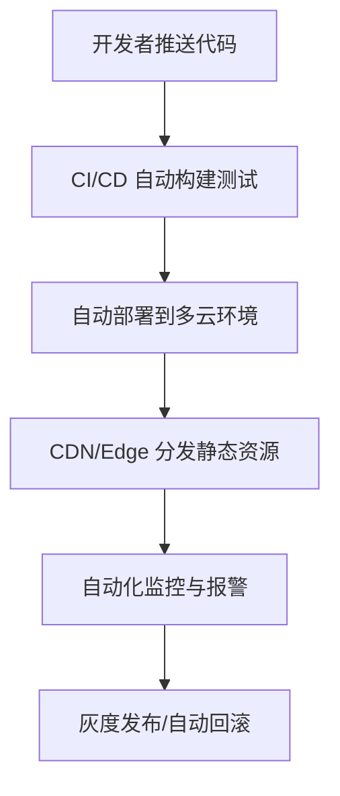

# 前言
大家好，我是鲫小鱼。是一名`不写前端代码`的前端工程师，热衷于分享非前端的知识，带领切图仔逃离切图圈子，欢迎关注我，微信公众号：`《鲫小鱼不正经》`。欢迎点赞、收藏、关注，一键三连！！

# 第二十三章：Next.js 应用部署策略与 CI/CD

## 理论讲解

### 1. Next.js 部署模式全景
- **Vercel 部署**：Next.js 官方推荐，支持零配置、自动 CDN、ISR、Serverless、Edge Functions。
- **Netlify 部署**：支持静态和 SSR，自动集成 CDN、环境变量、预览环境。
- **自定义服务器部署**：Node.js、Docker、PM2、Nginx，适合企业内网、定制化需求。
- **多云/混合部署**：结合阿里云、腾讯云、AWS、GCP 等，支持多地多活、灾备。
- **Serverless/FaaS**：如 Vercel、AWS Lambda、阿里云函数计算，弹性伸缩、自动计费。
- **静态托管**：纯 SSG 项目可用 OSS、COS、S3、GitHub Pages 等。

### 2. CI/CD 的核心价值
- **自动化构建、测试、部署**，提升效率、降低人为失误。
- **多环境支持**：开发、测试、预发、生产环境一键切换。
- **团队协作**：PR 自动预览、代码审核、自动回滚。
- **安全与合规**：自动化检测依赖漏洞、敏感信息、合规扫描。
- **性能与质量保障**：集成自动化测试、Lighthouse、Bundle Analyzer、Sentry 等。

### 3. 企业级部署架构设计要点
- **多环境隔离**：dev、test、staging、prod 独立域名、配置、资源。
- **自动化回滚**：部署失败自动回滚上一个稳定版本。
- **多云与灾备**：主备切换、跨云部署、CDN 全球加速。
- **灰度发布与 A/B 测试**：流量分配、分批上线、自动监控。
- **安全加固**：HTTPS、WAF、防火墙、环境变量加密、依赖漏洞扫描。
- **监控与告警**：接入 Sentry、Datadog、Prometheus，自动报警。

---

## 详细代码示例

### 1. Vercel 零配置部署

- 直接登录 [vercel.com](https://vercel.com/)，导入 GitHub/GitLab 仓库，选择 Next.js 项目，自动构建和部署。
- 支持自动预览环境（Preview）、生产环境（Production）、自定义域名、环境变量、Serverless。

### 2. Netlify 部署

- 登录 [netlify.com](https://www.netlify.com/)，导入仓库，选择 Next.js，自动识别 SSR/SSG。
- 支持自动分支预览、CDN、环境变量、函数扩展。

### 3. Docker 化部署

```dockerfile
# Dockerfile
FROM node:18-alpine AS builder
WORKDIR /app
COPY . .
RUN npm ci && npm run build

FROM node:18-alpine AS runner
WORKDIR /app
ENV NODE_ENV=production
COPY --from=builder /app .
EXPOSE 3000
CMD ["npm", "start"]
```
- 支持自定义服务器、K8s、云原生部署。

### 4. Nginx 反向代理与 HTTPS 配置

```nginx
server {
  listen 80;
  server_name example.com;
  return 301 https://$host$request_uri;
}
server {
  listen 443 ssl;
  server_name example.com;
  ssl_certificate /etc/nginx/ssl/example.crt;
  ssl_certificate_key /etc/nginx/ssl/example.key;
  location / {
    proxy_pass http://localhost:3000;
    proxy_set_header Host $host;
    proxy_set_header X-Real-IP $remote_addr;
    proxy_set_header X-Forwarded-For $proxy_add_x_forwarded_for;
    proxy_set_header X-Forwarded-Proto $scheme;
  }
}
```
- 支持 HTTPS、WebSocket、负载均衡。

### 5. GitHub Actions 自动化 CI/CD

```yaml
# .github/workflows/deploy.yml
name: Deploy Next.js App
on:
  push:
    branches: [main]
jobs:
  build-deploy:
    runs-on: ubuntu-latest
    steps:
      - uses: actions/checkout@v2
      - name: Install deps
        run: npm ci
      - name: Lint
        run: npm run lint
      - name: Test
        run: npm run test
      - name: Build
        run: npm run build
      - name: Deploy to Vercel
        uses: amondnet/vercel-action@v20
        with:
          vercel-token: ${{ secrets.VERCEL_TOKEN }}
          vercel-org-id: ${{ secrets.VERCEL_ORG_ID }}
          vercel-project-id: ${{ secrets.VERCEL_PROJECT_ID }}
          working-directory: ./
          prod: true
```
- 支持自动化测试、Lighthouse、Bundle Analyzer、Sentry 上报等扩展。

### 6. 多环境与灰度发布

- Vercel/Netlify 支持分支预览、环境变量隔离。
- Docker/K8s 可用 Helm/ArgoCD 实现多环境、灰度流量切换。

---

## 实战项目：企业级多云自动化部署

### 1. 需求分析
- 支持 Vercel、阿里云、腾讯云等多云部署，自动化构建、测试、发布。
- 多环境隔离，支持预发、生产、回滚、灰度。
- 自动化监控、报警、性能分析。

### 2. 目录结构
```
.github/
  workflows/
    deploy.yml
Dockerfile
nginx.conf
k8s/
  deployment.yaml
  service.yaml
scripts/
  health-check.sh
.env
src/
  ...
```

### 3. 关键代码片段
- 见上方详细代码示例。
- deploy.yml 实现自动化构建、测试、部署。
- Dockerfile 支持本地和云原生部署。
- nginx.conf 配置 HTTPS、负载均衡。
- k8s/ 目录支持 Kubernetes 部署与弹性伸缩。
- scripts/health-check.sh 实现健康检查与自动回滚。

### 4. 项目亮点
- 多云自动化部署，支持主备切换、弹性伸缩。
- 自动化测试、性能分析、监控报警一体化。
- 灰度发布、A/B 测试、自动回滚，保障稳定性。
- 代码结构清晰，易于团队协作和维护。

---

## 最佳实践
- 优先用 Vercel/Netlify 部署，享受零运维和自动 CDN。
- 企业内网/定制需求用 Docker/K8s，结合 Nginx、CI/CD。
- 多环境隔离，环境变量加密，敏感信息不入库。
- 自动化测试、Lighthouse、Bundle Analyzer、Sentry 集成。
- 灰度发布、A/B 测试、自动回滚，保障上线安全。
- 监控与报警全链路覆盖，定期演练灾备切换。
- 团队协作：前端、后端、运维、测试协同，制定部署规范。

---

## 常见问题与解决方案

### Q1: 部署后页面白屏或 500？
A: 检查构建日志、环境变量、API 连接、SSR/SSG 配置，建议本地先用 `npm run build && npm start` 验证。

### Q2: 环境变量泄露或配置混乱？
A: 用 .env 文件和平台环境变量管理，敏感信息用加密服务，PR 不提交 .env。

### Q3: 自动化测试未覆盖导致线上 bug？
A: 集成 Jest、Playwright、Lighthouse，CI 阶段强制通过。

### Q4: 灰度发布失败如何回滚？
A: 用 Vercel/Netlify 的自动回滚，或 Docker/K8s 的多版本切换。

### Q5: CDN 缓存未生效或失效？
A: 检查资源 hash、CDN 配置、缓存策略，必要时手动刷新。

### Q6: 多云部署如何主备切换？
A: 用 DNS 轮询、健康检查脚本、自动切换脚本，定期演练。

### Q7: 如何保障安全与合规？
A: 全链路 HTTPS、WAF、依赖漏洞扫描、Sentry/Datadog 监控、合规扫描。

---

## 配图说明



---

## 进阶细化与企业级实战补充

### 1. 多云与混合部署的架构细节

- **多云主备与流量切换**：结合 DNS 轮询、健康检查脚本、云厂商 API 实现主备自动切换，支持跨云灾备和多地多活。
- **CDN 边缘渲染与缓存**：利用 Vercel Edge Functions、Cloudflare Workers、阿里云边缘节点等，将 SSR/ISR 渲染和静态资源推到离用户最近的节点，极大提升全球访问速度和稳定性。
- **混合部署场景**：部分页面用 SSG/ISR 静态托管，部分用 SSR/Serverless 动态渲染，提升性能与弹性。

### 2. CI/CD 自动化流程深度拆解

- **分支策略与自动预览**：每个 feature/bugfix 分支自动生成预览环境，支持产品、测试、设计提前验收。
- **多阶段流水线**：CI 阶段分为依赖安装、Lint 检查、单元测试、集成测试、E2E 测试、性能分析、构建、部署、回滚等，所有环节自动化。
- **自动化安全扫描**：集成 Snyk、Dependabot、Trivy 等工具，自动检测依赖漏洞、镜像安全、敏感信息泄露。
- **自动化性能分析**：集成 Lighthouse、Bundle Analyzer、WebPageTest，构建后自动生成报告并推送到团队通知。
- **自动化回滚与发布审批**：部署失败自动回滚，生产环境发布需多角色审批，支持一键回滚上一个稳定版本。

### 3. Kubernetes 与云原生部署细节

- **K8s 部署最佳实践**：用 Helm/ArgoCD 管理多环境配置，支持弹性伸缩、自动重启、健康检查、蓝绿/金丝雀发布。
- **服务发现与负载均衡**：结合 Ingress、Service Mesh（如 Istio）实现多服务自动发现和流量治理。
- **配置与密钥管理**：用 K8s Secret、ConfigMap 管理环境变量和敏感信息，支持动态热更新。

### 4. 灰度发布与 A/B 测试实战

- **流量分配策略**：按用户、地域、设备、账号等维度分流，支持分批上线、灰度回滚。
- **A/B 测试集成**：结合 LaunchDarkly、阿里云 AHAS、腾讯云 A/B Test 等平台，自动收集实验数据，支持自动化分析和切流。
- **自动监控与报警**：灰度期间自动监控核心指标（如 QPS、错误率、转化率），异常自动报警并回滚。

### 5. 团队协作与规范

- **多角色协作**：前端、后端、运维、测试、产品、设计协同，PR 审核、自动化测试、预览环境、发布审批全流程自动化。
- **文档与知识库**：自动生成部署、回滚、监控、报警等操作手册，集成到团队知识库。
- **安全与合规**：定期安全审计、依赖升级、合规扫描，支持 GDPR、等保等合规要求。

### 6. 进阶代码与脚本示例

#### 1. K8s 部署 YAML 片段

```yaml
# k8s/deployment.yaml
apiVersion: apps/v1
kind: Deployment
metadata:
  name: nextjs-app
spec:
  replicas: 3
  selector:
    matchLabels:
      app: nextjs
  template:
    metadata:
      labels:
        app: nextjs
    spec:
      containers:
        - name: nextjs
          image: registry.example.com/nextjs:latest
          ports:
            - containerPort: 3000
          envFrom:
            - secretRef:
                name: nextjs-secrets
          readinessProbe:
            httpGet:
              path: /api/health
              port: 3000
            initialDelaySeconds: 10
            periodSeconds: 5
```

#### 2. 灰度发布脚本片段

```bash
# scripts/gray-release.sh
kubectl set image deployment/nextjs-app nextjs=registry.example.com/nextjs:${NEW_TAG} --record
kubectl rollout status deployment/nextjs-app
# 检查核心指标，异常则回滚
if [ $(check_error_rate) -gt 1 ]; then
  kubectl rollout undo deployment/nextjs-app
fi
```

#### 3. 自动化安全扫描集成

```yaml
# .github/workflows/security.yml
name: Security Scan
on: [pull_request]
jobs:
  scan:
    runs-on: ubuntu-latest
    steps:
      - uses: actions/checkout@v2
      - name: Run Snyk to check for vulnerabilities
        uses: snyk/actions/node@master
        with:
          command: test
        env:
          SNYK_TOKEN: ${{ secrets.SNYK_TOKEN }}
```

---

## 进阶最佳实践补充

- 多云与混合部署需定期演练主备切换和灾备恢复，确保业务连续性。
- 灰度发布和 A/B 测试需与监控、报警、自动回滚联动，保障上线安全。
- 自动化流程需与团队协作、知识库、审批流集成，提升整体交付效率和安全性。
- 安全与合规需全链路覆盖，定期审计和升级依赖，防止供应链攻击。


---

> 最后感谢阅读！欢迎关注我，微信公众号：`《鲫小鱼不正经》`。欢迎点赞、收藏、关注，一键三连！！