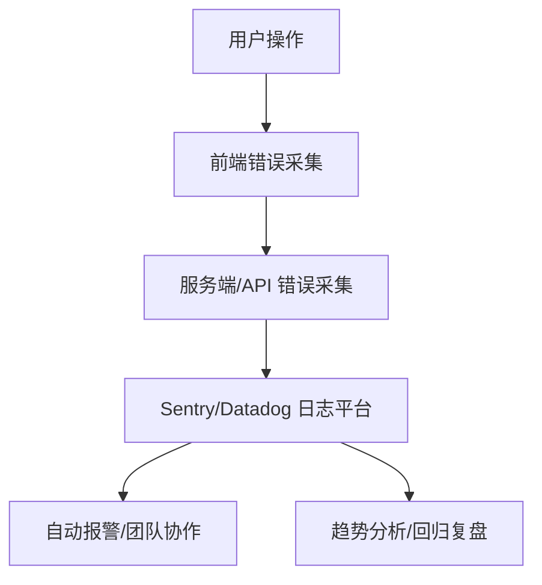

# 前言
大家好，我是鲫小鱼。是一名`不写前端代码`的前端工程师，热衷于分享非前端的知识，带领切图仔逃离切图圈子，欢迎关注我，微信公众号：`《鲫小鱼不正经》`。欢迎点赞、收藏、关注，一键三连！！

# 第二十四章：错误处理与日志监控

## 理论讲解

### 1. 错误处理的全景视角
- 前端应用不可避免会遇到运行时错误、网络异常、接口失败、权限问题等。
- 企业级项目需关注：客户端错误、服务端错误、API 异常、第三方依赖、性能瓶颈、用户体验。
- 错误处理不仅是 try/catch，更包括全链路监控、自动报警、用户提示、团队协作、问题溯源。

### 2. Next.js 错误处理机制
- **客户端错误边界（Error Boundary）**：React 组件级错误捕获，防止页面崩溃。
- **服务端错误处理**：API Routes、getServerSideProps、Server Actions 等服务端逻辑需 try/catch 并返回标准错误响应。
- **全局错误页面**：自定义 404、500、error.tsx，提升用户体验。
- **日志采集与监控**：集成 Sentry、Datadog、阿里云前端监控等平台，自动采集和上报错误。
- **自动报警与回归分析**：错误触发自动通知团队，支持回溯和趋势分析。

### 3. 日志采集与监控体系
- **前端日志**：捕获 JS 错误、Promise 未捕获异常、资源加载失败、用户行为、性能指标。
- **服务端日志**：API 错误、请求链路、慢查询、依赖异常、SSR/SSG 渲染异常。
- **分布式链路追踪**：结合 TraceID/RequestID，实现前后端、微服务全链路追踪。
- **日志分级与归档**：区分 info、warn、error、fatal，支持日志归档、检索、合规。
- **自动报警**：集成钉钉、企业微信、邮件、短信等多渠道报警。

---

## 详细代码示例

### 1. 客户端错误边界组件

```tsx
// components/ErrorBoundary.tsx
import React from 'react';

export class ErrorBoundary extends React.Component {
  constructor(props) {
    super(props);
    this.state = { hasError: false, error: null };
  }
  static getDerivedStateFromError(error) {
    return { hasError: true, error };
  }
  componentDidCatch(error, info) {
    // 可集成 Sentry/Datadog 上报
    if (window.Sentry) window.Sentry.captureException(error, { extra: info });
  }
  render() {
    if (this.state.hasError) {
      return <div>页面出错了，请刷新或联系管理员。</div>;
    }
    return this.props.children;
  }
}
```

### 2. 全局错误页面与 404/500 定制

```tsx
// pages/_error.tsx
function Error({ statusCode }) {
  return (
    <div>
      <h1>{statusCode ? `错误码: ${statusCode}` : '应用出错'}</h1>
      <p>请刷新页面或联系客服。</p>
    </div>
  );
}
Error.getInitialProps = ({ res, err }) => {
  const statusCode = res ? res.statusCode : err ? err.statusCode : 404;
  return { statusCode };
};
export default Error;
```

```tsx
// app/error.tsx (App Router)
'use client';
export default function GlobalError({ error, reset }) {
  return (
    <html>
      <body>
        <h2>应用发生错误</h2>
        <pre>{error.message}</pre>
        <button onClick={() => reset()}>重试</button>
      </body>
    </html>
  );
}
```

### 3. API Routes 与服务端错误处理

```ts
// pages/api/user.ts
export default async function handler(req, res) {
  try {
    // ...业务逻辑
    res.status(200).json({ user: { name: '鲫小鱼' } });
  } catch (error) {
    // 日志采集
    if (process.env.NODE_ENV === 'production') {
      // 可集成 Sentry/Datadog
      console.error('API Error:', error);
    }
    res.status(500).json({ error: '服务端异常，请稍后重试' });
  }
}
```

### 4. getServerSideProps/getStaticProps 错误处理

```ts
export async function getServerSideProps(context) {
  try {
    // ...数据获取
    return { props: { data } };
  } catch (error) {
    // 日志采集
    return { notFound: true };
  }
}
```

### 5. Sentry 日志采集与自动报警

```ts
// sentry.server.config.ts
import * as Sentry from '@sentry/nextjs';
Sentry.init({
  dsn: process.env.SENTRY_DSN,
  tracesSampleRate: 1.0,
  environment: process.env.NODE_ENV,
});
```

```tsx
// pages/_app.tsx
import * as Sentry from '@sentry/nextjs';
Sentry.init({ dsn: process.env.SENTRY_DSN });
```

- 支持自动采集前后端错误、性能指标、分布式链路。
- 可配置报警规则，自动通知团队。

### 6. 日志分级与链路追踪

```ts
// utils/logger.ts
export function logError(error, context) {
  // 可按 info/warn/error/fatal 分级
  if (window.Sentry) window.Sentry.captureException(error, { extra: context });
  // 也可写入自有日志服务
}
```

---

## 实战项目：企业级全链路错误监控与报警

### 1. 需求分析
- 前后端、API、第三方依赖、性能瓶颈全链路监控。
- 自动采集、归档、报警、回归分析。
- 支持多环境、分级、团队协作。

### 2. 目录结构
```
components/
  ErrorBoundary.tsx
pages/
  _error.tsx
  api/
    user.ts
app/
  error.tsx
utils/
  logger.ts
sentry.server.config.ts
sentry.client.config.ts
scripts/
  alert-webhook.js
```

### 3. 关键代码片段
- 见上方详细代码示例。
- ErrorBoundary 组件全局包裹，捕获所有 React 错误。
- API、服务端、getServerSideProps 全部 try/catch 并日志采集。
- Sentry 配置自动采集、报警、链路追踪。
- alert-webhook.js 支持钉钉/企业微信/邮件自动报警。

### 4. 项目亮点
- 全链路监控，前后端、API、第三方依赖、性能一体化。
- 自动报警、分级归档、趋势分析。
- 多环境、团队协作、知识库集成。
- 代码结构清晰，易于维护和扩展。

---

## 最佳实践
- 全局 ErrorBoundary 包裹所有页面，防止页面崩溃。
- API、服务端、Server Actions 全部 try/catch 并日志采集。
- Sentry/Datadog/阿里云前端监控平台集成，自动报警。
- 日志分级、归档、检索，支持链路追踪。
- 自动化测试覆盖异常分支，保障稳定性。
- 团队协作：前端、后端、运维、测试协同，定期复盘。

---

## 常见问题与解决方案

### Q1: 页面崩溃但无提示？
A: 检查是否全局包裹 ErrorBoundary，error.tsx 是否配置。

### Q2: API/服务端错误未被监控？
A: 检查 try/catch、日志采集、Sentry/Datadog 配置。

### Q3: 日志太多难以检索？
A: 日志分级、归档、定期清理，结合 Kibana/Elasticsearch 检索。

### Q4: 错误报警太频繁？
A: 配置报警阈值、合并重复报警、分级通知。

### Q5: 如何定位线上 bug？
A: 结合 Sentry 链路追踪、用户行为回放、日志检索，快速定位。

### Q6: 如何保障合规与隐私？
A: 日志脱敏、合规归档、权限控制，支持 GDPR/等保。

---

## 配图说明



> Next.js 企业级全链路错误监控与自动报警全流程示意图。

---

> 最后感谢阅读！欢迎关注我，微信公众号：`《鲫小鱼不正经》`。欢迎点赞、收藏、关注，一键三连！！