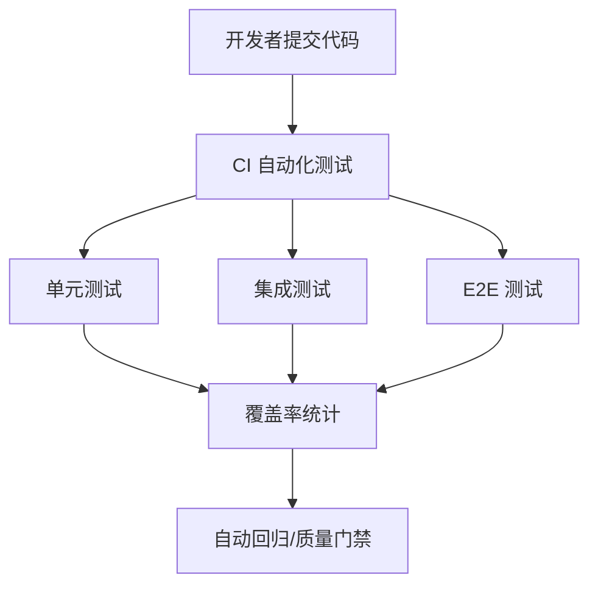

# 前言
大家好，我是鲫小鱼。是一名`不写前端代码`的前端工程师，热衷于分享非前端的知识，带领切图仔逃离切图圈子，欢迎关注我，微信公众号：`《鲫小鱼不正经》`。欢迎点赞、收藏、关注，一键三连！！

# 第二十五章：测试策略：单元、集成与端到端测试

## 理论讲解

### 1. 为什么要做测试？
- 测试是保障代码质量、稳定性和可维护性的基石，尤其在企业级、多人协作、持续集成场景下更为重要。
- 测试可提前发现 bug，防止回归，提升开发效率，降低线上事故风险。
- Next.js 项目需关注：组件/页面单元测试、API/服务端集成测试、端到端（E2E）测试、自动化测试、CI 集成、团队协作。

### 2. Next.js 测试体系全景
- **单元测试（Unit Test）**：针对最小功能单元（函数、组件、hooks），快速定位问题。
- **集成测试（Integration Test）**：验证多个模块/组件/接口协作是否正常，覆盖业务流程。
- **端到端测试（E2E Test）**：模拟真实用户操作，验证整个系统从前端到后端的完整链路。
- **自动化测试与 CI 集成**：测试自动化、持续集成、自动回归、质量门禁。

### 3. 主流测试工具与选型
- **Jest**：主流 JS/TS 单元测试框架，支持快照、Mock、覆盖率统计。
- **React Testing Library**：专注于 React 组件测试，强调用户视角。
- **Testing Library Hooks**：专门测试自定义 hooks。
- **Supertest**：API/服务端接口测试。
- **Playwright/Cypress**：端到端测试，支持多浏览器、移动端、自动截图、视频回放。
- **msw（Mock Service Worker）**：前后端接口 Mock，提升测试隔离性。

---

## 详细代码示例

### 1. 单元测试：组件与函数

```tsx
// components/Button.tsx
export default function Button({ onClick, children }) {
  return <button onClick={onClick}>{children}</button>;
}
```

```tsx
// __tests__/Button.test.tsx
import { render, fireEvent } from '@testing-library/react';
import Button from '../components/Button';

test('点击按钮触发事件', () => {
  const handleClick = jest.fn();
  const { getByText } = render(<Button onClick={handleClick}>点我</Button>);
  fireEvent.click(getByText('点我'));
  expect(handleClick).toHaveBeenCalled();
});
```

```ts
// utils/math.ts
export function add(a, b) { return a + b; }
```

```ts
// __tests__/math.test.ts
import { add } from '../utils/math';
test('加法函数', () => {
  expect(add(1, 2)).toBe(3);
});
```

### 2. 集成测试：API 与服务端

```ts
// pages/api/hello.ts
export default function handler(req, res) {
  res.status(200).json({ message: 'Hello, Next.js!' });
}
```

```ts
// __tests__/api/hello.test.ts
import handler from '../../pages/api/hello';
import { createMocks } from 'node-mocks-http';

test('API 返回 Hello', async () => {
  const { req, res } = createMocks({ method: 'GET' });
  await handler(req, res);
  expect(res._getStatusCode()).toBe(200);
  expect(res._getJSONData()).toEqual({ message: 'Hello, Next.js!' });
});
```

### 3. 端到端测试：Playwright/Cypress

```js
// e2e/home.spec.ts (Playwright)
import { test, expect } from '@playwright/test';

test('首页加载与交互', async ({ page }) => {
  await page.goto('http://localhost:3000');
  await expect(page.locator('text=欢迎')).toBeVisible();
  await page.click('text=点我');
  await expect(page.locator('text=已点击')).toBeVisible();
});
```

```js
// cypress/e2e/login.cy.js
describe('登录流程', () => {
  it('用户可以登录', () => {
    cy.visit('/login');
    cy.get('input[name=username]').type('testuser');
    cy.get('input[name=password]').type('123456');
    cy.get('button[type=submit]').click();
    cy.contains('欢迎，testuser').should('be.visible');
  });
});
```

### 4. Mock 与隔离测试

```ts
// __tests__/api/user.test.ts
import handler from '../../pages/api/user';
import { createMocks } from 'node-mocks-http';
import { getUser } from '../../services/user';
jest.mock('../../services/user');

test('API 返回用户信息', async () => {
  getUser.mockResolvedValue({ name: '鲫小鱼' });
  const { req, res } = createMocks({ method: 'GET' });
  await handler(req, res);
  expect(res._getJSONData()).toEqual({ name: '鲫小鱼' });
});
```

### 5. CI 集成与自动化

```yaml
# .github/workflows/test.yml
name: Test
on: [push, pull_request]
jobs:
  test:
    runs-on: ubuntu-latest
    steps:
      - uses: actions/checkout@v2
      - name: Install deps
        run: npm ci
      - name: Run unit & integration tests
        run: npm test -- --coverage
      - name: Run E2E tests
        run: npx playwright test
```

---

## 实战项目：企业级测试体系落地

### 1. 需求分析
- 组件、页面、API、服务端、端到端全链路测试。
- 自动化、Mock、覆盖率统计、CI 集成、团队协作。

### 2. 目录结构
```
components/
  Button.tsx
pages/
  api/
    hello.ts
  login.tsx
utils/
  math.ts
services/
  user.ts
__tests__/
  Button.test.tsx
  math.test.ts
  api/
    hello.test.ts
    user.test.ts
cypress/
  e2e/
    login.cy.js
e2e/
  home.spec.ts
.github/
  workflows/
    test.yml
```

### 3. 关键代码片段
- 见上方详细代码示例。
- Button、math、API、登录流程全链路测试。
- Mock 服务端依赖，隔离外部影响。
- test.yml 集成单元、集成、E2E 测试，自动化覆盖率统计。

### 4. 项目亮点
- 单元、集成、E2E 全链路自动化测试。
- Mock、隔离、覆盖率统计，保障质量。
- CI 集成、自动回归、团队协作。
- 代码结构清晰，易于维护和扩展。

---

## 最佳实践
- 单元测试覆盖所有核心函数、组件、hooks。
- 集成测试覆盖 API、服务端、业务流程。
- 端到端测试覆盖关键用户路径、异常分支。
- Mock 外部依赖，提升测试隔离性和稳定性。
- 自动化测试集成到 CI，强制通过后才能合并。
- 覆盖率统计、趋势分析，定期 review。
- 团队协作：前端、后端、测试、产品协同，制定测试规范。

---

## 常见问题与解决方案

### Q1: 测试覆盖率低？
A: 制定覆盖率门槛，CI 阶段强制检查，定期补齐核心代码测试。

### Q2: E2E 测试不稳定？
A: 用 Mock、数据隔离、重试机制，避免依赖外部服务。

### Q3: Mock 数据与真实环境不一致？
A: 定期同步生产数据，或用 msw 动态 Mock。

### Q4: 测试执行慢？
A: 并行执行、只跑受影响用例、分阶段测试。

### Q5: 团队协作难？
A: 制定测试规范、代码评审、自动化流程、知识库沉淀。

### Q6: 如何保障安全与合规？
A: 测试数据脱敏、权限隔离、合规审计。

---

## 配图说明



> Next.js 企业级自动化测试全流程示意图。

---

> 最后感谢阅读！欢迎关注我，微信公众号：`《鲫小鱼不正经》`。欢迎点赞、收藏、关注，一键三连！！