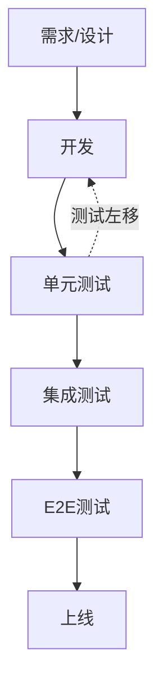
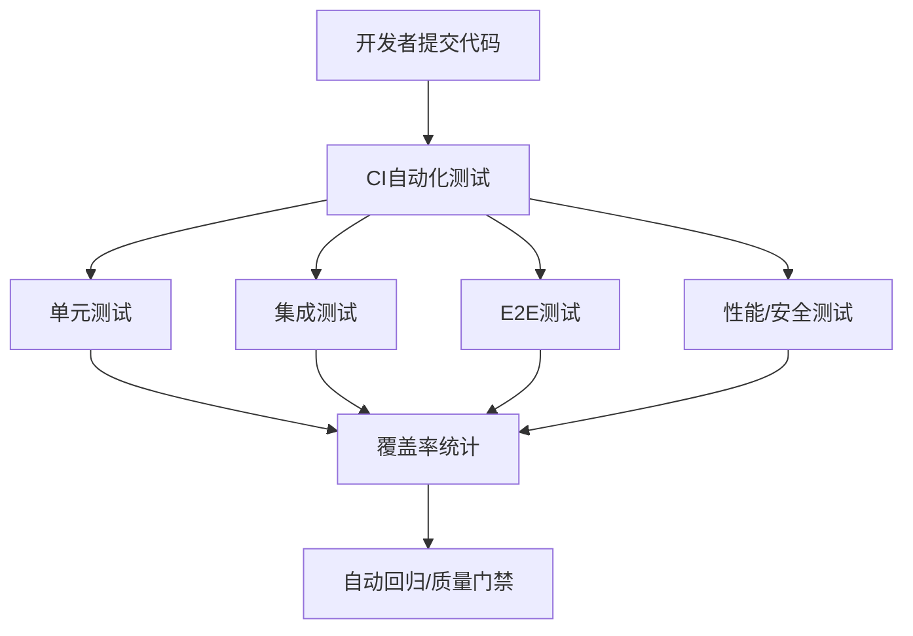
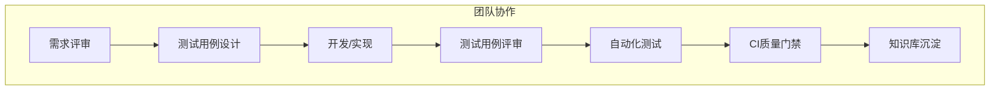

# 前言
大家好，我是鲫小鱼。是一名`不写前端代码`的前端工程师，热衷于分享非前端的知识，带领切图仔逃离切图圈子，欢迎关注我，微信公众号：`《鲫小鱼不正经》`。欢迎点赞、收藏、关注，一键三连！！

# 第二十五章：测试策略：单元、集成与端到端测试

## 理论讲解

### 1. 测试金字塔与测试左移
- **测试金字塔**：底层是单元测试（数量最多、执行最快），中层是集成测试，顶层是端到端（E2E）测试（数量最少、最贴近用户）。合理分布测试类型，既保证质量又兼顾效率。
- **测试左移**：将测试环节前置到开发早期，越早发现问题，修复成本越低。TDD（测试驱动开发）和CI自动化测试是典型实践。


> 测试左移理念：越早测试，越低成本。

### 2. 企业级Next.js测试体系全景
- **单元测试（Unit Test）**：函数、组件、hooks，Mock依赖，快速定位问题。
- **集成测试（Integration Test）**：模块/接口/服务协作，业务流程、API、Server Actions、RSC等。
- **端到端测试（E2E Test）**：模拟真实用户，覆盖桌面与移动端，验证全链路。
- **性能与安全测试**：Lighthouse、Web Vitals、自动化安全扫描（如OWASP ZAP）。
- **自动化测试与CI/CD**：测试自动化、持续集成、质量门禁、自动回归、自动通知、自动回滚。
- **团队协作与规范**：测试用例评审、覆盖率门槛、知识库沉淀、分支策略。

### 3. 主流测试工具与选型
- **Jest**：主流JS/TS单元测试框架，支持Mock、快照、覆盖率。
- **React Testing Library**：以用户视角测试React组件。
- **Testing Library Hooks**：测试自定义hooks。
- **Supertest**：API/服务端接口测试。
- **Playwright/Cypress**：E2E测试，支持多端、自动截图、视频回放。
- **msw（Mock Service Worker）**：前后端接口Mock，提升隔离性。
- **Lighthouse/Web Vitals**：性能测试。
- **OWASP ZAP/Snyk**：安全扫描。

---

## 详细代码示例

### 1. 单元测试：组件、函数、hooks

```tsx
// components/Button.tsx
export default function Button({ onClick, children }) {
  return <button onClick={onClick}>{children}</button>;
}
```

```tsx
// __tests__/Button.test.tsx
import { render, fireEvent } from '@testing-library/react';
import Button from '../components/Button';

test('点击按钮触发事件', () => {
  const handleClick = jest.fn();
  const { getByText } = render(<Button onClick={handleClick}>点我</Button>);
  fireEvent.click(getByText('点我'));
  expect(handleClick).toHaveBeenCalled();
});
```

```ts
// utils/math.ts
export function add(a, b) { return a + b; }
```

```ts
// __tests__/math.test.ts
import { add } from '../utils/math';
test('加法函数', () => {
  expect(add(1, 2)).toBe(3);
});
```

```tsx
// hooks/useMobile.ts
import { useEffect, useState } from 'react';
export function useMobile() {
  const [isMobile, setIsMobile] = useState(false);
  useEffect(() => {
    setIsMobile(window.innerWidth < 768);
  }, []);
  return isMobile;
}
```

```tsx
// __tests__/useMobile.test.tsx
import { renderHook } from '@testing-library/react';
import { useMobile } from '../hooks/useMobile';

test('移动端判断', () => {
  global.innerWidth = 375;
  const { result } = renderHook(() => useMobile());
  expect(result.current).toBe(true);
});
```

### 2. 集成测试：API Routes、Server Actions、RSC

```ts
// pages/api/hello.ts
export default function handler(req, res) {
  res.status(200).json({ message: 'Hello, Next.js!' });
}
```

```ts
// __tests__/api/hello.test.ts
import handler from '../../pages/api/hello';
import { createMocks } from 'node-mocks-http';

test('API 返回 Hello', async () => {
  const { req, res } = createMocks({ method: 'GET' });
  await handler(req, res);
  expect(res._getStatusCode()).toBe(200);
  expect(res._getJSONData()).toEqual({ message: 'Hello, Next.js!' });
});
```

```ts
// app/actions/submitFeedback.ts (Server Action)
'use server';
export async function submitFeedback(data) {
  if (!data.message) throw new Error('内容不能为空');
  // ...保存逻辑
  return { success: true };
}
```

```ts
// __tests__/actions/submitFeedback.test.ts
import { submitFeedback } from '../../app/actions/submitFeedback';
test('Server Action 校验', async () => {
  await expect(submitFeedback({ message: '' })).rejects.toThrow('内容不能为空');
  await expect(submitFeedback({ message: 'ok' })).resolves.toEqual({ success: true });
});
```

```tsx
// app/article/page.server.tsx (RSC)
export default async function ArticlePage({ params }) {
  const article = await fetch(`https://api.example.com/articles/${params.id}`).then(res => res.json());
  return <div>{article.title}</div>;
}
```

```ts
// __tests__/articlePage.test.tsx
import ArticlePage from '../app/article/page.server';
global.fetch = jest.fn(() => Promise.resolve({ json: () => ({ title: 'Test' }) }));
test('RSC 数据获取', async () => {
  const el = await ArticlePage({ params: { id: 1 } });
  expect(el.props.children).toBe('Test');
});
```

### 3. 端到端测试：桌面与移动端、性能与安全

```js
// e2e/home.spec.ts (Playwright)
import { test, expect } from '@playwright/test';

test('首页加载与交互', async ({ page }) => {
  await page.goto('http://localhost:3000');
  await expect(page.locator('text=欢迎')).toBeVisible();
  await page.setViewportSize({ width: 375, height: 667 }); // 模拟移动端
  await expect(page.locator('nav.mobile-menu')).toBeVisible();
});
```

```js
// cypress/e2e/login.cy.js
describe('登录流程', () => {
  it('用户可以登录', () => {
    cy.viewport('iphone-6');
    cy.visit('/login');
    cy.get('input[name=username]').type('testuser');
    cy.get('input[name=password]').type('123456');
    cy.get('button[type=submit]').click();
    cy.contains('欢迎，testuser').should('be.visible');
  });
});
```

```js
// e2e/performance.spec.ts (Lighthouse)
const { lighthouse, prepareAudit } = require('@cypress-audit/lighthouse');
describe('性能测试', () => {
  it('首页性能达标', () => {
    cy.visit('/');
    cy.lighthouse({ performance: 90 });
  });
});
```

### 4. Mock、隔离与安全测试

```ts
// __tests__/api/user.test.ts
import handler from '../../pages/api/user';
import { createMocks } from 'node-mocks-http';
import { getUser } from '../../services/user';
jest.mock('../../services/user');

test('API 返回用户信息', async () => {
  getUser.mockResolvedValue({ name: '鲫小鱼' });
  const { req, res } = createMocks({ method: 'GET' });
  await handler(req, res);
  expect(res._getJSONData()).toEqual({ name: '鲫小鱼' });
});
```

```ts
// __tests__/api/secure.test.ts
import handler from '../../pages/api/secure';
import { createMocks } from 'node-mocks-http';
test('API 拒绝未授权请求', async () => {
  const { req, res } = createMocks({ method: 'GET', headers: {} });
  await handler(req, res);
  expect(res._getStatusCode()).toBe(401);
});
```

### 5. CI/CD 集成与自动化

```yaml
# .github/workflows/test.yml
name: Test
on: [push, pull_request]
jobs:
  test:
    runs-on: ubuntu-latest
    steps:
      - uses: actions/checkout@v2
      - name: Install deps
        run: npm ci
      - name: Run unit & integration tests
        run: npm test -- --coverage
      - name: Run E2E tests
        run: npx playwright test
      - name: Run Lighthouse
        run: npx lhci autorun
      - name: 安全扫描
        run: npx snyk test
```

---

## 实战项目：企业级全链路测试体系落地

### 1. 需求分析与目标
- 组件、页面、API、Server Actions、RSC、端到端全链路测试。
- 移动端适配、性能与安全测试。
- 自动化、Mock、覆盖率统计、CI/CD集成、团队协作、质量门禁。

### 2. 目录结构
```
components/
  Button.tsx
pages/
  api/
    hello.ts
    secure.ts
  login.tsx
app/
  actions/
    submitFeedback.ts
  article/
    page.server.tsx
hooks/
  useMobile.ts
utils/
  math.ts
services/
  user.ts
__tests__/
  Button.test.tsx
  math.test.ts
  hooks/
    useMobile.test.tsx
  api/
    hello.test.ts
    user.test.ts
    secure.test.ts
  actions/
    submitFeedback.test.ts
  articlePage.test.tsx
cypress/
  e2e/
    login.cy.js
    performance.spec.ts
e2e/
  home.spec.ts
.github/
  workflows/
    test.yml
```

### 3. 关键代码片段
- 见上方详细代码示例。
- Button、math、API、Server Actions、RSC、移动端、性能与安全全链路测试。
- Mock服务端依赖，隔离外部影响。
- test.yml集成单元、集成、E2E、性能、安全测试，自动化覆盖率统计。

### 4. 团队协作与CI质量门禁
- Pull Request必须通过所有测试和覆盖率门槛。
- 代码评审需关注测试用例质量。
- 自动化通知、失败快照、自动回归。
- 测试规范沉淀到团队知识库。

### 5. 项目亮点
- 单元、集成、E2E、性能、安全全链路自动化测试。
- Mock、隔离、覆盖率统计，保障质量。
- CI/CD集成、自动回归、团队协作、质量门禁。
- 代码结构清晰，易于维护和扩展。
- 移动端适配、性能与安全测试全覆盖。

---

## 最佳实践
- 单元测试覆盖所有核心函数、组件、hooks。
- 集成测试覆盖API、服务端、Server Actions、RSC、业务流程。
- 端到端测试覆盖关键用户路径、异常分支、移动端视图。
- Mock外部依赖，提升测试隔离性和稳定性。
- 自动化测试集成到CI/CD，强制通过后才能合并。
- 覆盖率统计、趋势分析，定期review。
- 团队协作：前端、后端、测试、产品协同，制定测试规范。
- 性能与安全测试纳入CI流程。
- 测试数据脱敏、权限隔离、合规审计。
- 测试用例与需求、设计、Bug追踪系统联动。

---

## 常见问题与解决方案

### Q1: 测试覆盖率低？
A: 制定覆盖率门槛，CI阶段强制检查，定期补齐核心代码测试。

### Q2: E2E测试不稳定？
A: 用Mock、数据隔离、重试机制，避免依赖外部服务。

### Q3: Mock数据与真实环境不一致？
A: 定期同步生产数据，或用msw动态Mock。

### Q4: 测试执行慢？
A: 并行执行、只跑受影响用例、分阶段测试。

### Q5: 团队协作难？
A: 制定测试规范、代码评审、自动化流程、知识库沉淀。

### Q6: 如何保障安全与合规？
A: 测试数据脱敏、权限隔离、合规审计。

### Q7: 移动端适配如何测试？
A: E2E测试中模拟不同设备视口，覆盖主流机型。

### Q8: 性能与安全测试如何自动化？
A: 集成Lighthouse、Web Vitals、Snyk等工具到CI流程。

---

## 配图说明


> Next.js企业级自动化测试全流程示意图。


> 团队协作与测试规范流程。

---

## 资源链接与完整源码
- [Next.js官方文档](https://nextjs.org/docs/testing)
- [Jest](https://jestjs.io/)
- [React Testing Library](https://testing-library.com/docs/react-testing-library/intro/)
- [Playwright](https://playwright.dev/)
- [Cypress](https://www.cypress.io/)
- [msw(Mock Service Worker)](https://mswjs.io/)
- [Lighthouse](https://developers.google.com/web/tools/lighthouse)
- [Snyk安全扫描](https://snyk.io/)
- [GitHub Actions官方文档](https://docs.github.com/en/actions)
- [企业级Next.js测试开源项目示例](https://github.com/vercel/next.js/tree/canary/examples/with-jest)

> 最后感谢阅读！欢迎关注我，微信公众号：`《鲫小鱼不正经》`。欢迎点赞、收藏、关注，一键三连！！