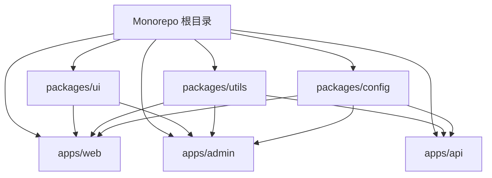
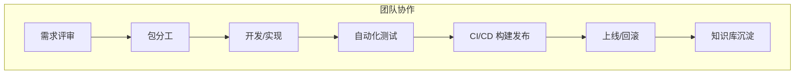
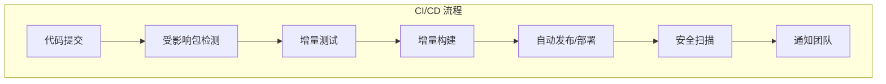

# 前言
大家好，我是鲫小鱼。是一名`不写前端代码`的前端工程师，热衷于分享非前端的知识，带领切图仔逃离切图圈子，欢迎关注我，微信公众号：`《鲫小鱼不正经》`。欢迎点赞、收藏、关注，一键三连！！

# 第二十六章：Monorepo 架构与 Next.js

## 理论讲解

### 1. 什么是 Monorepo？为什么要用 Monorepo？

Monorepo（单一代码仓库）是一种将多个项目（如前端、后端、组件库、工具库等）统一管理在同一个 Git 仓库的架构模式。与之相对的是 Polyrepo（多仓库），即每个项目单独一个仓库。

**Monorepo 的优势：**
- **代码复用**：共享 UI 组件、工具函数、类型定义等，避免重复造轮子。
- **一致性**：统一依赖、统一 lint/测试/构建规范，减少环境差异。
- **原子化提交**：一次提交可同时修改多个包，保证变更一致性。
- **团队协作**：前后端、设计、测试等多团队协作更高效。
- **自动化**：CI/CD、自动发布、依赖追踪、影响分析等更容易实现。
- **微前端支持**：多个 Next.js 子应用可独立开发、独立部署，支持微前端架构。
- **企业级权限与安全**：可结合 Git 权限、CI/CD 权限、包发布权限实现分层管理。

**Monorepo 的挑战：**
- **依赖管理复杂**：包之间的依赖关系、版本同步、循环依赖等需谨慎设计。
- **构建性能**：项目大了后，构建/测试/发布速度可能变慢，需要增量构建、缓存等优化。
- **权限与安全**：大团队下，如何细粒度控制不同包的访问权限。
- **工具链门槛**：需要引入如 Turborepo、Nx、Lerna 等工具，初期学习成本较高。
- **团队协作冲突**：多人协作时，分支管理、代码合并、包依赖变更需规范。

#### Monorepo 与 Polyrepo 对比
| 维度         | Monorepo                        | Polyrepo                      |
|--------------|----------------------------------|-------------------------------|
| 代码复用     | 极高，依赖本地包                | 低，需发布/安装               |
| 依赖管理     | 复杂，需工具辅助                | 简单，独立 package.json       |
| CI/CD        | 可统一、自动化                  | 分散，需多套流程               |
| 协作效率     | 高，变更可原子化                | 低，跨仓库需多次提交           |
| 适用场景     | 大型企业、平台、微前端           | 小型项目、独立服务             |

### 2. 企业级 Monorepo 场景与最佳实践

- **多产品线/多端统一管理**：如 Web、Mobile、Admin、API、组件库、工具库等。
- **微前端架构**：多个独立 Next.js 子应用共存，支持独立部署与集成。
- **统一规范与自动化**：统一 ESLint、Prettier、测试、CI/CD 流程。
- **增量构建与缓存**：只构建/测试受影响的包，大幅提升效率。
- **依赖追踪与影响分析**：自动检测变更影响，精准触发测试/发布。
- **团队协作与权限管理**：不同团队负责不同包，权限隔离，协作高效。
- **自动发布与灰度发布**：支持 NPM 包自动发布、灰度发布、回滚。
- **安全与合规**：统一依赖安全扫描、敏感信息管理、合规审计。

#### 企业级真实案例
- **Vercel**、**Airbnb**、**ByteDance** 等大型企业均采用 Monorepo 管理数百个包，提升协作与自动化效率。

### 3. 主流 Monorepo 工具对比与进阶

| 工具      | 适用场景           | 特点                         |
|-----------|--------------------|------------------------------|
| Turborepo | Next.js/React 项目 | 极致性能、增量构建、易上手   |
| Nx        | 大型企业/多语言    | 强大依赖分析、插件丰富       |
| Lerna     | 传统 JS Monorepo   | 经典方案，适合包发布         |

- **Turborepo**：Vercel 出品，天然支持 Next.js，极致性能，配置简单，推荐！支持远程缓存、影响分析、增量构建、跨包测试。
- **Nx**：功能强大，适合大型多语言项目，依赖分析和插件体系丰富，支持微前端、GraphQL、NestJS 等。
- **Lerna**：适合传统 JS 包管理，和 Yarn/NPM workspace 配合使用，支持自动发布、版本管理。

#### Turborepo 进阶用法
- 远程缓存（Remote Caching）：团队成员共享构建缓存，极大提升 CI/CD 速度。
- 影响分析（Affected）：只测试/构建受影响的包，节省资源。
- 跨包测试：如 UI 组件变更自动触发所有依赖包的测试。

#### Nx 进阶用法
- 依赖图可视化：`nx dep-graph` 命令生成依赖关系图。
- 插件体系：支持 React、Next.js、NestJS、Storybook、Cypress 等。
- 微前端支持：可拆分多个 Next.js 子应用，独立部署。

#### Lerna 进阶用法
- 自动发布：`lerna publish` 支持多包自动发布。
- 版本管理：支持独立/统一版本策略。

---

## 详细代码示例

### 1. 使用 Turborepo 初始化 Monorepo

```bash
npx create-turbo@latest my-monorepo
cd my-monorepo
```

目录结构如下：
```
my-monorepo/
  apps/
    web/           # Next.js 主应用
    admin/         # 管理后台（可选）
  packages/
    ui/            # 共享 UI 组件库
    utils/         # 公共工具函数
    config/        # 统一配置
  package.json
  turbo.json       # Turborepo 配置
```

### 2. 新增 Next.js 子应用

```bash
cd apps
npx create-next-app@latest web
npx create-next-app@latest admin
```

### 3. 创建共享 UI 组件库

`packages/ui/button.tsx`
```tsx
import React from 'react';
export const Button = ({ children, ...props }) => (
  <button style={{ padding: 8, borderRadius: 4 }} {...props}>{children}</button>
);
```

`packages/ui/package.json`
```json
{
  "name": "@my/ui",
  "version": "1.0.0",
  "main": "button.tsx"
}
```

### 4. 在 Next.js 应用中使用共享组件

`apps/web/pages/index.tsx`
```tsx
import { Button } from '@my/ui/button';
export default function Home() {
  return <Button>点我</Button>;
}
```

### 5. 公共工具函数包

`packages/utils/formatDate.ts`
```ts
export function formatDate(date: Date) {
  return date.toLocaleDateString('zh-CN');
}
```

### 6. 统一 TypeScript 配置

`packages/tsconfig.base.json`
```json
{
  "compilerOptions": {
    "strict": true,
    "baseUrl": ".",
    "paths": {
      "@my/ui/*": ["../ui/*"],
      "@my/utils/*": ["../utils/*"]
    }
  }
}
```

### 7. Turbo 配置增量构建与缓存

`turbo.json`
```json
{
  "pipeline": {
    "build": {
      "dependsOn": ["^build"],
      "outputs": ["dist/**", ".next/**"]
    },
    "lint": {},
    "test": {}
  }
}
```

### 8. 跨包依赖与本地开发
- 使用 `yarn workspaces` 或 `npm workspaces` 管理依赖。
- 代码变更后，Turbo 只会重建受影响的包，极大提升效率。

### 9. 自动化脚本与 CI/CD

`.github/workflows/ci.yml`
```yaml
name: CI
on: [push, pull_request]
jobs:
  build:
    runs-on: ubuntu-latest
    steps:
      - uses: actions/checkout@v3
      - name: 安装依赖
        run: yarn install --frozen-lockfile
      - name: Lint
        run: yarn lint
      - name: Test
        run: yarn test
      - name: Build
        run: yarn build
```

### 10. 进阶：自动发布 NPM 包与影响分析

- 在 `packages/ui` 下配置 `publishConfig`，结合 Lerna 或 Nx 实现自动发布：

`packages/ui/package.json`
```json
{
  "name": "@my/ui",
  "version": "1.0.0",
  "main": "button.tsx",
  "publishConfig": {
    "access": "public"
  }
}
```

- Lerna 自动发布脚本：
```bash
npx lerna publish --yes
```

- Nx 影响分析：
```bash
npx nx affected:apps --base=main
```

### 11. 进阶：跨包测试与增量构建
- UI 组件变更自动触发所有依赖包的测试与构建。
- Turbo/Nx 支持只测试/构建受影响的包，极大提升 CI/CD 效率。

---

## 实战项目：企业级博客 Monorepo 拆分

### 1. 项目背景
假设我们有一个企业级博客系统，包含：
- 前台 Web 应用（Next.js）
- 管理后台（Next.js）
- 共享 UI 组件库
- 公共工具函数
- API 层（可选，Node.js/Express）

### 2. Monorepo 拆分与目录结构
```
my-blog-monorepo/
  apps/
    web/         # 博客前台
    admin/       # 管理后台
    api/         # API 服务（可选）
  packages/
    ui/          # 共享 UI 组件
    utils/       # 公共工具
    config/      # 统一配置
```

### 3. 团队协作与权限管理
- 前端、后端、设计、测试各自负责不同包，协作高效。
- 通过代码评审、CI 质量门禁、自动化测试保障质量。
- 统一 lint、测试、构建规范，减少环境差异。
- 通过 Turbo/Nx 实现增量构建、影响分析、自动发布。
- 结合 GitHub CODEOWNERS 文件实现包级别评审人自动分配。
- 结合 GitHub Actions/CI 权限，细粒度控制不同包的发布与部署。

### 4. CI/CD 与自动化
- 只测试/构建受影响的包，提升效率。
- 自动发布 NPM 包（如 UI 组件库）。
- 自动部署 Next.js 应用到 Vercel/Netlify/自建服务器。
- 代码提交即触发自动化流程，保障主干分支稳定。
- 结合 Turbo/Nx 远程缓存，极大提升团队 CI/CD 速度。

### 5. 移动端适配与性能优化
- 共享 UI 组件库内置响应式设计，适配多端。
- 统一图片、字体、代码分割等优化策略。
- Turbo/Nx 支持缓存与并行构建，提升大项目性能。
- 结合 Lighthouse、Web Vitals、自动化性能测试，保障多端体验。

### 6. 安全与合规
- 统一依赖管理，定期安全扫描（如 Snyk、OWASP ZAP）。
- 代码审计、权限隔离，敏感信息集中管理。
- 合规审计与日志追踪。
- 结合 CI/CD 自动化安全扫描，保障上线安全。

### 7. 常见问题与解决方案
- **依赖冲突/循环依赖**：合理设计包结构，避免包间强耦合。
- **构建慢**：开启 Turbo/Nx 缓存，合理拆分 pipeline。
- **权限管理难**：结合 Git 子模块、分支保护、CI 权限控制。
- **团队协作冲突**：制定分支策略、代码规范、自动化流程。
- **包发布失败**：检查 NPM 权限、2FA、publishConfig 配置。
- **安全与合规风险**：定期安全扫描、依赖升级、敏感信息加密。

---

## 最佳实践与常见误区
- 统一依赖版本，避免“幽灵依赖”与版本地狱。
- 充分利用 Turbo/Nx 的增量构建与缓存。
- 结合 CODEOWNERS、CI 权限、分支保护实现包级别协作。
- 组件库/工具库优先本地依赖，必要时发布 NPM。
- 自动化测试、Lint、构建、发布全流程集成到 CI/CD。
- 定期安全扫描与依赖升级。
- 避免包间强耦合，保持包的独立性。
- 规范分支管理，避免多人协作冲突。

---

## Mermaid 配图说明


> Monorepo 依赖关系示意图


> Monorepo 团队协作与自动化流程


> Monorepo 下的 CI/CD 自动化与安全流程

---

## 资源链接与完整源码
- [Turborepo 官方文档](https://turbo.build/)
- [Nx 官方文档](https://nx.dev/)
- [Lerna 官方文档](https://lerna.js.org/)
- [Yarn Workspaces](https://classic.yarnpkg.com/lang/en/docs/workspaces/)
- [NPM Workspaces](https://docs.npmjs.com/cli/v8/using-npm/workspaces)
- [Next.js Monorepo 示例](https://github.com/vercel/next.js/tree/canary/examples/with-turborepo)
- [企业级 Monorepo 实践案例](https://github.com/vercel/turbo)
- [Nx 微前端官方案例](https://nx.dev/getting-started/micro-frontends)
- [Lerna 自动发布官方文档](https://lerna.js.org/docs/features/publishing)
- [Monorepo 依赖安全最佳实践](https://snyk.io/blog/monorepo-dependency-management/)

> 最后感谢阅读！欢迎关注我，微信公众号：`《鲫小鱼不正经》`。欢迎点赞、收藏、关注，一键三连！！
