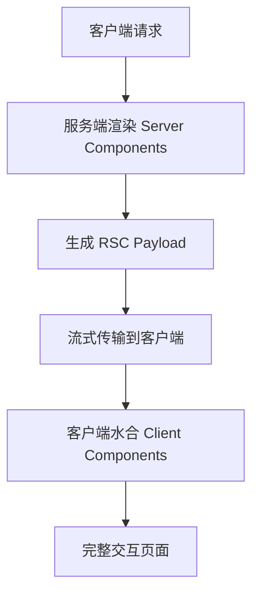
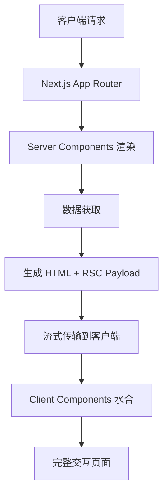
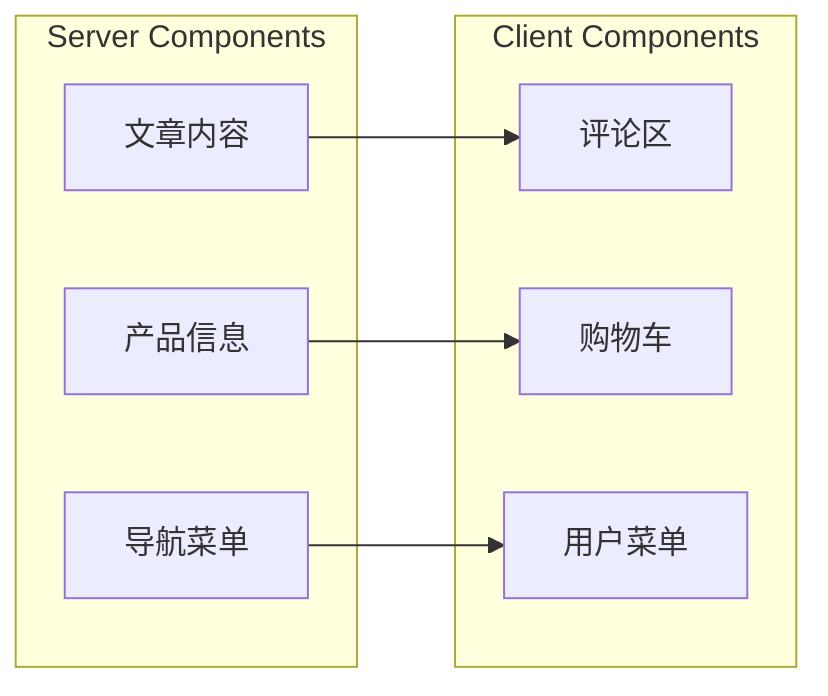

# 前言
大家好，我是鲫小鱼。是一名`不写前端代码`的前端工程师，热衷于分享非前端的知识，带领切图仔逃离切图圈子，欢迎关注我，微信公众号：`《鲫小鱼不正经》`。欢迎点赞、收藏、关注，一键三连！！

# 第二十七章：React Server Components (RSC) 与未来趋势

## 理论讲解

### 1. 什么是 React Server Components (RSC)？

React Server Components (RSC) 是 React 18 引入的革命性特性，允许组件在服务端渲染，而无需发送到客户端。这是 React 生态系统的重大演进，标志着从传统的客户端渲染向服务端优先架构的转变。

**RSC 的核心思想：**
- **服务端优先**：组件默认在服务端渲染，减少客户端 JavaScript 包大小。
- **渐进式增强**：可以混合使用 Server Components 和 Client Components。
- **数据获取优化**：服务端组件可以直接访问数据库、文件系统等资源。
- **安全性提升**：敏感逻辑和 API 密钥保留在服务端，不暴露给客户端。

**RSC 的优势：**
- **性能提升**：减少客户端 JavaScript 包大小，提升首屏加载速度。
- **SEO 友好**：服务端渲染内容对搜索引擎更友好。
- **安全性**：敏感逻辑和 API 密钥保留在服务端。
- **开发体验**：更简单的数据获取，无需 useEffect、useState 等 hooks。
- **缓存优化**：服务端组件可以更好地利用缓存策略。

**RSC 的挑战：**
- **学习曲线**：需要理解服务端和客户端组件的边界。
- **调试复杂**：服务端组件调试相对困难。
- **状态管理**：服务端组件无法使用 useState、useEffect 等客户端 hooks。
- **交互限制**：服务端组件无法直接处理用户交互。

### 2. RSC 渲染模型与架构

RSC 采用了一种全新的渲染模型，称为"流式服务端渲染"：



**渲染流程：**
1. **服务端渲染**：Server Components 在服务端执行，生成 RSC Payload。
2. **流式传输**：RSC Payload 通过流式传输发送到客户端。
3. **客户端水合**：Client Components 在客户端水合，处理交互。
4. **混合渲染**：Server Components 和 Client Components 协同工作。

### 3. Next.js App Router 中的 RSC 实践

Next.js 13+ 的 App Router 天然支持 RSC，所有组件默认都是 Server Components：

- **默认 Server Components**：App Router 中的组件默认在服务端渲染。
- **'use client' 指令**：使用 `'use client'` 指令将组件标记为 Client Component。
- **数据获取**：Server Components 可以直接使用 async/await 进行数据获取。
- **缓存策略**：支持多种缓存策略，如 `cache()`、`revalidate` 等。

### 4. 企业级 RSC 应用场景

- **内容管理系统**：文章内容、产品信息等静态内容使用 Server Components。
- **电商平台**：产品列表、详情页等使用 Server Components，购物车、用户交互使用 Client Components。
- **企业门户**：公司介绍、新闻资讯等使用 Server Components。
- **管理后台**：数据展示使用 Server Components，表单交互使用 Client Components。

---

## 详细代码示例

### 1. 基础 Server Component

```tsx
// app/page.tsx (默认 Server Component)
import { getArticles } from '@/lib/articles';

export default async function HomePage() {
  const articles = await getArticles();

  return (
    <div>
      <h1>博客首页</h1>
      <ArticleList articles={articles} />
    </div>
  );
}
```

### 2. 数据获取 Server Component

```tsx
// app/articles/[id]/page.tsx
import { getArticle, getComments } from '@/lib/articles';
import { CommentSection } from '@/components/CommentSection';

export default async function ArticlePage({ params }: { params: { id: string } }) {
  const [article, comments] = await Promise.all([
    getArticle(params.id),
    getComments(params.id)
  ]);

  return (
    <article>
      <h1>{article.title}</h1>
      <div dangerouslySetInnerHTML={{ __html: article.content }} />
      <CommentSection articleId={params.id} initialComments={comments} />
    </article>
  );
}
```

### 3. Client Component 交互

```tsx
// components/CommentSection.tsx
'use client';

import { useState } from 'react';

interface Comment {
  id: string;
  content: string;
  author: string;
}

export function CommentSection({
  articleId,
  initialComments
}: {
  articleId: string;
  initialComments: Comment[];
}) {
  const [comments, setComments] = useState(initialComments);
  const [newComment, setNewComment] = useState('');

  const handleSubmit = async (e: React.FormEvent) => {
    e.preventDefault();
    const response = await fetch('/api/comments', {
      method: 'POST',
      headers: { 'Content-Type': 'application/json' },
      body: JSON.stringify({ articleId, content: newComment })
    });

    if (response.ok) {
      const comment = await response.json();
      setComments([...comments, comment]);
      setNewComment('');
    }
  };

  return (
    <div>
      <h3>评论 ({comments.length})</h3>
      {comments.map(comment => (
        <div key={comment.id}>
          <strong>{comment.author}</strong>: {comment.content}
        </div>
      ))}
      <form onSubmit={handleSubmit}>
        <textarea
          value={newComment}
          onChange={(e) => setNewComment(e.target.value)}
          placeholder="写下你的评论..."
        />
        <button type="submit">提交评论</button>
      </form>
    </div>
  );
}
```

### 4. 混合使用 Server 和 Client Components

```tsx
// app/layout.tsx
import { Header } from '@/components/Header';
import { Footer } from '@/components/Footer';
import { ThemeProvider } from '@/components/ThemeProvider';

export default function RootLayout({
  children,
}: {
  children: React.ReactNode;
}) {
  return (
    <html lang="zh">
      <body>
        <ThemeProvider>
          <Header />
          <main>{children}</main>
          <Footer />
        </ThemeProvider>
      </body>
    </html>
  );
}
```

```tsx
// components/Header.tsx
'use client';

import { useState } from 'react';
import { UserMenu } from './UserMenu';

export function Header() {
  const [isMenuOpen, setIsMenuOpen] = useState(false);

  return (
    <header>
      <nav>
        <div className="logo">我的博客</div>
        <UserMenu isOpen={isMenuOpen} onToggle={() => setIsMenuOpen(!isMenuOpen)} />
      </nav>
    </header>
  );
}
```

### 5. 缓存与性能优化

```tsx
// lib/articles.ts
import { cache } from 'react';

export const getArticles = cache(async () => {
  const response = await fetch('https://api.example.com/articles', {
    next: { revalidate: 3600 } // 缓存1小时
  });
  return response.json();
});

export const getArticle = cache(async (id: string) => {
  const response = await fetch(`https://api.example.com/articles/${id}`, {
    next: { revalidate: 1800 } // 缓存30分钟
  });
  return response.json();
});
```

### 6. 错误处理与加载状态

```tsx
// app/articles/[id]/page.tsx
import { Suspense } from 'react';
import { getArticle } from '@/lib/articles';
import { ArticleContent } from '@/components/ArticleContent';
import { LoadingSpinner } from '@/components/LoadingSpinner';

export default async function ArticlePage({ params }: { params: { id: string } }) {
  return (
    <Suspense fallback={<LoadingSpinner />}>
      <ArticleContent articleId={params.id} />
    </Suspense>
  );
}
```

```tsx
// components/ArticleContent.tsx
import { getArticle } from '@/lib/articles';

export async function ArticleContent({ articleId }: { articleId: string }) {
  const article = await getArticle(articleId);

  if (!article) {
    throw new Error('文章不存在');
  }

  return (
    <article>
      <h1>{article.title}</h1>
      <div dangerouslySetInnerHTML={{ __html: article.content }} />
    </article>
  );
}
```

---

## 实战项目：企业级博客 RSC 实践

### 1. 项目背景
我们有一个企业级博客系统，需要实现：
- 文章内容使用 Server Components 渲染，提升 SEO 和性能。
- 评论区使用 Client Components 处理用户交互。
- 用户认证和权限控制。
- 移动端适配和性能优化。

### 2. 项目结构
```
app/
  layout.tsx
  page.tsx
  articles/
    [id]/
      page.tsx
  api/
    comments/
      route.ts
components/
  ArticleContent.tsx
  CommentSection.tsx
  Header.tsx
  Footer.tsx
  ThemeProvider.tsx
lib/
  articles.ts
  auth.ts
```

### 3. 核心实现

#### 文章页面（Server Component）
```tsx
// app/articles/[id]/page.tsx
import { getArticle, getComments } from '@/lib/articles';
import { ArticleContent } from '@/components/ArticleContent';
import { CommentSection } from '@/components/CommentSection';
import { notFound } from 'next/navigation';

export default async function ArticlePage({ params }: { params: { id: string } }) {
  try {
    const [article, comments] = await Promise.all([
      getArticle(params.id),
      getComments(params.id)
    ]);

    if (!article) {
      notFound();
    }

    return (
      <div className="max-w-4xl mx-auto px-4">
        <ArticleContent article={article} />
        <CommentSection articleId={params.id} initialComments={comments} />
      </div>
    );
  } catch (error) {
    console.error('加载文章失败:', error);
    throw new Error('文章加载失败');
  }
}
```

#### 文章内容组件（Server Component）
```tsx
// components/ArticleContent.tsx
import { formatDate } from '@/lib/utils';

interface Article {
  id: string;
  title: string;
  content: string;
  author: string;
  publishedAt: string;
}

export function ArticleContent({ article }: { article: Article }) {
  return (
    <article className="prose lg:prose-xl">
      <header className="mb-8">
        <h1 className="text-3xl font-bold mb-4">{article.title}</h1>
        <div className="text-gray-600">
          <span>作者: {article.author}</span>
          <span className="mx-2">•</span>
          <span>发布时间: {formatDate(article.publishedAt)}</span>
        </div>
      </header>
      <div
        className="article-content"
        dangerouslySetInnerHTML={{ __html: article.content }}
      />
    </article>
  );
}
```

#### 评论区组件（Client Component）
```tsx
// components/CommentSection.tsx
'use client';

import { useState } from 'react';
import { useSession } from 'next-auth/react';

interface Comment {
  id: string;
  content: string;
  author: string;
  createdAt: string;
}

export function CommentSection({
  articleId,
  initialComments
}: {
  articleId: string;
  initialComments: Comment[];
}) {
  const { data: session } = useSession();
  const [comments, setComments] = useState(initialComments);
  const [newComment, setNewComment] = useState('');
  const [isSubmitting, setIsSubmitting] = useState(false);

  const handleSubmit = async (e: React.FormEvent) => {
    e.preventDefault();

    if (!session) {
      alert('请先登录');
      return;
    }

    setIsSubmitting(true);

    try {
      const response = await fetch('/api/comments', {
        method: 'POST',
        headers: { 'Content-Type': 'application/json' },
        body: JSON.stringify({ articleId, content: newComment })
      });

      if (response.ok) {
        const comment = await response.json();
        setComments([comment, ...comments]);
        setNewComment('');
      } else {
        throw new Error('提交失败');
      }
    } catch (error) {
      console.error('提交评论失败:', error);
      alert('提交失败，请重试');
    } finally {
      setIsSubmitting(false);
    }
  };

  return (
    <section className="mt-12">
      <h3 className="text-xl font-semibold mb-6">
        评论 ({comments.length})
      </h3>

      {/* 评论列表 */}
      <div className="space-y-4 mb-8">
        {comments.map(comment => (
          <div key={comment.id} className="border-b pb-4">
            <div className="flex items-center mb-2">
              <span className="font-medium">{comment.author}</span>
              <span className="text-gray-500 text-sm ml-2">
                {new Date(comment.createdAt).toLocaleDateString()}
              </span>
            </div>
            <p className="text-gray-700">{comment.content}</p>
          </div>
        ))}
      </div>

      {/* 评论表单 */}
      {session ? (
        <form onSubmit={handleSubmit} className="space-y-4">
          <textarea
            value={newComment}
            onChange={(e) => setNewComment(e.target.value)}
            placeholder="写下你的评论..."
            className="w-full p-3 border rounded-lg resize-none"
            rows={4}
            required
          />
          <button
            type="submit"
            disabled={isSubmitting || !newComment.trim()}
            className="px-6 py-2 bg-blue-600 text-white rounded-lg disabled:opacity-50"
          >
            {isSubmitting ? '提交中...' : '提交评论'}
          </button>
        </form>
      ) : (
        <p className="text-gray-600">请登录后发表评论</p>
      )}
    </section>
  );
}
```

### 4. API 路由实现

```tsx
// app/api/comments/route.ts
import { NextRequest, NextResponse } from 'next/server';
import { getServerSession } from 'next-auth';
import { authOptions } from '@/lib/auth';

export async function POST(request: NextRequest) {
  try {
    const session = await getServerSession(authOptions);

    if (!session) {
      return NextResponse.json({ error: '未授权' }, { status: 401 });
    }

    const { articleId, content } = await request.json();

    if (!content?.trim()) {
      return NextResponse.json({ error: '评论内容不能为空' }, { status: 400 });
    }

    // 这里应该保存到数据库
    const comment = {
      id: Date.now().toString(),
      content: content.trim(),
      author: session.user?.name || '匿名用户',
      createdAt: new Date().toISOString(),
      articleId
    };

    return NextResponse.json(comment);
  } catch (error) {
    console.error('保存评论失败:', error);
    return NextResponse.json({ error: '服务器错误' }, { status: 500 });
  }
}
```

### 5. 性能优化与移动端适配

```tsx
// app/layout.tsx
import { Inter } from 'next/font/google';
import { ThemeProvider } from '@/components/ThemeProvider';
import { Header } from '@/components/Header';
import { Footer } from '@/components/Footer';

const inter = Inter({ subsets: ['latin'] });

export default function RootLayout({
  children,
}: {
  children: React.ReactNode;
}) {
  return (
    <html lang="zh">
      <body className={inter.className}>
        <ThemeProvider>
          <div className="min-h-screen flex flex-col">
            <Header />
            <main className="flex-1">{children}</main>
            <Footer />
          </div>
        </ThemeProvider>
      </body>
    </html>
  );
}
```

---

## 最佳实践与常见问题

### 最佳实践
- **合理划分边界**：静态内容使用 Server Components，交互功能使用 Client Components。
- **数据获取优化**：利用 Server Components 直接获取数据，减少客户端请求。
- **缓存策略**：合理使用 Next.js 的缓存机制。
- **错误处理**：为 Server Components 添加适当的错误边界。
- **性能监控**：监控 RSC 的性能表现。

### 常见问题与解决方案

**Q1: 什么时候使用 Server Components？**
A: 静态内容、SEO 重要内容、数据获取、不需要交互的组件。

**Q2: 什么时候使用 Client Components？**
A: 需要用户交互、使用浏览器 API、需要状态管理、使用事件监听器。

**Q3: 如何处理 Server Components 中的错误？**
A: 使用 try-catch、error.tsx 文件、Suspense 边界。

**Q4: 如何优化 RSC 性能？**
A: 合理使用缓存、避免不必要的重新渲染、优化数据获取。

**Q5: 如何调试 Server Components？**
A: 使用 console.log、Next.js 开发工具、服务端日志。

---

## Mermaid 配图说明


> RSC 渲染流程示意图


> Server Components 与 Client Components 混合使用

---

## 资源链接与完整源码
- [React Server Components 官方文档](https://react.dev/learn/server-components)
- [Next.js App Router 文档](https://nextjs.org/docs/app)
- [RSC 最佳实践](https://nextjs.org/docs/app/building-your-application/rendering/server-components)
- [Next.js 缓存策略](https://nextjs.org/docs/app/building-your-application/caching)
- [React 18 新特性](https://react.dev/blog/2022/03/29/react-v18)
- [企业级 RSC 实践案例](https://github.com/vercel/next.js/tree/canary/examples/app-dir)

> 最后感谢阅读！欢迎关注我，微信公众号：`《鲫小鱼不正经》`。欢迎点赞、收藏、关注，一键三连！！