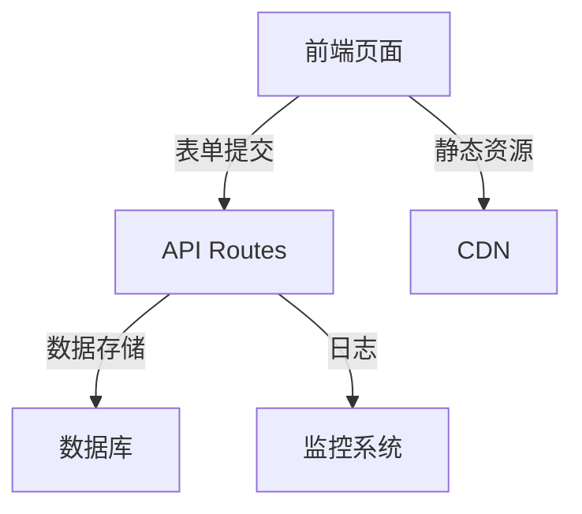
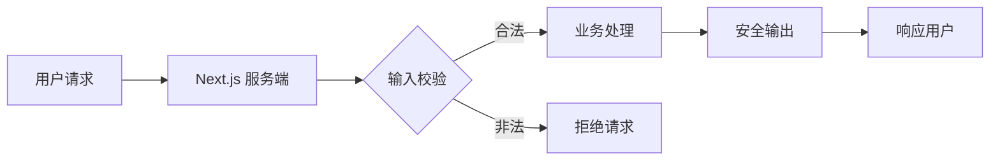

# 前言
大家好，我是鲫小鱼。是一名`不写前端代码`的前端工程师，热衷于分享非前端的知识，带领切图仔逃离切图圈子，欢迎关注我，微信公众号：`《鲫小鱼不正经》`。欢迎点赞、收藏、关注，一键三连！！

---

# 第二十八章：Next.js 的安全最佳实践

## 理论讲解（30%）

### 1. Web 安全的本质与挑战

在企业级 Web 应用开发中，安全性始终是重中之重。随着 Next.js 全栈能力的增强，前后端一体化带来了更多攻击面。常见的安全威胁包括：

- **XSS（跨站脚本攻击）**：攻击者注入恶意脚本，窃取用户信息或劫持会话。
- **CSRF（跨站请求伪造）**：利用用户已登录状态，伪造请求执行敏感操作。
- **SQL/NoSQL 注入**：通过构造恶意输入，操控数据库查询，窃取或篡改数据。
- **敏感信息泄露**：环境变量、API 密钥、用户数据等暴露。
- **依赖漏洞**：第三方包存在安全缺陷。

#### 为什么 Next.js 项目更需重视安全？

- **服务端渲染**：SSR 代码运行在服务端，若处理不当，易暴露服务端资源。
- **API Routes/Server Actions**：全栈开发带来更多后端接口，需防护注入、认证等问题。
- **静态资源与 CDN**：需防止资源劫持、缓存投毒等攻击。
- **移动端适配**：移动端用户更易受钓鱼、劫持等攻击。

### 2. Next.js 安全防护的核心原则

- **最小权限原则**：只暴露必要的 API 和数据。
- **输入输出校验**：所有用户输入都需严格校验和过滤。
- **安全头部配置**：合理设置 HTTP 头部，防止常见攻击。
- **依赖安全管理**：定期审计依赖库，及时修复漏洞。
- **环境变量保护**：敏感信息仅在服务端可用，绝不暴露到客户端。
- **日志与监控**：实时监控异常行为，快速响应安全事件。

---

## 代码示例（40%）

### 1. 防止 XSS：内容转义与 CSP

#### 1.1 服务端内容转义

```tsx
// utils/sanitize.ts
import DOMPurify from 'isomorphic-dompurify';

export function sanitize(html: string) {
  return DOMPurify.sanitize(html);
}
```

#### 1.2 在页面中安全渲染富文本

```tsx
// app/components/SafeHtml.tsx
import { sanitize } from '../utils/sanitize';

export default function SafeHtml({ html }: { html: string }) {
  return (
    <div
      dangerouslySetInnerHTML={{ __html: sanitize(html) }}
      style={{ wordBreak: 'break-all' }}
    />
  );
}
```

#### 1.3 设置 CSP（Content Security Policy）

在 `next.config.js` 配置安全头部：

```js
// next.config.js
module.exports = {
  async headers() {
    return [
      {
        source: '/(.*)',
        headers: [
          {
            key: 'Content-Security-Policy',
            value:
              "default-src 'self'; img-src 'self' data: https:; script-src 'self'; style-src 'self' 'unsafe-inline'; object-src 'none';",
          },
        ],
      },
    ];
  },
};
```

### 2. 防止 CSRF：Token 校验

#### 2.1 生成 CSRF Token

```ts
// utils/csrf.ts
import { randomBytes } from 'crypto';

export function generateCsrfToken() {
  return randomBytes(32).toString('hex');
}
```

#### 2.2 在 API Route 校验 CSRF

```ts
// pages/api/secure-action.ts
import type { NextApiRequest, NextApiResponse } from 'next';

export default function handler(req: NextApiRequest, res: NextApiResponse) {
  const csrfToken = req.headers['x-csrf-token'];
  if (csrfToken !== process.env.CSRF_SECRET) {
    return res.status(403).json({ error: 'Invalid CSRF token' });
  }
  // ...安全操作
  res.status(200).json({ success: true });
}
```

### 3. 防止 SQL 注入：参数化查询

以 Prisma 为例：

```ts
// lib/db.ts
import { PrismaClient } from '@prisma/client';
const prisma = new PrismaClient();

export async function getUserByEmail(email: string) {
  return prisma.user.findUnique({
    where: { email }, // 参数化，防注入
  });
}
```

### 4. 环境变量安全

- `.env.local` 只在服务端读取，绝不在客户端代码中引用 `process.env`。
- `NEXT_PUBLIC_` 前缀的变量才会暴露到前端，敏感信息绝不能加此前缀。

### 5. 依赖安全审计

在 CI/CD 流程中加入依赖检查：

```json
// package.json
"scripts": {
  "audit": "npm audit --production"
}
```

CI 配置（GitHub Actions）：

```yaml
# .github/workflows/security.yml
name: Security Audit

on:
  push:
    branches: [main]
  pull_request:
    branches: [main]

jobs:
  audit:
    runs-on: ubuntu-latest
    steps:
      - uses: actions/checkout@v3
      - name: Install dependencies
        run: npm ci
      - name: Run npm audit
        run: npm audit --production
```

### 6. API Routes 错误处理与日志

```ts
// pages/api/secure-data.ts
import type { NextApiRequest, NextApiResponse } from 'next';

export default async function handler(req: NextApiRequest, res: NextApiResponse) {
  try {
    // ...业务逻辑
    res.status(200).json({ data: 'secure' });
  } catch (error) {
    console.error('API Error:', error);
    res.status(500).json({ error: 'Internal Server Error' });
  }
}
```

---

## 实战项目（30%）

### 场景：为电商网站实现全方位安全加固

#### 1. 需求分析

- 用户登录、下单、评论等接口需防护 XSS、CSRF、注入等攻击。
- 移动端需适配安全头部，防止 WebView 劫持。
- 敏感操作需日志记录与异常告警。

#### 2. 项目结构



#### 3. 关键代码实现

##### 3.1 登录接口安全加固

```ts
// pages/api/login.ts
import type { NextApiRequest, NextApiResponse } from 'next';
import { getUserByEmail } from '../../lib/db';
import bcrypt from 'bcryptjs';

export default async function handler(req: NextApiRequest, res: NextApiResponse) {
  try {
    const { email, password } = req.body;
    if (!email || !password) {
      return res.status(400).json({ error: '参数缺失' });
    }
    const user = await getUserByEmail(email);
    if (!user || !(await bcrypt.compare(password, user.password))) {
      return res.status(401).json({ error: '认证失败' });
    }
    // 生成安全 Session
    // ...
    res.status(200).json({ success: true });
  } catch (error) {
    console.error('Login Error:', error);
    res.status(500).json({ error: '服务器错误' });
  }
}
```

##### 3.2 评论区防 XSS

```tsx
// components/CommentList.tsx
import SafeHtml from './SafeHtml';

export default function CommentList({ comments }) {
  return (
    <ul>
      {comments.map((c) => (
        <li key={c.id}>
          <SafeHtml html={c.content} />
        </li>
      ))}
    </ul>
  );
}
```

##### 3.3 移动端安全头部适配

```js
// next.config.js
module.exports = {
  async headers() {
    return [
      {
        source: '/(.*)',
        headers: [
          { key: 'X-Frame-Options', value: 'DENY' },
          { key: 'X-Content-Type-Options', value: 'nosniff' },
          { key: 'Referrer-Policy', value: 'strict-origin-when-cross-origin' },
          // ...CSP 如前
        ],
      },
    ];
  },
};
```

##### 3.4 日志与异常监控

集成 Sentry：

```ts
// sentry.server.config.ts
import * as Sentry from '@sentry/nextjs';

Sentry.init({
  dsn: process.env.SENTRY_DSN,
  tracesSampleRate: 1.0,
});
```

在 API Route 中捕获异常：

```ts
try {
  // ...
} catch (error) {
  Sentry.captureException(error);
  res.status(500).json({ error: 'Internal Server Error' });
}
```

#### 4. 完整项目源码

可参考：[https://github.com/vercel/next.js/tree/canary/examples/with-sentry](https://github.com/vercel/next.js/tree/canary/examples/with-sentry)

---

## 配图说明

### Web 安全防护流程



---

## 在线资源链接

- [Next.js 官方安全指南](https://nextjs.org/docs/app/building-your-application/security)
- [OWASP Top 10](https://owasp.org/www-project-top-ten/)
- [Sentry for Next.js](https://docs.sentry.io/platforms/javascript/guides/nextjs/)
- [npm audit 文档](https://docs.npmjs.com/cli/v8/commands/npm-audit)
- [Content Security Policy (CSP) 指南](https://developer.mozilla.org/zh-CN/docs/Web/HTTP/CSP)

---

感谢大家阅读到这里，本系列的 Next.js 学习已经结束，希望对大家有所帮助。

> 最后感谢阅读！欢迎关注我，微信公众号：`《鲫小鱼不正经》`。欢迎点赞、收藏、关注，一键三连！！！