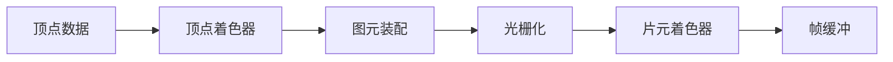
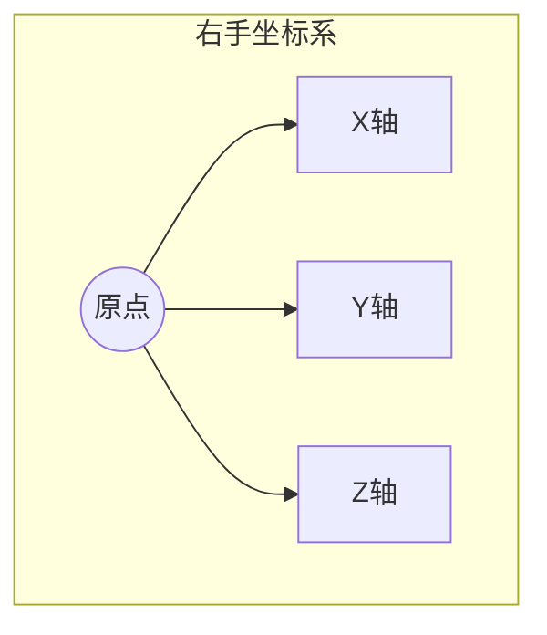
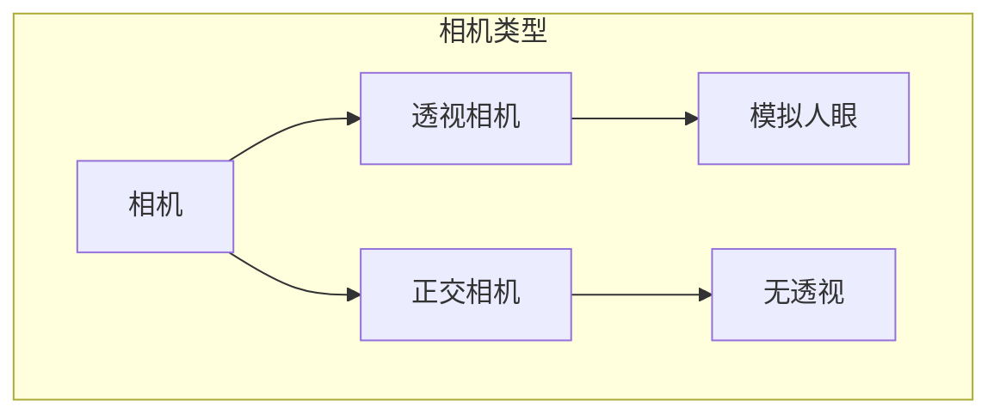

# Three.js 简介与核心概念

## 什么是 Three.js？

Three.js 是一个轻量级的 3D 图形库，它封装了 WebGL 的底层 API，让开发者能够更容易地创建和展示 3D 图形。它提供了丰富的功能，包括：

- 场景管理
- 相机控制
- 光照系统
- 材质系统
- 几何体
- 动画系统
- 后期处理
- 等等


*图 1.1: Three.js 创建的复杂 3D 场景示例*

## WebGL 基础概念

在开始使用 Three.js 之前，我们需要了解一些 WebGL 的基础概念：

### 1. 渲染管线

WebGL 的渲染管线主要包含以下步骤：

1. **顶点着色器（Vertex Shader）**：处理顶点数据
2. **图元装配（Primitive Assembly）**：将顶点组装成图元
3. **光栅化（Rasterization）**：将图元转换为像素
4. **片元着色器（Fragment Shader）**：处理像素颜色
5. **帧缓冲（Frame Buffer）**：存储最终的渲染结果



*图 1.2: WebGL 渲染管线流程图*

### 2. 坐标系

WebGL 使用右手坐标系：
- X 轴：向右为正
- Y 轴：向上为正
- Z 轴：向外为正



*图 1.3: 右手坐标系示意图*


*图 1.4: Three.js 中的坐标系应用示例*

## 开发环境搭建

### 1. 创建项目

首先，创建一个新的项目目录并初始化：

```bash
mkdir threejs-demo
cd threejs-demo
npm init -y
```

### 2. 安装依赖

安装必要的依赖：

```bash
npm install three
npm install vite --save-dev
```

### 3. 创建基础项目结构

```
threejs-demo/
├── index.html
├── src/
│   ├── main.js
│   └── style.css
├── package.json
└── vite.config.js
```

*图 1.5: 项目目录结构*

### 4. 配置 Vite

创建 `vite.config.js`：

```javascript
export default {
  root: './',
  publicDir: 'public',
  server: {
    host: true
  }
}
```

### 5. 创建 HTML 文件

```html
<!DOCTYPE html>
<html lang="en">
<head>
    <meta charset="UTF-8">
    <meta name="viewport" content="width=device-width, initial-scale=1.0">
    <title>Three.js 入门</title>
    <link rel="stylesheet" href="src/style.css">
</head>
<body>
    <div id="app"></div>
    <script type="module" src="src/main.js"></script>
</body>
</html>
```

### 6. 添加基础样式

```css
body {
    margin: 0;
    overflow: hidden;
}

#app {
    width: 100vw;
    height: 100vh;
}
```

## 第一个 3D 场景

让我们创建一个简单的 3D 场景，包含一个旋转的立方体：

```javascript
import * as THREE from 'three';

// 创建场景
const scene = new THREE.Scene();

// 创建相机
const camera = new THREE.PerspectiveCamera(
    75, // 视角
    window.innerWidth / window.innerHeight, // 宽高比
    0.1, // 近平面
    1000 // 远平面
);
camera.position.z = 5;

// 创建渲染器
const renderer = new THREE.WebGLRenderer();
renderer.setSize(window.innerWidth, window.innerHeight);
document.getElementById('app').appendChild(renderer.domElement);

// 创建一个立方体
const geometry = new THREE.BoxGeometry();
const material = new THREE.MeshBasicMaterial({
    color: 0x00ff00,
    wireframe: true
});
const cube = new THREE.Mesh(geometry, material);
scene.add(cube);

// 动画循环
function animate() {
    requestAnimationFrame(animate);

    // 旋转立方体
    cube.rotation.x += 0.01;
    cube.rotation.y += 0.01;

    // 渲染场景
    renderer.render(scene, camera);
}

// 处理窗口大小变化
window.addEventListener('resize', () => {
    camera.aspect = window.innerWidth / window.innerHeight;
    camera.updateProjectionMatrix();
    renderer.setSize(window.innerWidth, window.innerHeight);
});

// 开始动画
animate();
```


*图 1.6: 运行结果：一个旋转的绿色线框立方体*

## 核心概念解析

### 1. 场景（Scene）

场景是所有 3D 对象的容器，它定义了：
- 3D 空间
- 背景色
- 雾效果
- 等等


*图 1.7: 包含多个几何体的场景示例*

### 2. 相机（Camera）

相机决定了我们如何观察场景：
- 透视相机（PerspectiveCamera）：模拟人眼视角
- 正交相机（OrthographicCamera）：无透视效果



*图 1.8: 相机类型对比图*

### 3. 渲染器（Renderer）

渲染器负责将场景和相机的内容绘制到屏幕上：
- WebGLRenderer：使用 WebGL 进行渲染
- 可配置抗锯齿、阴影等效果


*图 1.9: 不同渲染效果对比*

### 4. 网格（Mesh）

网格是 3D 对象的基本单位，由两部分组成：
- 几何体（Geometry）：定义形状
- 材质（Material）：定义外观


*图 1.10: 网格的几何体和法线可视化*

## 常见问题与解决方案

1. **性能问题**
   - 使用 `requestAnimationFrame` 进行动画
   - 及时释放不需要的资源
   - 使用适当的几何体复杂度

2. **内存管理**
   - 使用 `dispose()` 方法释放资源
   - 避免频繁创建新对象
   - 重用几何体和材质

3. **兼容性问题**
   - 检查 WebGL 支持
   - 提供降级方案
   - 使用 polyfill 解决兼容性问题

## 下一步学习

在下一章中，我们将深入学习：
- 场景的详细配置
- 不同类型的相机
- 渲染器的进阶设置
- 动画系统的基础知识

## 练习

1. 修改立方体的颜色和大小
2. 添加多个立方体
3. 实现鼠标控制相机
4. 添加简单的光照效果

## 资源链接

- [Three.js 官方文档](https://threejs.org/docs/)
- [WebGL 基础教程](https://webglfundamentals.org/)
- [Three.js 示例](https://threejs.org/examples/)
