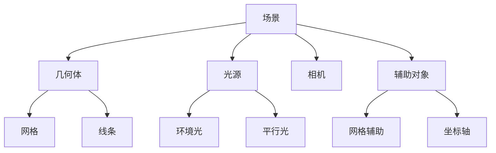

# 场景、相机、渲染器基础

## 场景（Scene）详解

场景是 Three.js 中所有 3D 对象的容器，它定义了整个 3D 空间。让我们深入了解场景的配置和使用。


*图 2.1: 包含多个几何体的场景示例*

### 1. 场景基础配置

```javascript
import * as THREE from 'three';

// 创建场景
const scene = new THREE.Scene();

// 设置背景色
scene.background = new THREE.Color(0x000000); // 黑色背景

// 添加雾效果
scene.fog = new THREE.Fog(0x000000, 10, 100); // 颜色、近平面、远平面

// 设置场景环境
scene.environment = new THREE.CubeTextureLoader().load([
    'px.jpg', 'nx.jpg',
    'py.jpg', 'ny.jpg',
    'pz.jpg', 'nz.jpg'
]);
```


*图 2.2: 使用环境贴图的场景效果*

### 2. 场景管理

```javascript
// 添加对象到场景
scene.add(mesh);

// 从场景中移除对象
scene.remove(mesh);

// 获取场景中的所有对象
const objects = scene.children;

// 遍历场景中的对象
scene.traverse((object) => {
    if (object.isMesh) {
        // 处理网格对象
    }
});
```



*图 2.3: 场景对象层级结构*

### 3. 场景优化

```javascript
// 设置场景自动更新
scene.autoUpdate = true;

// 手动更新场景
scene.updateMatrixWorld(true);

// 清理场景
function disposeScene() {
    scene.traverse((object) => {
        if (object.geometry) {
            object.geometry.dispose();
        }
        if (object.material) {
            if (Array.isArray(object.material)) {
                object.material.forEach(material => material.dispose());
            } else {
                object.material.dispose();
            }
        }
    });
}
```

## 相机（Camera）详解

Three.js 提供了多种相机类型，每种类型都有其特定的用途。

### 1. 透视相机（PerspectiveCamera）

透视相机模拟人眼视角，是最常用的相机类型。


*图 2.4: 透视相机的渲染效果*

```javascript
// 创建透视相机
const camera = new THREE.PerspectiveCamera(
    75, // 视角（FOV）
    window.innerWidth / window.innerHeight, // 宽高比
    0.1, // 近平面
    1000 // 远平面
);

// 设置相机位置
camera.position.set(0, 5, 10);

// 设置相机朝向
camera.lookAt(0, 0, 0);

// 更新相机参数
camera.aspect = window.innerWidth / window.innerHeight;
camera.updateProjectionMatrix();
```

### 2. 正交相机（OrthographicCamera）

正交相机没有透视效果，适合用于 2D 场景或等距视图。


*图 2.5: 正交相机的渲染效果*

```javascript
// 创建正交相机
const camera = new THREE.OrthographicCamera(
    -10, // 左
    10,  // 右
    10,  // 上
    -10, // 下
    0.1, // 近平面
    1000 // 远平面
);

// 设置相机位置
camera.position.set(0, 0, 10);
camera.lookAt(0, 0, 0);
```

### 3. 相机控制

使用 OrbitControls 实现相机控制：


*图 2.6: 使用 OrbitControls 的相机控制效果*

```javascript
import { OrbitControls } from 'three/examples/jsm/controls/OrbitControls';

// 创建控制器
const controls = new OrbitControls(camera, renderer.domElement);

// 配置控制器
controls.enableDamping = true; // 启用阻尼效果
controls.dampingFactor = 0.05;
controls.screenSpacePanning = false;
controls.minDistance = 10;
controls.maxDistance = 500;
controls.maxPolarAngle = Math.PI / 2;

// 在动画循环中更新控制器
function animate() {
    requestAnimationFrame(animate);
    controls.update();
    renderer.render(scene, camera);
}
```

## 渲染器（Renderer）详解

渲染器负责将场景和相机的内容绘制到屏幕上。

### 1. 基础配置

```javascript
// 创建渲染器
const renderer = new THREE.WebGLRenderer({
    antialias: true, // 抗锯齿
    alpha: true,     // 透明背景
    precision: 'highp' // 精度
});

// 设置渲染器尺寸
renderer.setSize(window.innerWidth, window.innerHeight);

// 设置像素比
renderer.setPixelRatio(window.devicePixelRatio);

// 设置输出编码
renderer.outputEncoding = THREE.sRGBEncoding;

// 启用阴影
renderer.shadowMap.enabled = true;
renderer.shadowMap.type = THREE.PCFSoftShadowMap;
```


*图 2.7: 不同渲染效果的对比*

### 2. 高级配置

```javascript
// 设置渲染器参数
renderer.setClearColor(0x000000, 1); // 设置清除颜色
renderer.setClearAlpha(1); // 设置清除透明度

// 配置阴影
renderer.shadowMap.enabled = true;
renderer.shadowMap.type = THREE.PCFSoftShadowMap;

// 配置后期处理
const composer = new THREE.EffectComposer(renderer);
const renderPass = new THREE.RenderPass(scene, camera);
composer.addPass(renderPass);
```


*图 2.8: 使用后期处理的效果*

### 3. 性能优化

```javascript
// 设置渲染器参数
renderer.powerPreference = 'high-performance';
renderer.precision = 'highp';

// 自动清理
function disposeRenderer() {
    renderer.dispose();
    renderer.forceContextLoss();
    renderer.domElement.remove();
}

// 处理窗口大小变化
window.addEventListener('resize', () => {
    const width = window.innerWidth;
    const height = window.innerHeight;

    camera.aspect = width / height;
    camera.updateProjectionMatrix();

    renderer.setSize(width, height);
    renderer.setPixelRatio(Math.min(window.devicePixelRatio, 2));
});
```

## 实战：创建一个完整的 3D 场景

让我们结合以上知识，创建一个完整的 3D 场景：


*图 2.9: 完整的 3D 场景示例*

```javascript
import * as THREE from 'three';
import { OrbitControls } from 'three/examples/jsm/controls/OrbitControls';

// 创建场景
const scene = new THREE.Scene();
scene.background = new THREE.Color(0x1a1a1a);

// 创建相机
const camera = new THREE.PerspectiveCamera(
    75,
    window.innerWidth / window.innerHeight,
    0.1,
    1000
);
camera.position.set(5, 5, 5);
camera.lookAt(0, 0, 0);

// 创建渲染器
const renderer = new THREE.WebGLRenderer({
    antialias: true,
    alpha: true
});
renderer.setSize(window.innerWidth, window.innerHeight);
renderer.setPixelRatio(Math.min(window.devicePixelRatio, 2));
renderer.shadowMap.enabled = true;
document.getElementById('app').appendChild(renderer.domElement);

// 创建控制器
const controls = new OrbitControls(camera, renderer.domElement);
controls.enableDamping = true;

// 添加网格
const gridHelper = new THREE.GridHelper(10, 10);
scene.add(gridHelper);

// 添加环境光
const ambientLight = new THREE.AmbientLight(0xffffff, 0.5);
scene.add(ambientLight);

// 添加平行光
const directionalLight = new THREE.DirectionalLight(0xffffff, 0.5);
directionalLight.position.set(5, 5, 5);
directionalLight.castShadow = true;
scene.add(directionalLight);

// 创建一个立方体
const geometry = new THREE.BoxGeometry(1, 1, 1);
const material = new THREE.MeshStandardMaterial({
    color: 0x00ff00,
    metalness: 0.3,
    roughness: 0.4
});
const cube = new THREE.Mesh(geometry, material);
cube.castShadow = true;
cube.receiveShadow = true;
scene.add(cube);

// 创建地面
const planeGeometry = new THREE.PlaneGeometry(10, 10);
const planeMaterial = new THREE.MeshStandardMaterial({
    color: 0x808080,
    side: THREE.DoubleSide
});
const plane = new THREE.Mesh(planeGeometry, planeMaterial);
plane.rotation.x = -Math.PI / 2;
plane.position.y = -0.5;
plane.receiveShadow = true;
scene.add(plane);

// 动画循环
function animate() {
    requestAnimationFrame(animate);

    // 更新控制器
    controls.update();

    // 旋转立方体
    cube.rotation.x += 0.01;
    cube.rotation.y += 0.01;

    // 渲染场景
    renderer.render(scene, camera);
}

// 开始动画
animate();
```

## 性能优化建议

1. **场景优化**
   - 使用适当的几何体复杂度
   - 及时清理不需要的对象
   - 使用对象池管理频繁创建的对象

2. **相机优化**
   - 设置合适的视锥体范围
   - 使用适当的相机类型
   - 优化控制器参数

3. **渲染器优化**
   - 使用适当的像素比
   - 启用必要的渲染特性
   - 及时释放资源

## 练习

1. 实现相机的自动旋转
2. 添加多个光源并观察效果
3. 实现场景的昼夜变化
4. 添加后期处理效果

## 下一步学习

在下一章中，我们将学习：
- 几何体的创建和使用
- 材质系统的详细配置
- 纹理的应用
- 对象的变换和组合
